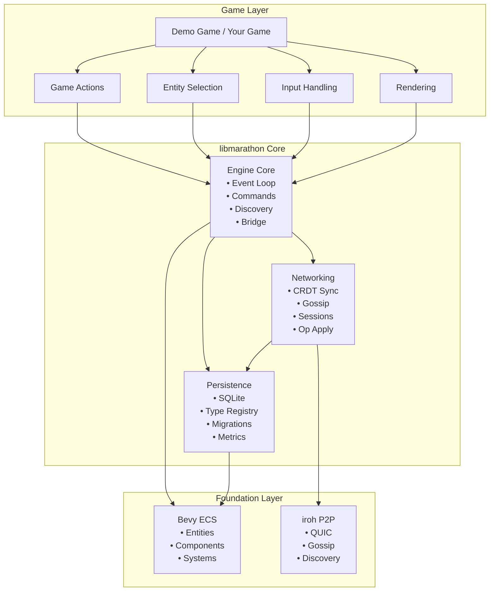
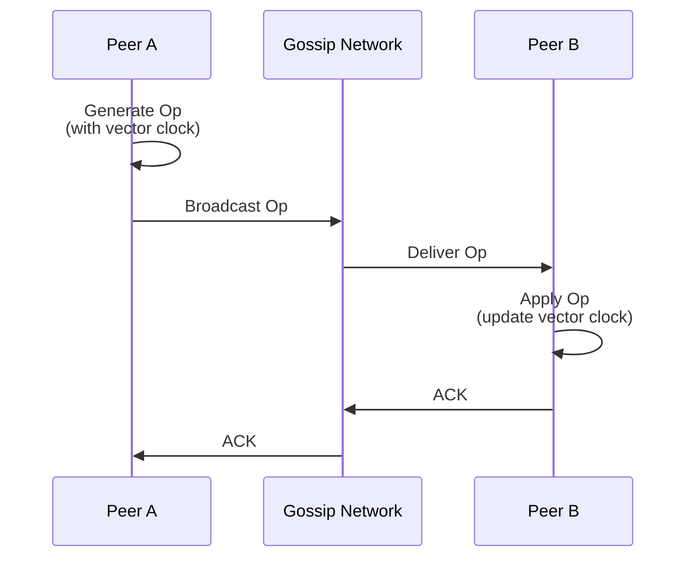
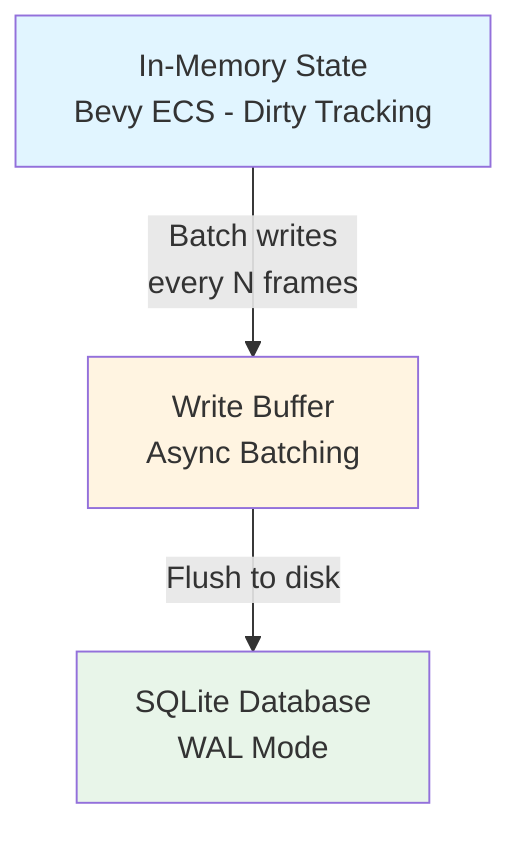
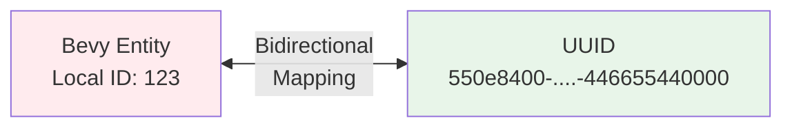
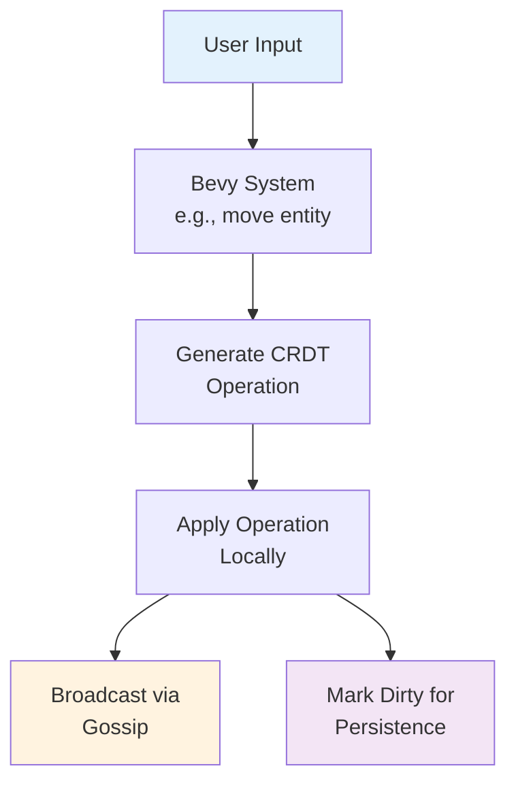
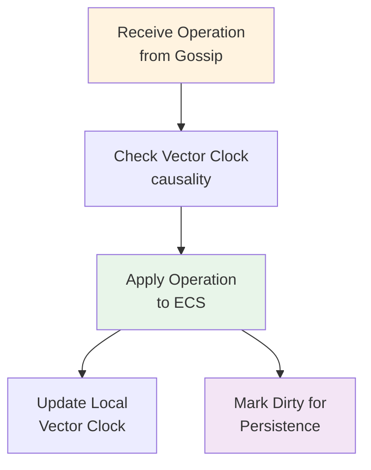
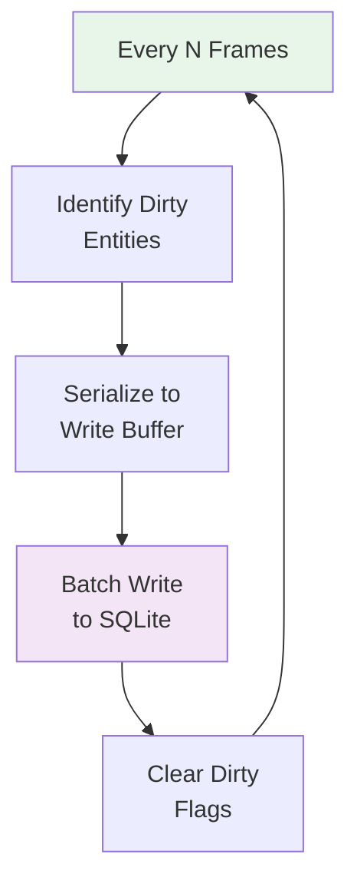

# Marathon Architecture

This document provides a high-level overview of Marathon's architecture to help contributors understand the system's design and organization.

## Table of Contents

- [Overview](#overview)
- [Core Principles](#core-principles)
- [System Architecture](#system-architecture)
- [Crate Organization](#crate-organization)
- [Key Components](#key-components)
- [Data Flow](#data-flow)
- [Technology Decisions](#technology-decisions)
- [Design Constraints](#design-constraints)

## Overview

Marathon is a **peer-to-peer game engine development kit** built on conflict-free replicated data types (CRDTs). It enables developers to build multiplayer games where players can interact with shared game state in real-time, even across network partitions, with automatic reconciliation.

**Key Characteristics:**
- **Decentralized** - No central game server required, all players are equal peers
- **Offline-first** - Gameplay continues during network partitions
- **Eventually consistent** - All players converge to the same game state
- **Real-time** - Player actions propagate with minimal latency
- **Persistent** - Game state survives application restarts

## Core Principles

1. **CRDTs for Consistency** - Use mathematically proven data structures that guarantee eventual consistency for multiplayer game state
2. **Bevy ECS First** - Build on Bevy's Entity Component System for game development flexibility
3. **Zero Trust Networking** - Assume peers may be malicious (future work for competitive games)
4. **Separation of Concerns** - Clear boundaries between networking, persistence, and game logic
5. **Performance Matters** - Optimize for low latency and high throughput suitable for real-time games

## System Architecture



## Crate Organization

Marathon is organized as a Rust workspace with four crates:

### `libmarathon` (Core Library)

**Purpose**: The heart of Marathon, providing networking, persistence, and CRDT synchronization.

**Key Modules:**
```
libmarathon/
├── networking/        # P2P networking and CRDT sync
│   ├── crdt/         # CRDT implementations (OR-Set, RGA, LWW)
│   ├── operations/   # Network operations and vector clocks
│   ├── gossip/       # Gossip protocol bridge to iroh
│   ├── session/      # Session management
│   └── entity_map/   # UUID ↔ Entity mapping
│
├── persistence/       # SQLite-backed state persistence
│   ├── database/     # SQLite connection and WAL
│   ├── registry/     # Type registry for reflection
│   └── health/       # Health checks and metrics
│
├── engine/           # Core engine logic
│   ├── networking_manager/  # Network event loop
│   ├── commands/     # Bevy commands
│   └── game_actions/ # User action handling
│
├── debug_ui/         # egui debug interface
├── render/           # Vendored Bevy render pipeline
├── transform/        # Vendored transform with rkyv
└── platform/         # Platform-specific code (iOS/desktop)
```

### `app` (Demo Game)

**Purpose**: Demonstrates Marathon capabilities with a simple multiplayer cube game.

**Key Files:**
- `main.rs` - Entry point with CLI argument handling
- `engine_bridge.rs` - Connects Bevy game to Marathon engine
- `cube.rs` - Demo game entity implementation
- `session.rs` - Multiplayer session lifecycle management
- `input/` - Input handling (keyboard, touch, Apple Pencil)
- `rendering/` - Rendering setup and camera

### `macros` (Procedural Macros)

**Purpose**: Code generation for serialization and deserialization.

Built on Bevy's macro infrastructure for consistency with the ecosystem.

### `xtask` (Build Automation)

**Purpose**: Automate iOS build and deployment using the cargo-xtask pattern.

**Commands:**
- `ios-build` - Build for iOS simulator/device
- `ios-deploy` - Deploy to connected device
- `ios-run` - Build and run on simulator

## Key Components

### 1. CRDT Synchronization Layer

**Location**: `libmarathon/src/networking/`

**Purpose**: Implements the CRDT-based synchronization protocol.

**Key Concepts:**
- **Operations** - Immutable change events (Create, Update, Delete)
- **Vector Clocks** - Track causality across peers
- **OR-Sets** - Observed-Remove Sets for entity membership
- **RGA** - Replicated Growable Array for ordered sequences
- **LWW** - Last-Write-Wins for simple values

**Protocol Flow:**



See [RFC 0001](docs/rfcs/0001-crdt-gossip-sync.md) for detailed protocol specification.

### 2. Persistence Layer

**Location**: `libmarathon/src/persistence/`

**Purpose**: Persist game state to SQLite with minimal overhead.

**Architecture**: Three-tier system



**Key Features:**
- **Automatic persistence** - Components marked with `Persisted` save automatically
- **Type registry** - Reflection-based serialization
- **WAL mode** - Write-Ahead Logging for crash safety
- **Migrations** - Schema versioning support

See [RFC 0002](docs/rfcs/0002-persistence-strategy.md) for detailed design.

### 3. Networking Manager

**Location**: `libmarathon/src/engine/networking_manager.rs`

**Purpose**: Bridge between Bevy and the iroh networking stack.

**Responsibilities:**
- Manage peer connections and discovery
- Route operations to/from gossip network
- Maintain session state
- Handle join protocol for new peers

### 4. Entity Mapping System

**Location**: `libmarathon/src/networking/entity_map.rs`

**Purpose**: Map between Bevy's local `Entity` IDs and global `UUID`s.

**Why This Exists**: Bevy assigns local sequential entity IDs that differ across instances. We need stable UUIDs for networked entities that all peers agree on.



### 5. Debug UI System

**Location**: `libmarathon/src/debug_ui/`

**Purpose**: Provide runtime inspection of internal state.

Built with egui for immediate-mode GUI, integrated into Bevy's render pipeline.

**Features:**
- View connected peers
- Inspect vector clocks
- Monitor operation log
- Check persistence metrics
- View entity mappings

## Data Flow

### Local Change Flow



### Remote Change Flow



### Persistence Flow



## Technology Decisions

### Why Bevy?

- **ECS architecture** maps perfectly to game development
- **Cross-platform** (desktop, mobile, web)
- **Active community** and ecosystem
- **Performance** through data-oriented design

### Why iroh?

- **QUIC-based** - Modern, efficient transport
- **NAT traversal** - Works behind firewalls
- **Gossip protocol** - Epidemic broadcast for multi-peer
- **Rust-native** - Zero-cost integration

### Why SQLite?

- **Embedded** - No server required
- **Battle-tested** - Reliable persistence
- **WAL mode** - Good write performance
- **Cross-platform** - Works everywhere

### Why CRDTs?

- **No central authority** - True P2P
- **Offline-first** - Work without connectivity
- **Provable consistency** - Mathematical guarantees
- **No conflict resolution UI** - Users don't see conflicts

## Design Constraints

### Current Limitations

1. **No Authentication** - All peers are trusted (0.1.x)
2. **No Authorization** - All peers have full permissions
3. **No Encryption** - Beyond QUIC's transport security
4. **Limited Scalability** - Not tested beyond ~10 peers
5. **Desktop + iOS Only** - Web and other platforms planned

### Performance Targets

- **Operation latency**: < 50ms peer-to-peer
- **Persistence overhead**: < 5% frame time
- **Memory overhead**: < 10MB for typical session
- **Startup time**: < 2 seconds

### Intentional Non-Goals

- **Central server architecture** - Stay decentralized
- **Strong consistency** - Use eventual consistency
- **Traditional database** - Use CRDTs, not SQL queries
- **General-purpose engine** - Focus on collaboration

## Related Documentation

- [RFC 0001: CRDT Synchronization Protocol](docs/rfcs/0001-crdt-gossip-sync.md)
- [RFC 0002: Persistence Strategy](docs/rfcs/0002-persistence-strategy.md)
- [RFC 0003: Sync Abstraction](docs/rfcs/0003-sync-abstraction.md)
- [RFC 0004: Session Lifecycle](docs/rfcs/0004-session-lifecycle.md)
- [RFC 0005: Spatial Audio System](docs/rfcs/0005-spatial-audio-vendoring.md)
- [RFC 0006: Agent Simulation Architecture](docs/rfcs/0006-agent-simulation-architecture.md)

## Questions?

If you're working on Marathon and something isn't clear:

1. Check the RFCs in `docs/rfcs/`
2. Search existing issues/discussions
3. Ask in GitHub Discussions
4. Reach out to maintainers

---

*This architecture will evolve. When making significant architectural changes, consider updating this document or creating a new RFC.*
