# RFC 0001: CRDT Synchronization Protocol over iroh-gossip

**Status:** Implemented
**Authors:** Sienna
**Created:** 2025-11-15
**Updated:** 2025-11-15

## Abstract

This RFC proposes a gossip-based CRDT synchronization protocol for building eventually-consistent multiplayer collaborative applications. The protocol enables 2-5 concurrent users to collaborate in real-time on shared entities and resources with support for presence, cursors, selections, and drawing operations.

## Motivation

We want to build a multiplayer collaborative system where:
- Two people can draw/edit together and see each other's changes in real-time
- Changes work offline and sync automatically when reconnected
- There's no "server" - all peers are equal
- State is eventually consistent across all peers
- We can see cursors, presence, selections, etc.

### Why iroh-gossip?

**Message bus > point-to-point**: In a 3-person session, gossip naturally handles the "multicast" pattern better than explicit peer-to-peer connections. Each message gets epidemic-broadcast to all peers efficiently.

**Built-in mesh networking**: iroh-gossip handles peer discovery and maintains the mesh topology automatically. We just subscribe to a topic.

**QUIC underneath**: Low latency, multiplexed, encrypted by default.

### Why CRDTs?

**The core problem**: When two people edit the same thing simultaneously, how do we merge the changes without coordination?

**CRDT solution**: Operations are designed to be commutative (order doesn't matter), associative (grouping doesn't matter), and idempotent (re-applying is safe). This means:
- No locks needed
- No coordination needed
- All peers converge to same state eventually
- Works offline naturally

## High-Level Architecture

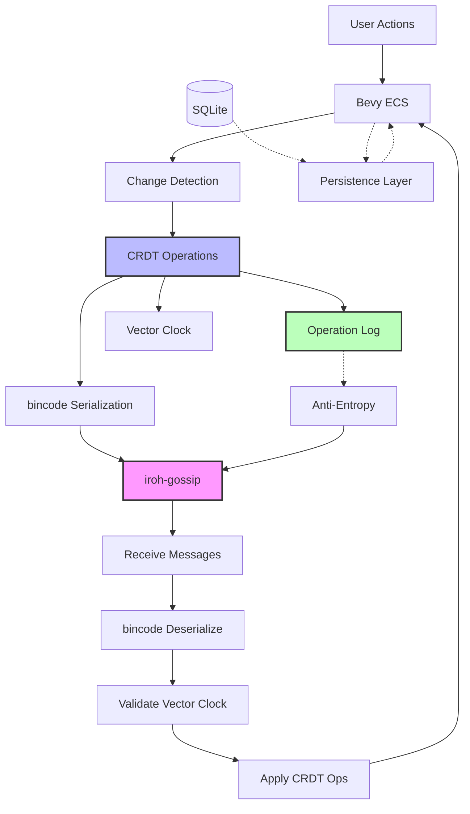

**The flow:**
1. User does something (moves object, draws stroke, selects item)
2. Bevy system detects the change (using `Changed<T>` queries)
3. Generate CRDT operation describing the change
4. Log operation to operation log (for anti-entropy)
5. Update vector clock (increment our sequence number)
6. Serialize with bincode
7. Broadcast via gossip
8. All peers (including us) receive and apply the operation
9. State converges

### System States

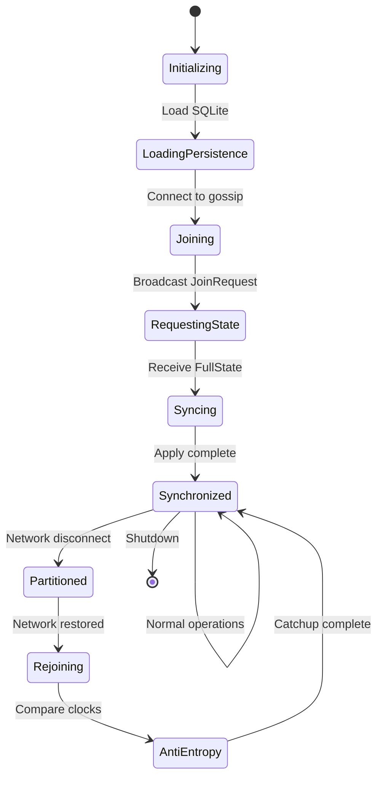

## Entity-Component-System Model

We're building on Bevy's ECS, but networked entities need special handling:

**The UUID problem**: Bevy's `Entity` is just an incrementing ID local to that instance. If two peers create entities, they'll have conflicting IDs.

**Our solution**: Separate network identity from ECS identity:

```rust
#[derive(Component)]
struct NetworkedEntity {
    network_id: Uuid,      // Stable across all peers
    is_local: bool,        // Did we create this?
    owner_node_id: NodeId, // Who created it originally?
}

// Maintained by sync system
struct NetworkEntityMap {
    map: HashMap<Uuid, Entity>,  // network UUID → Bevy Entity
}
```

When we receive an update for UUID `abc-123`:
- Look it up in the map
- If it exists: update the existing Entity
- If not: spawn a new Entity and add to map

## CRDT Types We Need

Different types of data need different CRDT semantics:

### Last-Write-Wins (LWW)
**For**: Simple fields where newest value should win (position, color, size)

**Concept**: Attach timestamp to each write. When merging, keep the newer one. If timestamps equal, use node ID as tiebreaker.

```rust
struct SyncedValue<T> {
    value: T,
    timestamp: DateTime<Utc>,
    node_id: NodeId,
}

fn merge(&mut self, other: &Self) {
    if other.timestamp > self.timestamp
       || (other.timestamp == self.timestamp && other.node_id > self.node_id) {
        self.value = other.value.clone();
        self.timestamp = other.timestamp;
        self.node_id = other.node_id.clone();
    }
}
```

### OR-Set (Observed-Remove Set)
**For**: Collections where items can be added/removed (selections, tags, participants)

**Concept**: Each add gets a unique token. Removes specify which add tokens to remove. This prevents the "add-remove" problem where concurrent operations conflict.

**Example**: If Alice adds "red" and Bob removes "red" concurrently, we need to know if Bob saw Alice's add or not.

```rust
// From crdts library
let mut set: Orswot<String, NodeId> = Default::default();

// Adding
let add_ctx = set.read_ctx().derive_add_ctx("alice");
set.apply(set.add("red".to_string(), add_ctx));

// Removing
let rm_ctx = set.read_ctx().derive_rm_ctx("bob");
set.apply(set.rm("red".to_string(), rm_ctx));
```

### Map CRDT
**For**: Nested key-value data (metadata, properties, nested objects)

**Concept**: Each key can have its own CRDT semantics. The map handles add/remove of keys.

```rust
// From crdts library
let mut map: Map<String, LWWReg<i32, NodeId>, NodeId> = Map::new();

// Update a key
let ctx = map.read_ctx().derive_add_ctx("alice");
map.apply(map.update("score".to_string(), ctx, |reg, actor| {
    reg.write(100, actor)
}));
```

### Sequence CRDT (List/RGA)
**For**: Ordered collections (drawing paths, text, ordered lists)

**Concept**: Each insertion gets a unique ID that includes ordering information. Maintains causal order even with concurrent edits.

**Use case**: Collaborative drawing paths where two people add points simultaneously.

### Counter
**For**: Increment/decrement operations (likes, votes, reference counts)

**Concept**: Each node tracks its own increment/decrement deltas. Total is the sum of all deltas.

```rust
// PN-Counter (positive-negative)
struct Counter {
    increments: HashMap<NodeId, u64>,
    decrements: HashMap<NodeId, u64>,
}

fn value(&self) -> i64 {
    let pos: u64 = self.increments.values().sum();
    let neg: u64 = self.decrements.values().sum();
    pos as i64 - neg as i64
}
```

## Message Protocol

We need a few types of messages:

### 1. JoinRequest
When a new peer joins, they need the current state.

```rust
enum SyncMessage {
    JoinRequest {
        node_id: NodeId,
        vector_clock: VectorClock,  // Usually empty on first join
    },
    // ...
}
```

### 2. FullState
Response to join - here's everything you need:

```rust
FullState {
    entities: HashMap<Uuid, EntityState>,  // All entities + components
    resources: HashMap<String, ResourceState>,  // Global singletons
    vector_clock: VectorClock,  // Current causality state
}
```

### 3. EntityDelta
Incremental update when something changes:

```rust
EntityDelta {
    entity_id: Uuid,
    component_ops: Vec<ComponentOp>,  // Operations to apply
    vector_clock: VectorClock,
}
```

### 4. Presence & Cursor (Ephemeral)
High-frequency, not persisted:

```rust
Presence {
    node_id: NodeId,
    user_info: UserInfo,  // Name, color, avatar
    ttl_ms: u64,  // Auto-expire after 5 seconds
}

Cursor {
    node_id: NodeId,
    position: (f32, f32),
}
```

### Serialization: bincode

**Why bincode**: Fast, compact, type-safe with serde.

**Caveat**: No schema evolution. If we change the message format, old and new clients can't talk.

**Solution**: Version envelope:

```rust
#[derive(Serialize, Deserialize)]
struct VersionedMessage {
    version: u32,
    payload: Vec<u8>,  // bincode-serialized SyncMessage
}
```

If we see version 2 and we're version 1, we can gracefully reject or upgrade.

## Vector Clocks: Tracking Causality

**The problem**: How do we know if we're missing messages? How do we detect conflicts?

**Solution**: Vector clocks - each node tracks "what operations has each peer seen?"

```rust
struct VectorClock {
    versions: HashMap<NodeId, u64>,  // node → sequence number
}
```

**Example**:
- Alice's clock: `{alice: 5, bob: 3}`
- Bob's clock: `{alice: 4, bob: 4}`

This tells us:
- Alice has seen her own ops 1-5
- Alice has seen Bob's ops 1-3
- Bob has seen Alice's ops 1-4 (missing Alice's op 5!)
- Bob has seen his own ops 1-4

So we know Bob is missing Alice's operation #5.

**Key operations**:

```rust
// Increment when we create an operation
clock.increment(&local_node_id);

// Merge when we receive a message
clock.merge(&received_clock);

// Check causality
if their_clock.happened_before(&our_clock) {
    // They're behind, we have newer info
}

if our_clock.is_concurrent_with(&their_clock) {
    // Conflict! Need CRDT merge semantics
}
```

## Synchronization Flow

### On Join (New Peer)

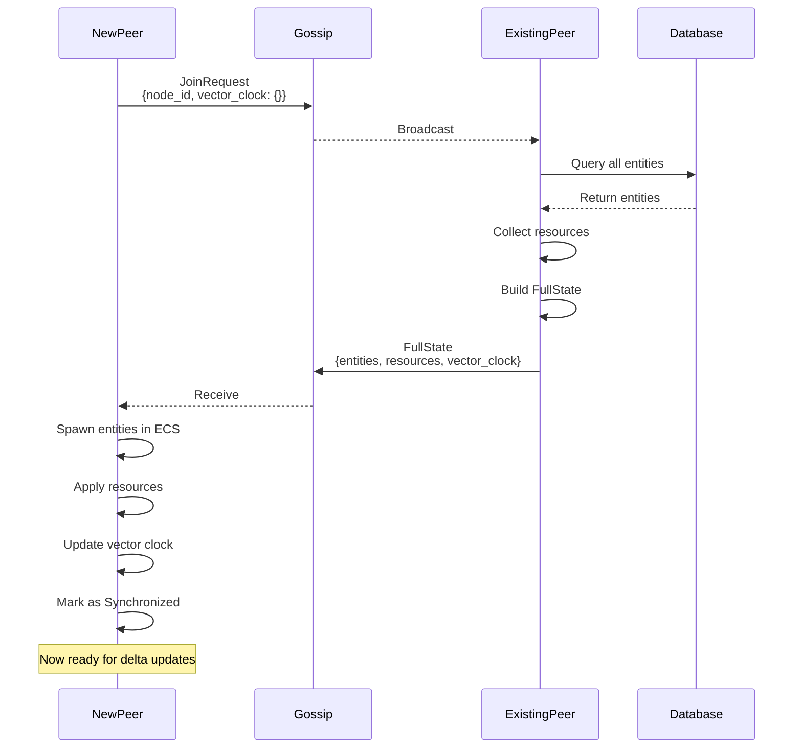

**Key insights**:
- Multiple peers may respond to a JoinRequest
- The joining peer should pick the FullState with the most advanced vector clock
- After applying FullState, immediately broadcast SyncRequest to catch any deltas that happened during transfer
- Anti-entropy will repair any remaining inconsistencies

**Improved join algorithm**:
```rust
async fn join_session(gossip: &GossipHandle) -> Result<()> {
    // Broadcast join request
    gossip.broadcast(SyncMessage::JoinRequest {
        node_id: local_node_id(),
        vector_clock: VectorClock::new(),
    }).await?;

    // Collect FullState responses for a short window (500ms)
    let mut responses = Vec::new();
    let deadline = Instant::now() + Duration::from_millis(500);

    while Instant::now() < deadline {
        if let Ok(msg) = timeout_until(deadline, gossip.recv()).await {
            if let SyncMessage::FullState { .. } = msg {
                responses.push(msg);
            }
        }
    }

    // Pick the most up-to-date response (highest vector clock)
    let best_state = responses.into_iter()
        .max_by_key(|r| r.vector_clock.total_operations())
        .ok_or("No FullState received")?;

    // Apply the state
    apply_full_state(best_state)?;

    // Immediately request any deltas that happened during the transfer
    gossip.broadcast(SyncMessage::SyncRequest {
        vector_clock: our_current_clock(),
    }).await?;

    Ok(())
}
```

**Why this works**:
- We don't rely on "first response wins" (which could be stale)
- We select the peer with the most complete state
- We immediately catch up on any operations that happened during the state transfer
- Anti-entropy continues to fill any remaining gaps

### During Operation (Real-time)

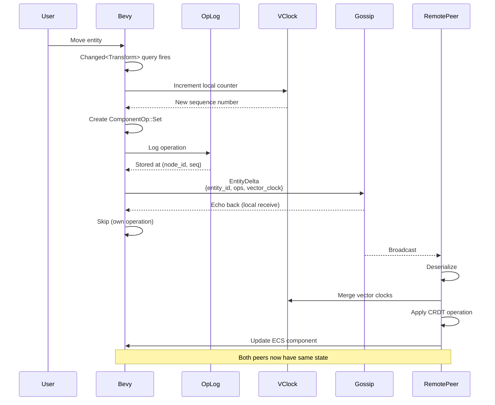

**Performance note**: We echo our own operations back to maintain consistency in the async/sync boundary.

### Anti-Entropy (Periodic Catchup)

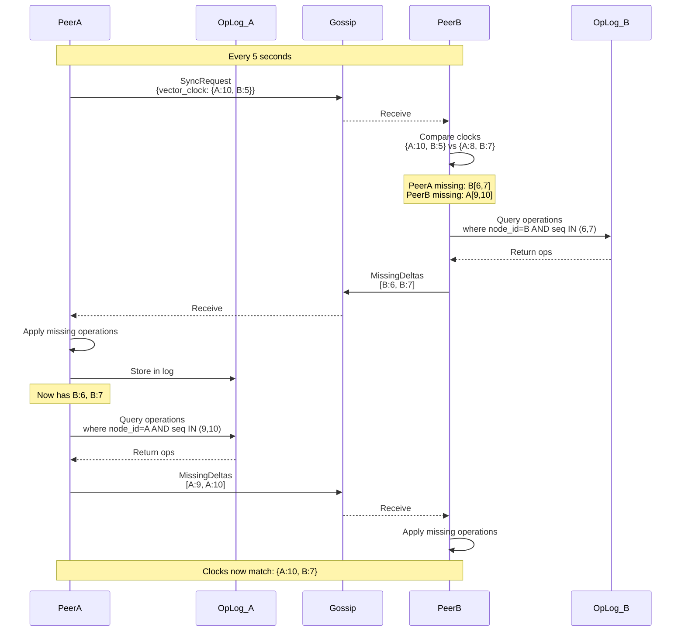

**Why this works**:
- Vector clocks tell us exactly what's missing
- Operation log preserves operations for catchup
- Anti-entropy repairs any message loss
- Eventually all peers converge

## Operation Log: The Anti-Entropy Engine

The operation log is critical for ensuring eventual consistency. It's an append-only log of all CRDT operations that allows peers to catch up after network partitions or disconnections.

### Structure

```rust
struct OperationLogEntry {
    // Primary key: (node_id, sequence_number)
    node_id: NodeId,
    sequence_number: u64,

    // The actual operation
    operation: Delta,  // EntityDelta or ResourceDelta

    // When this operation was created
    timestamp: DateTime<Utc>,

    // How many bytes (for storage metrics)
    size_bytes: u32,
}
```

### Storage Schema (SQLite)

```sql
CREATE TABLE operation_log (
    -- Composite primary key ensures uniqueness per node
    node_id TEXT NOT NULL,
    sequence_number INTEGER NOT NULL,

    -- Operation type for filtering
    operation_type TEXT NOT NULL,  -- 'EntityDelta' | 'ResourceDelta'

    -- The serialized Delta (bincode)
    operation_blob BLOB NOT NULL,

    -- Timestamp for pruning
    created_at INTEGER NOT NULL,

    -- Size tracking
    size_bytes INTEGER NOT NULL,

    PRIMARY KEY (node_id, sequence_number)
);

-- Index for time-based queries (pruning old operations)
CREATE INDEX idx_operation_log_timestamp
ON operation_log(created_at);

-- Index for node lookups (common query pattern)
CREATE INDEX idx_operation_log_node
ON operation_log(node_id, sequence_number);
```

### Write Path

Every time we generate an operation:

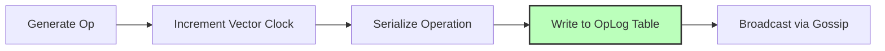

**Atomicity**: The vector clock increment and operation log write should be atomic. If we fail after incrementing the clock but before logging, we'll have a gap in the sequence.

**Solution**: Use SQLite transaction:
```sql
BEGIN TRANSACTION;
UPDATE vector_clock SET counter = counter + 1 WHERE node_id = ?;
INSERT INTO operation_log (...) VALUES (...);
COMMIT;
```

### Query Path (Anti-Entropy)

When we receive a SyncRequest with a vector clock that's behind ours:

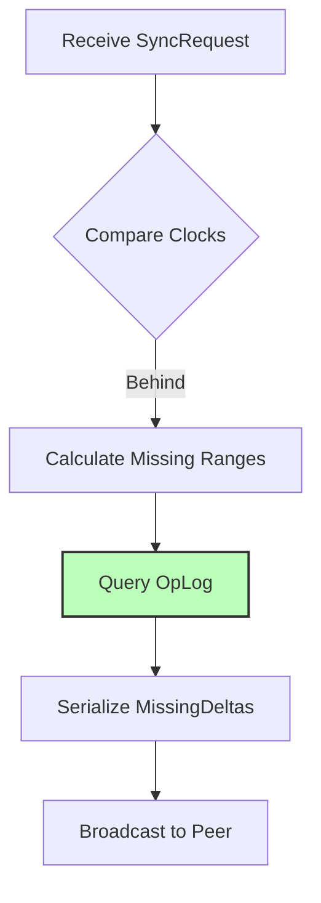

**Query example**:
```sql
-- Peer is missing operations from node 'alice' between 5-10
SELECT operation_blob
FROM operation_log
WHERE node_id = 'alice'
  AND sequence_number BETWEEN 5 AND 10
ORDER BY sequence_number ASC;
```

**Batch limits**: If the gap is too large (>1000 operations?), might be faster to send FullState instead.

### Pruning Strategy

We can't keep operations forever. Three pruning strategies:

#### 1. Time-based Pruning (Simple)

Delete operations older than 24 hours:

```sql
DELETE FROM operation_log
WHERE created_at < (strftime('%s', 'now') - 86400) * 1000;
```

**Pros**: Simple, predictable storage
**Cons**: Peers offline for >24 hours need full resync

#### 2. Vector Clock-based Pruning (Smart)

Only delete operations that **all known peers have seen**:

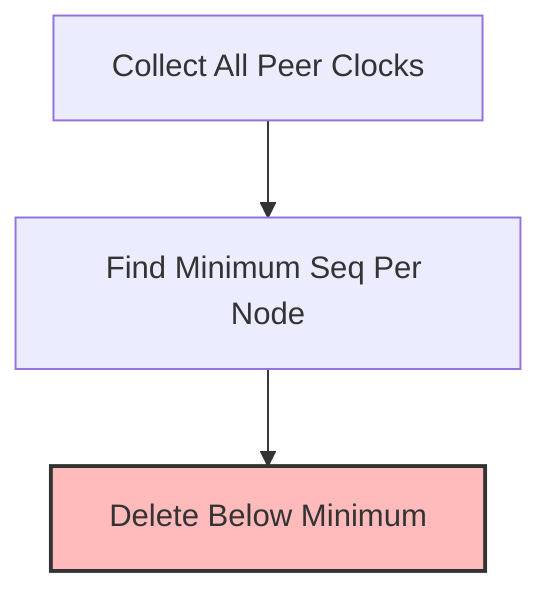

**Example**:
- Alice's clock: `{alice: 100, bob: 50}`
- Bob's clock: `{alice: 80, bob: 60}`
- Minimum: `{alice: 80, bob: 50}`
- Can delete: Alice's ops 1-79, Bob's ops 1-49

**Pros**: Maximally efficient storage
**Cons**: Complex, requires tracking peer clocks

#### 3. Hybrid (Recommended)

- Delete ops older than 24 hours AND seen by all peers
- Keep at least last 1000 operations per node (safety buffer)

```sql
WITH peer_min AS (
    SELECT node_id, MIN(counter) as min_seq
    FROM vector_clock
    GROUP BY node_id
)
DELETE FROM operation_log
WHERE (node_id, sequence_number) IN (
    SELECT ol.node_id, ol.sequence_number
    FROM operation_log ol
    JOIN peer_min pm ON ol.node_id = pm.node_id
    WHERE ol.sequence_number < pm.min_seq
      AND ol.created_at < (strftime('%s', 'now') - 86400) * 1000
      AND ol.sequence_number < (
          SELECT MAX(sequence_number) - 1000
          FROM operation_log ol2
          WHERE ol2.node_id = ol.node_id
      )
);
```

### Operation Log Cleanup Methodology

The cleanup methodology defines **when**, **how**, and **what** to delete while maintaining correctness.

#### Triggering Conditions

Cleanup triggers (whichever comes first):
- **Time-based**: Every 1 hour
- **Storage threshold**: When log exceeds 50 MB
- **Operation count**: When exceeding 100,000 ops
- **Manual trigger**: Via admin API

**Why multiple triggers?**: Different workloads have different patterns. Active sessions hit operation count first, idle sessions hit time first.

#### Cleanup Algorithm

Five-phase process ensures safety:

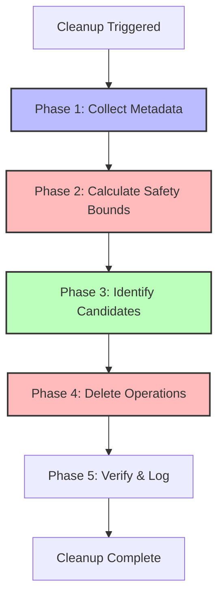

**Phase 1: Collect Metadata** - Query vector clocks, operation stats, peer activity

**Phase 2: Calculate Safety Bounds** - For each node, compute the safe deletion watermark by taking the minimum of:
1. Min sequence number all peers have seen (from vector clock)
2. Operations older than 24 hours
3. Safety buffer (keep last 1000 operations)
4. Active peer protection (keep last 5000 if peer active in last hour)

**Phase 3: Identify Candidates** - Generate deletion query per node based on watermarks

**Phase 4: Delete Operations** - Execute in SQLite transaction with pre/post audit trail

**Phase 5: Verify & Log** - Validate no gaps in sequences, emit metrics

#### Safety Mechanisms

**Dry-run mode**: Preview deletions without executing

**Maximum deletion limit**: Never delete >50% of operations in one run (prevents catastrophic bugs)

**Active peer protection**: Keep more operations for recently active peers (5000 vs 1000)

**Cleanup lock**: Prevent concurrent cleanup runs

**Emergency stop**: Can kill running cleanup mid-execution

#### Scheduling

**Background task**: Low-priority, runs hourly by default

**Adaptive scheduling**: Adjust frequency based on activity rate (30min for high activity, 4 hours for low)

**Time-of-day awareness**: Prefer 2-4 AM for cleanup (low activity period)

#### Key Edge Cases

**Peer rejoins after long absence**: If requested operations were pruned, send FullState instead of deltas

**Cleanup during partition**: Detect partition (no peer contact for >1 hour) and increase safety buffer to 10,000 operations

**Corrupted vector clock**: Validate clock before cleanup; skip if invalid and trigger anti-entropy

**Out of disk space**: Check available space before running (require 100MB minimum)

### Recovery Scenarios

#### Scenario 1: Clean Restart

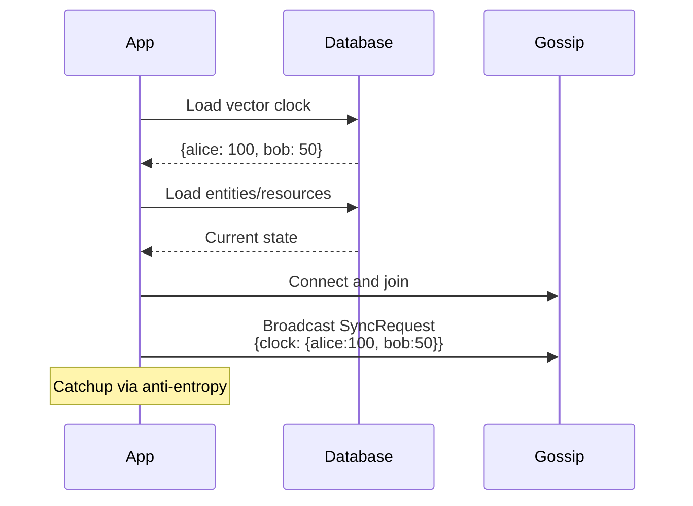

**Key**: We persist the vector clock, so we know exactly where we left off.

#### Scenario 2: Corrupted State

If the database is corrupted but operation log is intact:

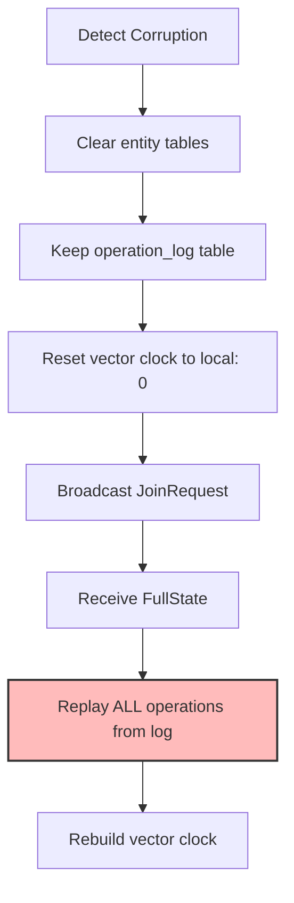

**Replay**:
```sql
SELECT operation_blob
FROM operation_log
ORDER BY node_id, sequence_number ASC;
```

Apply each operation in order. This rebuilds the entire state deterministically.

#### Scenario 3: Network Partition

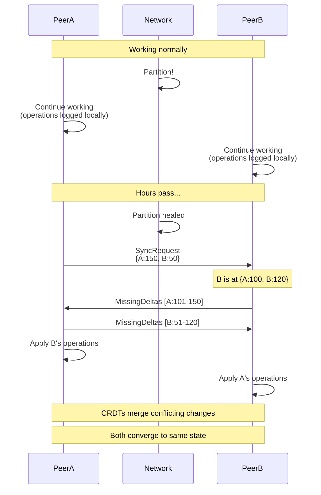

**CRDTs save us**: Even though both peers made conflicting changes, the CRDT merge semantics ensure they converge.

### Storage Estimation

For capacity planning:

**Average operation size**:
- LWW Set: ~100 bytes (component type + value + metadata)
- OR-Set Add: ~80 bytes
- Sequence Insert: ~60 bytes

**Rate estimation** (2 users actively collaborating):
- User actions: ~10 ops/minute
- Total: ~20 ops/minute
- Per hour: 1,200 operations
- 24 hours: 28,800 operations
- Storage: ~2.88 MB per day

**With pruning** (24 hour window): Steady state ~3 MB

**Worst case** (5 users, very active): ~15 MB per day, prune to ~15 MB steady state

### Monitoring

Track these metrics:

```rust
struct OperationLogMetrics {
    total_operations: u64,
    operations_by_node: HashMap<NodeId, u64>,
    oldest_operation_age: Duration,
    total_size_bytes: u64,
    operations_pruned_last_hour: u64,
}
```

**Alerts**:
- Operation log >100 MB (pruning not working?)
- Gap in sequence numbers (missed operations?)
- Oldest operation >48 hours (peer not catching up?)

## Persistence Strategy

Not everything needs to be saved to disk:

**Persistent (SQLite)**:
- Entities and components marked `#[persist(true)]`
- Resources (workspace config, document metadata)
- **Operation log** (detailed above - critical for anti-entropy)
- Vector clock state

**Ephemeral (in-memory only)**:
- Presence updates (who's online)
- Cursor positions
- Selections/highlights
- Components marked `#[persist(false)]`

**Why hybrid?**: Cursors at 60Hz would blow up the database. They're only relevant during the session.

### Database Schema Summary

```sql
-- Entities
CREATE TABLE entities (
    network_id TEXT PRIMARY KEY,
    owner_node_id TEXT NOT NULL,
    created_at INTEGER NOT NULL,
    updated_at INTEGER NOT NULL
);

-- Components (one row per component per entity)
CREATE TABLE components (
    entity_id TEXT NOT NULL,
    component_type TEXT NOT NULL,
    data BLOB NOT NULL,  -- bincode ComponentData
    updated_at INTEGER NOT NULL,
    PRIMARY KEY (entity_id, component_type),
    FOREIGN KEY (entity_id) REFERENCES entities(network_id)
);

-- Resources (global singletons)
CREATE TABLE resources (
    resource_id TEXT PRIMARY KEY,
    resource_type TEXT NOT NULL,
    data BLOB NOT NULL,
    updated_at INTEGER NOT NULL
);

-- Operation log (see detailed schema above)
CREATE TABLE operation_log (...);

-- Vector clock (persisted state)
CREATE TABLE vector_clock (
    node_id TEXT PRIMARY KEY,
    counter INTEGER NOT NULL
);
```

## iroh-gossip Integration

The actual gossip API is simple:

### Setup
```rust
use iroh_gossip::{net::Gossip, proto::TopicId};

// Create gossip instance
let gossip = Gossip::builder().spawn(endpoint);

// Subscribe to topic
let topic = TopicId::from_bytes(*b"global-sync-topic!!!!!");
let handle = gossip.subscribe(topic, bootstrap_peers).await?;
let (sender, receiver) = handle.split();
```

### Broadcast
```rust
let msg = SyncMessage::EntityDelta { /* ... */ };
let bytes = bincode::serialize(&VersionedMessage { version: 1, payload: bincode::serialize(&msg)? })?;

sender.broadcast(bytes.into()).await?;
```

### Receive
```rust
use futures_lite::StreamExt;

while let Some(event) = receiver.next().await {
    match event? {
        Event::Received(msg) => {
            let versioned: VersionedMessage = bincode::deserialize(&msg.content)?;
            let sync_msg: SyncMessage = bincode::deserialize(&versioned.payload)?;
            // Apply to ECS...
        }
        _ => {}
    }
}
```

## Bevy Integration Strategy

**The async problem**: Bevy is sync, gossip is async.

**Solution**: Channel bridge:

```rust
// In async task
let (tx, rx) = mpsc::unbounded_channel();

tokio::spawn(async move {
    while let Some(event) = receiver.next().await {
        // Send to Bevy via channel
        tx.send(event).ok();
    }
});

// In Bevy system
fn poll_gossip_system(
    mut channel: ResMut<GossipChannel>,
    mut events: EventWriter<GossipReceived>,
) {
    while let Ok(msg) = channel.rx.try_recv() {
        events.send(GossipReceived(msg));
    }
}
```

**Change detection**:

```rust
fn broadcast_changes_system(
    query: Query<(&NetworkedEntity, &Transform), Changed<Transform>>,
    gossip_tx: Res<GossipBroadcastChannel>,
    mut vector_clock: ResMut<VectorClock>,
) {
    for (net_entity, transform) in query.iter() {
        vector_clock.increment(&local_node_id);

        let op = ComponentOp::Set {
            component_type: "Transform",
            value: bincode::serialize(transform)?,
            timestamp: Utc::now().timestamp_micros(),
            node_id: local_node_id.clone(),
        };

        let msg = SyncMessage::EntityDelta {
            entity_id: net_entity.network_id,
            component_ops: vec![op],
            vector_clock: vector_clock.clone(),
        };

        gossip_tx.send(msg).ok();
    }
}
```

## Multiplayer Features

### Presence (Who's Online)

**Concept**: Heartbeat every 1 second, 5 second TTL. If we don't hear from someone for 5 seconds, they're gone.

**Why ephemeral**: Presence is only meaningful during the session. No need to persist.

### Cursors (60Hz)

**Challenge**: High frequency, low importance. Can't flood gossip.

**Solution**: Rate limit to 60Hz, send position only (tiny message), ephemeral.

**Rendering**: Spawn a sprite entity per remote peer, update position from cursor messages.

### Selections (What's Selected)

**Challenge**: Multiple people selecting overlapping sets of items.

**Solution**: OR-Set CRDT. Each selection is a set of UUIDs. Merge sets using OR-Set semantics.

**Visual**: Highlight selected items with user's color.

### Drawing (Collaborative Strokes)

**Challenge**: Two people drawing simultaneously, paths interleave.

**Solution**: Each stroke is an entity. Path is a Sequence CRDT. Points get unique IDs with ordering info.

**Result**: Both strokes appear correctly, points stay in order per-stroke.

## Performance Considerations

### Message Batching
Collect changes over 16ms (one frame), send one batched message instead of many tiny ones.

### Rate Limiting
Cursors: max 60Hz
Presence: max 1Hz
Changes: best-effort (as fast as user actions)

### Message Size
iroh-gossip has practical limits (~1MB per message). For large states, chunk them.

## Trade-offs and Decisions

### Why Global Topic, Not Per-Entity?

**Global**: Simpler, works great for 2-5 users, less topic management
**Per-entity**: Scales better, more complex, probably overkill for our use case

**Decision**: Start with global, can shard later if needed.

### Why bincode, Not JSON?

**bincode**: Faster, smaller, type-safe
**JSON**: Human-readable, easier debugging, schema evolution

**Decision**: bincode with version envelope. We can switch encoding later without changing wire protocol (just bump version).

### Why LWW for Simple Fields?

**Alternative**: Operational transforms, per-field CRDTs

**Decision**: LWW is simple and works for most use cases. Timestamp conflicts are rare. For critical data (where "last write wins" isn't good enough), use proper CRDTs.

### Why Operation Log?

**Alternative**: State-based sync only (send full state periodically)

**Decision**: Hybrid - operations for real-time (small), full state for joins (comprehensive), operation log for anti-entropy (reliable).

## Security and Identity

Even for a private, controlled deployment, the protocol must define security boundaries to prevent accidental data corruption and ensure system integrity.

### Authentication: Cryptographic Node Identity

**Problem**: As written, NodeId could be any string. A buggy client or malicious peer could forge messages with another node's ID, corrupting vector clocks and CRDT state.

**Solution**: Use cryptographic identities built into iroh.

```rust
use iroh::NodeId;  // iroh's NodeId is already a cryptographic public key

// Each peer has a keypair
// NodeId is derived from the public key
// All gossip messages are implicitly authenticated by QUIC's transport layer
```

**Key properties**:
- NodeId = public key (or hash thereof)
- iroh-gossip over QUIC already provides message authenticity (peer signatures)
- No additional signing needed - the transport guarantees messages come from the claimed NodeId

**Implementation**: Just use iroh's `NodeId` type consistently instead of `String`.

### Authorization: Session Membership

**Problem**: How do we ensure only authorized peers can join a session and access the data?

**Solution**: Pre-shared topic secret (simplest for 2-5 users).

```rust
// Generate a session secret when creating a new document/workspace
use iroh_gossip::proto::TopicId;
use blake3;

let session_secret = generate_random_bytes(32);  // Share out-of-band
let topic = TopicId::from_bytes(blake3::hash(&session_secret).as_bytes());

// To join, a peer must know the session_secret
// They derive the same TopicId and subscribe
```

**Access control**:
- Secret is shared via invite link, QR code, or manual entry
- Without the secret, you can't derive the TopicId, so you can't join the gossip
- For better UX, encrypt the secret into a shareable URL: `lonni://join/<base64-secret>`

**Revocation**: If someone leaves the session and shouldn't have access:
- Generate a new secret and topic
- Broadcast a "migration" message on the old topic
- All peers move to the new topic
- The revoked peer is left on the old topic (no data flow)

### Encryption: Application-Level Data Protection

**Question**: Is the gossip topic itself private, or could passive observers see it?

**Answer**: iroh-gossip over QUIC is transport-encrypted, but:
- Any peer in the gossip network can see message content
- If you don't trust all peers (or future peers after revocation), add application-level encryption

**Proposal** (for future consideration):
```rust
// Encrypt FullState and EntityDelta messages with session key derived from session_secret
let encrypted_payload = encrypt_aead(
    &session_secret,
    &bincode::serialize(&sync_msg)?
)?;
```

**For v1**: Skip application-level encryption. Transport encryption + topic secret is sufficient for a private, trusted peer group.

### Resource Limits: Preventing Abuse

**Problem**: What if a buggy client creates 100,000 entities or floods with operations?

**Solution**: Rate limiting and quotas.

```rust
struct RateLimits {
    max_entities_per_node: usize,     // Default: 10,000
    max_ops_per_second: usize,         // Default: 100
    max_entity_size_bytes: usize,      // Default: 1 MB
    max_component_count_per_entity: usize,  // Default: 50
}

// When receiving an EntityDelta:
fn apply_delta(&mut self, delta: EntityDelta) -> Result<(), RateLimitError> {
    // Check if this node has exceeded entity quota
    let node_entity_count = self.entities_by_owner(&delta.source_node).count();
    if node_entity_count >= self.limits.max_entities_per_node {
        return Err(RateLimitError::TooManyEntities);
    }

    // Check operation rate (requires tracking ops/sec per node)
    if self.operation_rate_exceeds_limit(&delta.source_node) {
        return Err(RateLimitError::TooManyOperations);
    }

    // Apply the operation...
}
```

**Handling violations**:
- Log a warning
- Ignore the operation (don't apply)
- Optionally: display a warning to the user ("Peer X is sending too many operations")

**Why this works**: CRDTs allow us to safely ignore operations. Other peers will still converge correctly.

## Entity Deletion and Garbage Collection

**Problem**: Without deletion, the dataset grows indefinitely. Users can't remove unwanted entities.

**Solution**: Tombstones (the standard CRDT deletion pattern).

### Deletion Protocol

**Strategy**: Despawn from ECS, keep tombstone in database only.

When an entity is deleted:
1. **Despawn from Bevy's ECS** - The entity is removed from the world entirely using `despawn_recursive()`
2. **Store tombstone in SQLite** - Record the deletion (entity ID, timestamp, node ID) in a `deleted_entities` table
3. **Remove from network map** - Clean up the UUID → Entity mapping
4. **Broadcast deletion operation** - Send a "Deleted" component operation via gossip so other peers delete it too

**Why this works:**
- **Zero footguns**: Deleted entities don't exist in ECS, so queries can't accidentally find them. No need to remember `Without<Deleted>` on every query.
- **Better performance**: ECS doesn't waste time iterating over tombstones during queries.
- **Tombstones live where they belong**: In the persistent database, not cluttering the real-time ECS.

**Receiving deletions from peers:**

When we receive a deletion operation:
1. Check if the entity exists in our ECS (via the network map)
2. If yes: despawn it, record tombstone, remove from map
3. If no: just record the tombstone (peer is catching us up on something we never spawned)

**Receiving operations for deleted entities:**

When we receive an operation for an entity UUID that's not in our ECS map:
1. Check the database for a tombstone
2. If tombstone exists and operation timestamp < deletion timestamp: **Ignore** (stale operation)
3. If tombstone exists and operation timestamp > deletion timestamp: **Resurrection conflict** - log warning, potentially notify user
4. If no tombstone: Spawn the entity normally (we're just learning about it for the first time)

### Garbage Collection: Operation Log Only

**Critical rule**: Never delete entity rows from the database. Only garbage collect their operation log entries.

Tombstones (the `Deleted` component and the entity row) must be kept **forever**. They're tiny (just metadata) and prevent the resurrection problem.

**What gets garbage collected**:
- Operation log entries for deleted entities (once all peers have seen the deletion)
- Blob data referenced by deleted entities (see Blob Garbage Collection section)

**What never gets deleted**:
- Entity rows (even with `Deleted` component)
- The `Deleted` component itself

**Operation log cleanup for deleted entities**:
```sql
-- During operation log cleanup, we CAN delete operations for deleted entities
-- once all peers have acknowledged the deletion
WITH peer_min AS (
    SELECT node_id, MIN(counter) as min_seq
    FROM vector_clock
    GROUP BY node_id
),
deleted_entities AS (
    SELECT e.network_id, e.owner_node_id, c.updated_at as deleted_at
    FROM entities e
    JOIN components c ON e.network_id = c.entity_id
    WHERE c.component_type = 'Deleted'
      AND c.updated_at < (strftime('%s', 'now') - 86400) * 1000  -- Deleted >24h ago
)
DELETE FROM operation_log
WHERE (node_id, sequence_number) IN (
    SELECT ol.node_id, ol.sequence_number
    FROM operation_log ol
    JOIN deleted_entities de ON ol.entity_id = de.network_id
    JOIN peer_min pm ON ol.node_id = pm.node_id
    WHERE ol.sequence_number < pm.min_seq  -- All peers have seen this operation
);
```

**Why keep entity rows forever?**:
- Prevents resurrection conflicts (see next section)
- Tombstone size is negligible (~100 bytes per entity)
- Allows us to detect late operations and handle them correctly

### Edge Case: Resurrection

What if a peer deletes an entity, but a partitioned peer still has the old version?

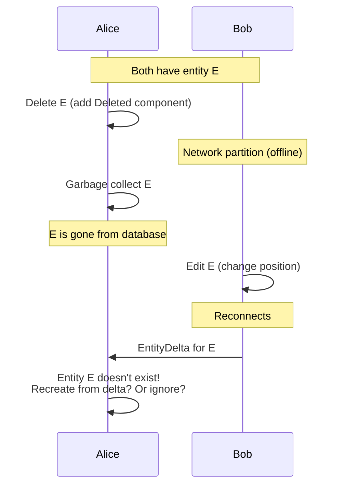

**Solution**: Never garbage collect entities. Only garbage collect their operation log entries. Keep the entity row and the `Deleted` component forever (they're tiny - just metadata).

This way, if a late operation arrives for a deleted entity, we can detect the conflict:
- If `Deleted` timestamp > operation timestamp: Ignore (operation predates deletion)
- If operation timestamp > `Deleted` timestamp: Resurrection! Re-add the entity (or warn the user)

## Large Binary Data

**Problem**: iroh-gossip has practical message size limits (~1MB). Syncing a 5MB image via gossip would saturate the network and fail.

**Solution**: Use iroh-blobs for large binary data, gossip for metadata.

### Two-Tier Architecture

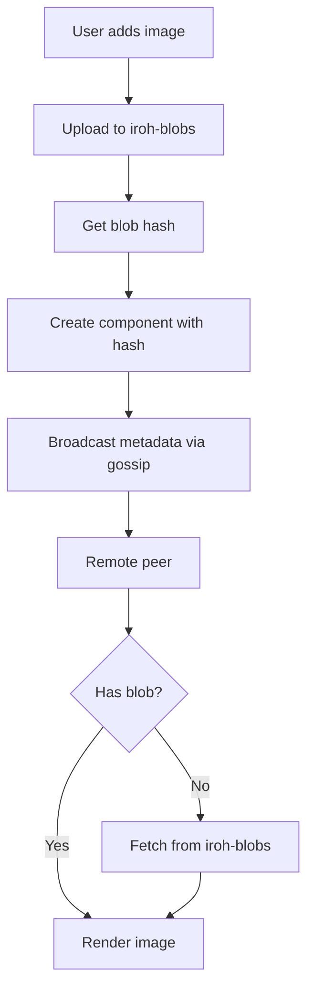

### Protocol

**Adding a large file**:
```rust
// 1. Add blob to iroh-blobs
let hash = blobs.add_bytes(image_data).await?;

// 2. Create a component that references the blob
let image_component = ImageComponent {
    blob_hash: hash.to_string(),
    width: 1024,
    height: 768,
    mime_type: "image/png".to_string(),
};

// 3. Broadcast a tiny metadata operation via gossip
let op = ComponentOp::Set {
    component_type: "Image",
    value: bincode::serialize(&image_component)?,
    timestamp: Utc::now().timestamp_micros(),
    node_id: local_node_id.clone(),
};
```

**Receiving the metadata**:
```rust
// Peer receives the EntityDelta with Image component
async fn apply_image_component(component: ImageComponent) {
    let hash = Hash::from_str(&component.blob_hash)?;

    // Check if we already have the blob
    if !blobs.has(hash).await? {
        // Fetch it from any peer that has it
        blobs.download(hash).await?;
    }

    // Now we can load and render the image
    let image_data = blobs.read_to_bytes(hash).await?;
    // ... render in Bevy
}
```

### Blob Discovery

iroh-blobs has built-in peer discovery and transfer. As long as peers are connected (via gossip or direct connections), they can find and fetch blobs from each other.

**Optimization**: When broadcasting the metadata, include a "providers" list:
```rust
struct ImageComponent {
    blob_hash: String,
    providers: Vec<NodeId>,  // Which peers currently have this blob
    width: u32,
    height: u32,
}
```

This helps peers find the blob faster.

### Threshold

Define a threshold for what goes through blobs vs gossip:

```rust
const MAX_INLINE_SIZE: usize = 64 * 1024;  // 64 KB

fn serialize_component(component: &Component) -> ComponentData {
    let bytes = bincode::serialize(component)?;

    if bytes.len() <= MAX_INLINE_SIZE {
        // Small enough - send inline via gossip
        ComponentData::Inline(bytes)
    } else {
        // Too large - upload to blobs and send hash
        let hash = blobs.add_bytes(&bytes).await?;
        ComponentData::BlobRef(hash)
    }
}
```

### Blob Garbage Collection

**Problem**: When an entity with a blob reference is deleted, the blob becomes orphaned. Without GC, blobs accumulate indefinitely.

**Solution**: Mark-and-sweep garbage collection using vector clock synchronization.

#### How It Works

**Mark Phase** - Scan database for all blob hashes currently referenced by non-deleted entities. Build a `HashSet<BlobHash>` of active blobs.

**Sweep Phase** - List all blobs in iroh-blobs. For each blob not in the active set:
- Check if all peers have seen the deletion (using vector clock + blob_references table)
- Apply 24-hour safety window
- If safe, delete the blob and record bytes freed

**Safety coordination**: The critical challenge is knowing when all peers have seen a blob deletion. We solve this by:
1. Recording blob add/remove events in a `blob_references` table with (node_id, sequence_number)
2. Using vector clock logic: only delete if all peers' sequence numbers exceed the removal operation's sequence
3. Adding a 24-hour time window for additional safety

#### Database Schema

Track blob lifecycle events:

```sql
CREATE TABLE blob_references (
    id INTEGER PRIMARY KEY AUTOINCREMENT,
    blob_hash TEXT NOT NULL,
    entity_id TEXT NOT NULL,
    event_type TEXT NOT NULL,  -- 'added' | 'removed'
    node_id TEXT NOT NULL,
    sequence_number INTEGER NOT NULL,
    timestamp INTEGER NOT NULL
);
```

**Optimization**: Maintain reference counts for efficiency:

```sql
CREATE TABLE blob_refcount (
    blob_hash TEXT PRIMARY KEY,
    ref_count INTEGER NOT NULL DEFAULT 0,
    last_accessed INTEGER NOT NULL,
    total_size_bytes INTEGER NOT NULL
);
```

This avoids full component scans - GC only checks blobs where `ref_count = 0`.

#### Scheduling

Run every 4 hours (less frequent than operation log cleanup, since it's more expensive). Process max 100 blobs per run to avoid blocking.

#### Key Edge Cases

**Offline peer**: Bob is offline. Alice adds and deletes a 50MB blob. GC runs and deletes it. Bob reconnects and gets FullState - no blob reference, no problem.

**Concurrent add/delete**: Alice adds entity E with blob B. Bob deletes E. CRDT resolves to deleted. Both peers have orphaned blob B, which gets cleaned up after the 24-hour safety period.

**Why it works**: Deletion tombstones win (LWW timestamp), and vector clock coordination ensures both peers converge and safely GC the blob.

## Schema Evolution and Data Migration

**Problem**: The version envelope only handles message format changes, not data semantics changes.

### The Challenge

Consider these scenarios:

**Scenario 1: Component Type Change**
```rust
// Version 1
struct Position { x: f32, y: f32 }

// Version 2
struct Transform {
    pos: Vec2,  // Changed from x,y to Vec2
    rot: f32,   // Added rotation
}
```

- v2 client receives v1 `Position` component - can't deserialize
- v1 client receives v2 `Transform` component - can't deserialize

**Scenario 2: Component Removed**
- v2 removes the `Health` component entirely
- v1 clients still send `Health` operations
- v2 clients don't know what to do with them

### Solution: Component Schema Versioning

**Approach 1: Graceful Degradation (Recommended for v1)**

```rust
// Tag each component type with a version
#[derive(Serialize, Deserialize)]
struct ComponentData {
    component_type: String,
    component_version: u32,  // NEW
    data: Vec<u8>,
}

// When receiving a component:
fn deserialize_component(data: ComponentData) -> Result<Component> {
    match (data.component_type.as_str(), data.component_version) {
        ("Transform", 1) => {
            // Deserialize v1
            let pos: Position = bincode::deserialize(&data.data)?;
            // Migrate to v2
            Ok(Component::Transform(Transform {
                pos: Vec2::new(pos.x, pos.y),
                rot: 0.0,  // Default value
            }))
        }
        ("Transform", 2) => {
            // Deserialize v2 directly
            Ok(Component::Transform(bincode::deserialize(&data.data)?))
        }
        (unknown_type, _) => {
            // Component type we don't understand - just skip it
            warn!("Unknown component type: {}", unknown_type);
            Ok(Component::Unknown)
        }
    }
}
```

**Rules**:
- Unknown component types are ignored (not an error)
- Older versions can be migrated forward
- Newer versions send the latest schema
- If an old client receives a new schema it can't understand, it ignores it (graceful degradation)

**Approach 2: Coordinated Upgrades (For Breaking Changes)**

For major changes where compatibility can't be maintained:

1. **Announce migration**: All peers must update within a time window
2. **Migration phase**: New version can read old + new formats
3. **Cutover**: After all peers upgraded, stop supporting old format
4. **Garbage collect**: Clean up old-format data

**For a 2-5 person private app**: Coordinated upgrades are manageable. Just message everyone: "Hey, please update the app to the latest version."

### Handling Unknown Data

```rust
fn apply_component_op(&mut self, op: ComponentOp) {
    match self.component_registry.get(&op.component_type) {
        Some(schema) => {
            // We understand this component - deserialize and apply
            let component = schema.deserialize(&op.value)?;
            self.set_component(component);
        }
        None => {
            // Unknown component - store it opaquely
            // This preserves it for anti-entropy and persistence
            // but we don't render/use it
            self.unknown_components.insert(
                op.component_type.clone(),
                op.value.clone()
            );
        }
    }
}
```

This ensures that even if a peer doesn't understand a component, it still:
- Stores it in the database
- Includes it in FullState responses
- Preserves it in anti-entropy

This prevents data loss when old and new clients coexist.

## Open Questions

1. **Network partitions**: How to handle very long-term partitions (weeks)? Should we have a "reset and resync" UX?
2. **Compaction efficiency**: What's the best heuristic for detecting compactable operations? (e.g., squashing 1000 LWW ops into one)
3. **Conflict UI**: Should users see when CRDTs merged conflicting changes, or is silent convergence better UX?

## Success Criteria

We'll know this is working when:
- [ ] Two peers can draw simultaneously and see each other's strokes
- [ ] Adding/removing items shows correct merged state
- [ ] Presence/cursors update in real-time
- [ ] Disconnecting and reconnecting syncs correctly
- [ ] State persists across restarts
- [ ] No conflicts, no lost data

## Migration Path

1. **Phase 1**: Basic sync with LWW only, in-memory (no persistence)
2. **Phase 2**: Add persistence layer (SQLite)
3. **Phase 3**: Add OR-Set for selections
4. **Phase 4**: Add Sequence CRDT for drawing paths
5. **Phase 5**: Anti-entropy and robustness
6. **Phase 6**: Optimize performance

Each phase builds on the previous, maintains backward compatibility.

## References

- [CRDTs: Consistency without concurrency control](https://arxiv.org/abs/0907.0929) - Shapiro et al.
- [A comprehensive study of CRDTs](https://hal.inria.fr/hal-00932836) - Shapiro et al.
- [iroh documentation](https://docs.rs/iroh)
- [iroh-gossip documentation](https://docs.rs/iroh-gossip)
- [crdts crate](https://docs.rs/crdts) - Rust CRDT implementations
- [Automerge](https://automerge.org/) - JSON CRDT implementation
- [Yjs](https://docs.yjs.dev/) - Shared editing CRDT

## Appendix: Component Operation Types

Just for reference, the operations we'll need:

```rust
enum ComponentOp {
    // LWW: simple set
    Set { component_type: String, value: Vec<u8>, timestamp: i64, node_id: NodeId },

    // OR-Set: add/remove
    SetAdd { component_type: String, element: Vec<u8>, ctx: AddContext },
    SetRemove { component_type: String, element: Vec<u8>, ctx: Vec<AddContext> },

    // Map: update/remove keys
    MapUpdate { component_type: String, key: String, operation: Box<ComponentOp> },
    MapRemove { component_type: String, key: String },

    // Sequence: insert/delete
    SequenceInsert { component_type: String, id: SequenceId, value: Vec<u8> },
    SequenceDelete { component_type: String, id: SequenceId },

    // Counter: increment/decrement
    CounterIncrement { component_type: String, delta: u64, node_id: NodeId },
    CounterDecrement { component_type: String, delta: u64, node_id: NodeId },
}
```

These map directly to the CRDT primitives from the `crdts` library.