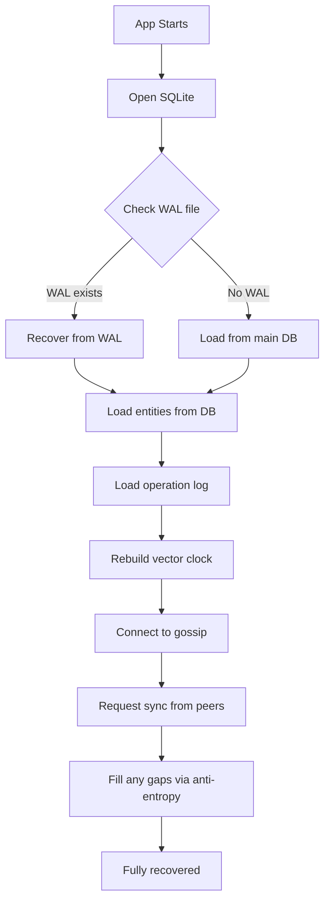

# RFC 0002: Persistence Strategy for Battery-Efficient State Management

**Status:** Implemented
**Authors:** Sienna
**Created:** 2025-11-15
**Related:** RFC 0001 (CRDT Sync Protocol)

## Abstract

This RFC defines a persistence strategy that balances data durability with battery efficiency for mobile platforms (iPad). The core challenge: Bevy runs at 60fps and generates continuous state changes, but we can't write to SQLite on every frame without destroying battery life and flash storage.

## The Problem

**Naive approach (bad)**:
```rust
fn sync_to_db_system(query: Query<&NetworkedEntity, Changed<Transform>>) {
    for entity in query.iter() {
        db.execute("UPDATE components SET data = ? WHERE entity_id = ?", ...)?;
        // This runs 60 times per second!
        // iPad battery: 💀
    }
}
```

**Why this is terrible**:
- SQLite writes trigger `fsync()` syscalls (flush to physical storage)
- Each `fsync()` on iOS can take 5-20ms and drains battery significantly
- At 60fps with multiple entities, we'd be doing hundreds of disk writes per second
- Flash wear: mobile devices have limited write cycles
- User moves object around → hundreds of unnecessary writes of intermediate positions

## Requirements

1. **Survive crashes**: If the app crashes, user shouldn't lose more than a few seconds of work
2. **Battery efficient**: Minimize disk I/O, especially `fsync()` calls
3. **Flash-friendly**: Reduce write amplification on mobile storage
4. **Low latency**: Persistence shouldn't block rendering or input
5. **Recoverable**: On startup, we should be able to reconstruct recent state

## Categorizing Data by Persistence Needs

Not all data is equal. We need to categorize by how critical immediate persistence is:

### Tier 1: Critical State (Persist Immediately)

**What**: State that's hard or impossible to reconstruct if lost
- User-created entities (the fact that they exist)
- Operation log entries (for CRDT sync)
- Vector clock state (for causality tracking)
- Document metadata (name, creation time, etc.)

**Why**: These are the "source of truth" - if we lose them, data is gone

**Strategy**: Write to database within ~1 second of creation, but still batched

### Tier 2: Derived State (Defer and Batch)

**What**: State that can be reconstructed or is constantly changing
- Entity positions during drag operations
- Transform components (position, rotation, scale)
- UI state (selected items, viewport position)
- Temporary drawing strokes in progress

**Why**: These change rapidly and the intermediate states aren't valuable

**Strategy**: Batch writes, flush every 5-10 seconds or on specific events

### Tier 3: Ephemeral State (Never Persist)

**What**: State that only matters during current session
- Remote peer cursors
- Presence indicators (who's online)
- Network connection status
- Frame-rate metrics

**Why**: These are meaningless after restart

**Strategy**: Keep in-memory only (Bevy resources, not components)

## Write Strategy: The Three-Buffer System

We use a three-tier approach to minimize disk writes while maintaining durability:

### Layer 1: In-Memory Dirty Tracking (0ms latency)

Bevy change detection marks components as dirty, but we don't write immediately. Instead, we maintain a dirty set:

```rust
#[derive(Resource)]
struct DirtyEntities {
    // Entities with changes not yet in write buffer
    entities: HashSet<Uuid>,
    components: HashMap<Uuid, HashSet<String>>,  // entity → dirty component types
    last_modified: HashMap<Uuid, Instant>,       // when was it last changed
}
```

**Update frequency**: Every frame (cheap - just memory operations)

### Layer 2: Write Buffer (100ms-1s batching)

Periodically (every 100ms-1s), we collect dirty entities and prepare a write batch:

```rust
#[derive(Resource)]
struct WriteBuffer {
    // Pending writes not yet committed to SQLite
    pending_operations: Vec<PersistenceOp>,
    last_flush: Instant,
}

enum PersistenceOp {
    UpsertEntity { id: Uuid, data: EntityData },
    UpsertComponent { entity_id: Uuid, component_type: String, data: Vec<u8> },
    LogOperation { node_id: NodeId, seq: u64, op: Vec<u8> },
    UpdateVectorClock { node_id: NodeId, counter: u64 },
}
```

**Update frequency**: Every 100ms-1s (configurable based on battery level)

**Strategy**: Accumulate operations in memory, then batch-write them

### Layer 3: SQLite with WAL Mode (5-10s commit interval)

Write buffer is flushed to SQLite, but we don't call `fsync()` immediately. Instead, we use WAL mode and control checkpoint timing:

```sql
-- Enable Write-Ahead Logging
PRAGMA journal_mode = WAL;

-- Don't auto-checkpoint on every transaction
PRAGMA wal_autocheckpoint = 0;

-- Synchronous = NORMAL (fsync WAL on commit, but not every write)
PRAGMA synchronous = NORMAL;
```

**Update frequency**: Manual checkpoints every 5-10 seconds (or on specific events)

## Flush Events: When to Force Persistence

Certain events require immediate persistence (within 1 second):

### 1. Entity Creation
When user creates a new entity, we need to persist its existence quickly:
- Add to write buffer immediately
- Trigger flush within 1 second

### 2. Major User Actions
Actions that represent "savepoints" in user's mental model:
- Finishing a drawing stroke (stroke start → immediate, intermediate points → batched, stroke end → flush)
- Deleting entities
- Changing document metadata
- Undo/redo operations

### 3. Application State Transitions
State changes that might precede app termination:
- App going to background (iOS `applicationWillResignActive`)
- Low memory warning
- User explicitly saving (if we have a save button)
- Switching documents/workspaces

### 4. Network Events
Sync protocol events that need persistence:
- Receiving operation log entries from peers
- Vector clock updates (every 5 operations or 5 seconds, whichever comes first)

### 5. Periodic Background Flush
Even if no major events happen:
- Flush every 10 seconds during active use
- Flush every 30 seconds when idle (no user input for >1 minute)

## Battery-Adaptive Flushing

Different flush strategies based on battery level:

```rust
fn get_flush_interval(battery_level: f32, is_charging: bool) -> Duration {
    if is_charging {
        Duration::from_secs(5)  // Aggressive - power available
    } else if battery_level > 0.5 {
        Duration::from_secs(10)  // Normal
    } else if battery_level > 0.2 {
        Duration::from_secs(30)  // Conservative
    } else {
        Duration::from_secs(60)  // Very conservative - low battery
    }
}
```

**On iOS**: Use `UIDevice.current.batteryLevel` and `UIDevice.current.batteryState`

## SQLite Optimizations for Mobile

### Transaction Batching

Group multiple writes into a single transaction:

```rust
async fn flush_write_buffer(buffer: &WriteBuffer, db: &Connection) -> Result<()> {
    let tx = db.transaction()?;

    // All writes in one transaction
    for op in &buffer.pending_operations {
        match op {
            PersistenceOp::UpsertEntity { id, data } => {
                tx.execute("INSERT OR REPLACE INTO entities (...) VALUES (...)", ...)?;
            }
            PersistenceOp::UpsertComponent { entity_id, component_type, data } => {
                tx.execute("INSERT OR REPLACE INTO components (...) VALUES (...)", ...)?;
            }
            // ...
        }
    }

    tx.commit()?;  // Single fsync for entire batch
}
```

**Impact**: 100 individual writes = 100 fsyncs. 1 transaction with 100 writes = 1 fsync.

### WAL Mode Checkpoint Control

```rust
async fn checkpoint_wal(db: &Connection) -> Result<()> {
    // Manually checkpoint WAL to database file
    db.execute("PRAGMA wal_checkpoint(PASSIVE)", [])?;
}
```

**PASSIVE checkpoint**: Doesn't block readers, syncs when possible
**When to checkpoint**: Every 10 seconds, or when WAL exceeds 1MB

### Index Strategy

Be selective about indexes - they increase write cost:

```sql
-- Only index what we actually query frequently
CREATE INDEX idx_components_entity ON components(entity_id);
CREATE INDEX idx_oplog_node_seq ON operation_log(node_id, sequence_number);

-- DON'T index everything just because we can
-- Every index = extra writes on every INSERT/UPDATE
```

### Page Size Optimization

```sql
-- Larger page size = fewer I/O operations for sequential writes
-- Default is 4KB, but 8KB or 16KB can be better for mobile
PRAGMA page_size = 8192;
```

**Caveat**: Must be set before database is created (or VACUUM to rebuild)

## Recovery Strategy

What happens if app crashes before flush?

### What We Lose

**Worst case**: Up to 10 seconds of component updates (positions, transforms)

**What we DON'T lose**:
- Entity existence (flushed within 1 second of creation)
- Operation log entries (flushed with vector clock updates)
- Any data from before the last checkpoint

### Recovery on Startup



**Key insight**: Even if we lose local state, gossip sync repairs it. Peers send us missing operations.

### Crash Detection

On startup, detect if previous session crashed:

```sql
CREATE TABLE session_state (
    key TEXT PRIMARY KEY,
    value TEXT
);

-- On startup, check if previous session closed cleanly
SELECT value FROM session_state WHERE key = 'clean_shutdown';

-- If not found or 'false', we crashed
-- Trigger recovery procedures
```

## Platform-Specific Concerns

### iOS / iPadOS

**Background app suspension**: iOS aggressively suspends apps. We have ~5 seconds when moving to background:

```rust
// When app moves to background:
fn handle_background_event() {
    // Force immediate flush
    flush_write_buffer().await?;
    checkpoint_wal().await?;

    // Mark clean shutdown
    db.execute("INSERT OR REPLACE INTO session_state VALUES ('clean_shutdown', 'true')", [])?;
}
```

**Low Power Mode**: Detect and reduce flush frequency:
```swift
// iOS-specific detection
if ProcessInfo.processInfo.isLowPowerModeEnabled {
    set_flush_interval(Duration::from_secs(60));
}
```

### Desktop (macOS/Linux/Windows)

More relaxed constraints:
- Battery life less critical on plugged-in desktops
- Can use more aggressive flush intervals (every 5 seconds)
- Larger WAL sizes acceptable (up to 10MB before checkpoint)

## Monitoring & Metrics

Track these metrics to tune persistence:

```rust
struct PersistenceMetrics {
    // Write volume
    total_writes: u64,
    bytes_written: u64,

    // Timing
    flush_count: u64,
    avg_flush_duration: Duration,
    checkpoint_count: u64,
    avg_checkpoint_duration: Duration,

    // WAL health
    wal_size_bytes: u64,
    max_wal_size_bytes: u64,

    // Recovery
    crash_recovery_count: u64,
    clean_shutdown_count: u64,
}
```

**Alerts**:
- Flush duration >50ms (disk might be slow or overloaded)
- WAL size >5MB (checkpoint more frequently)
- Crash recovery rate >10% (need more aggressive flushing)

## Write Coalescing: Deduplication

When the same entity is modified multiple times before flush, we only keep the latest:

```rust
fn add_to_write_buffer(op: PersistenceOp, buffer: &mut WriteBuffer) {
    match op {
        PersistenceOp::UpsertComponent { entity_id, component_type, data } => {
            // Remove any existing pending write for this entity+component
            buffer.pending_operations.retain(|existing_op| {
                !matches!(existing_op,
                    PersistenceOp::UpsertComponent {
                        entity_id: e_id,
                        component_type: c_type,
                        ..
                    } if e_id == &entity_id && c_type == &component_type
                )
            });

            // Add the new one (latest state)
            buffer.pending_operations.push(op);
        }
        // ...
    }
}
```

**Impact**: User drags object for 5 seconds @ 60fps = 300 transform updates → coalesced to 1 write

## Persistence vs Sync: Division of Responsibility

Important distinction:

**Persistence layer** (this RFC):
- Writes to local SQLite
- Optimized for durability and battery life
- Only cares about local state survival

**Sync layer** (RFC 0001):
- Broadcasts operations via gossip
- Maintains operation log for anti-entropy
- Ensures eventual consistency across peers

**Key insight**: These operate independently. An operation can be:
1. Logged to operation log (for sync) - happens immediately
2. Applied to ECS (for rendering) - happens immediately
3. Persisted to SQLite (for durability) - happens on flush schedule

If local state is lost due to delayed flush, sync layer repairs it from peers.

## Configuration Schema

Expose configuration for tuning:

```toml
[persistence]
# Base flush interval (may be adjusted by battery level)
flush_interval_secs = 10

# Max time to defer critical writes (entity creation, etc.)
critical_flush_delay_ms = 1000

# WAL checkpoint interval
checkpoint_interval_secs = 30

# Max WAL size before forced checkpoint
max_wal_size_mb = 5

# Adaptive flushing based on battery
battery_adaptive = true

# Flush intervals per battery tier
[persistence.battery_tiers]
charging = 5
high = 10      # >50%
medium = 30    # 20-50%
low = 60       # <20%

# Platform overrides
[persistence.ios]
background_flush_timeout_secs = 5
low_power_mode_interval_secs = 60
```

## Example System Implementation

```rust
fn persistence_system(
    dirty: Res<DirtyEntities>,
    mut write_buffer: ResMut<WriteBuffer>,
    db: Res<DatabaseConnection>,
    time: Res<Time>,
    battery: Res<BatteryStatus>,
    query: Query<(Entity, &NetworkedEntity, &Transform, &/* other components */)>,
) {
    // Step 1: Check if it's time to collect dirty entities
    let flush_interval = get_flush_interval(battery.level, battery.is_charging);

    if time.elapsed() - write_buffer.last_flush < flush_interval {
        return;  // Not time yet
    }

    // Step 2: Collect dirty entities into write buffer
    for entity_uuid in &dirty.entities {
        if let Some((entity, net_entity, transform, /* ... */)) =
            query.iter().find(|(_, ne, ..)| ne.network_id == *entity_uuid)
        {
            // Serialize component
            let transform_data = bincode::serialize(transform)?;

            // Add to write buffer (coalescing happens here)
            write_buffer.add(PersistenceOp::UpsertComponent {
                entity_id: *entity_uuid,
                component_type: "Transform".to_string(),
                data: transform_data,
            });
        }
    }

    // Step 3: Flush write buffer to SQLite (async, non-blocking)
    if write_buffer.pending_operations.len() > 0 {
        let ops = std::mem::take(&mut write_buffer.pending_operations);

        // Spawn async task to write to SQLite
        spawn_blocking(move || {
            flush_to_sqlite(&ops, &db)
        });

        write_buffer.last_flush = time.elapsed();
    }

    // Step 4: Clear dirty tracking (they're now in write buffer/SQLite)
    dirty.entities.clear();
}
```

## Trade-offs and Decisions

### Why WAL Mode?

**Alternatives**:
- DELETE mode (traditional journaling)
- MEMORY mode (no durability)

**Decision**: WAL mode because:
- Better write concurrency (readers don't block writers)
- Fewer `fsync()` calls (only on checkpoint)
- Better crash recovery (WAL can be replayed)

### Why Not Use a Dirty Flag on Components?

We could mark components with a `#[derive(Dirty)]` flag, but:
- Bevy's `Changed<T>` already gives us change detection for free
- A separate dirty flag adds memory overhead
- We'd need to manually clear flags after persistence

**Decision**: Use Bevy's change detection + our own dirty tracking resource

### Why Not Use a Separate Persistence Thread?

We could run SQLite writes on a dedicated thread:

**Pros**: Never blocks main thread
**Cons**: More complex synchronization, harder to guarantee flush order

**Decision**: Use `spawn_blocking` from async runtime (Tokio). Simpler, good enough.

## Open Questions

1. **Write ordering**: Do we need to guarantee operation log entries are persisted before entity state? Or can they be out of order?
2. **Compression**: Should we compress component data before writing to SQLite? Trade-off: CPU vs I/O
3. **Memory limits**: On iPad with 2GB RAM, how large can the write buffer grow before we force a flush?

## Success Criteria

We'll know this is working when:
- [ ] App can run for 30 minutes with <5% battery drain attributed to persistence
- [ ] Crash recovery loses <10 seconds of work
- [ ] No perceptible frame drops during flush operations
- [ ] SQLite file size grows linearly with user data, not explosively
- [ ] WAL checkpoints complete in <100ms

## Implementation Phases

1. **Phase 1**: Basic in-memory dirty tracking + batched writes
2. **Phase 2**: WAL mode + manual checkpoint control
3. **Phase 3**: Battery-adaptive flushing
4. **Phase 4**: iOS background handling
5. **Phase 5**: Monitoring and tuning based on metrics

## References

- [SQLite WAL Mode](https://www.sqlite.org/wal.html)
- [iOS Background Execution](https://developer.apple.com/documentation/uikit/app_and_environment/scenes/preparing_your_ui_to_run_in_the_background)
- [Bevy Change Detection](https://docs.rs/bevy/latest/bevy/ecs/change_detection/)