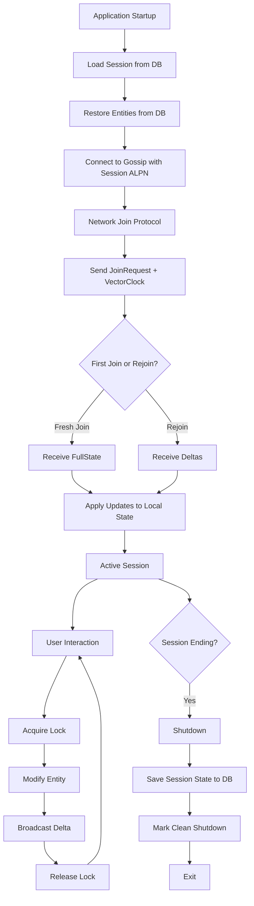
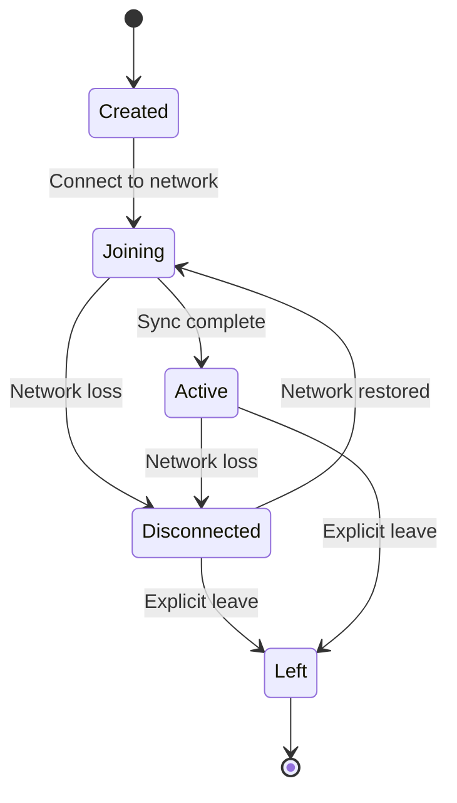
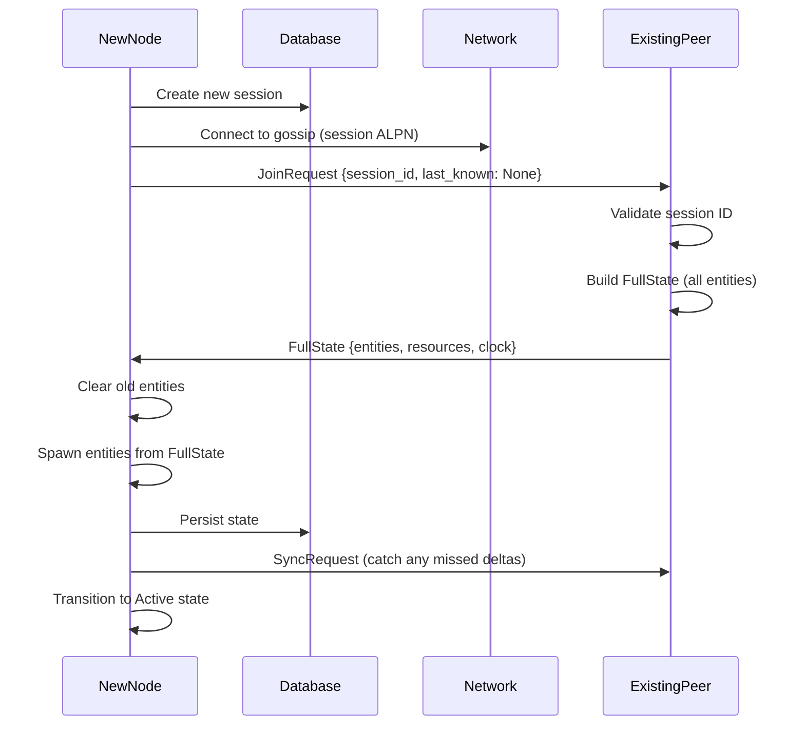
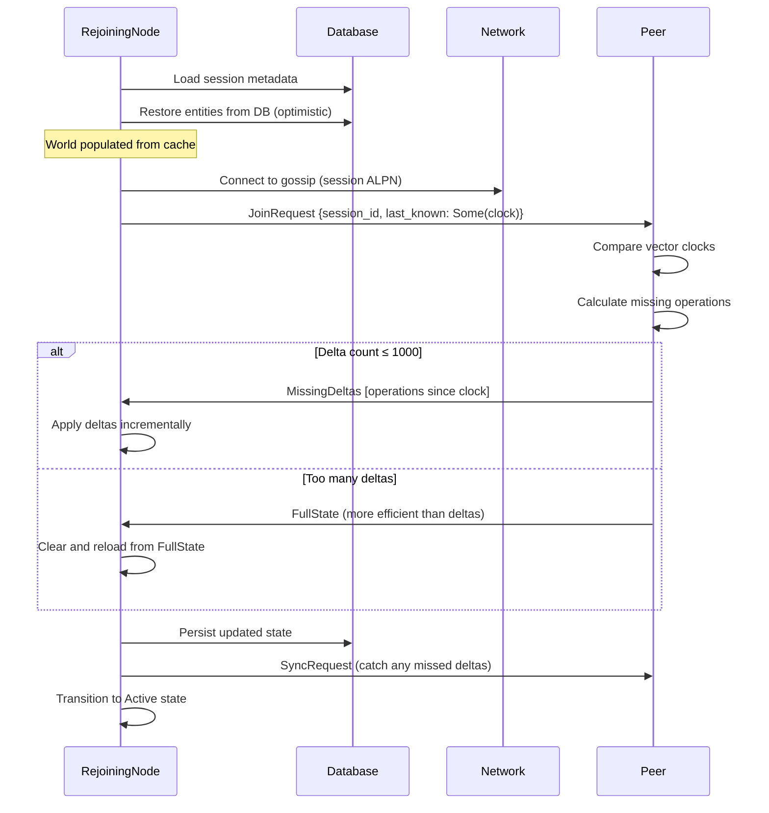
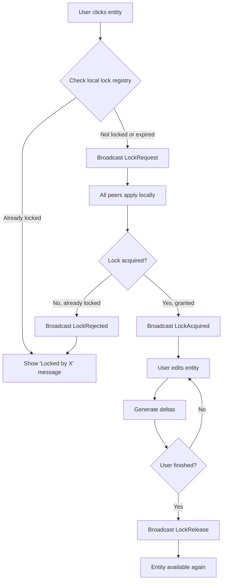
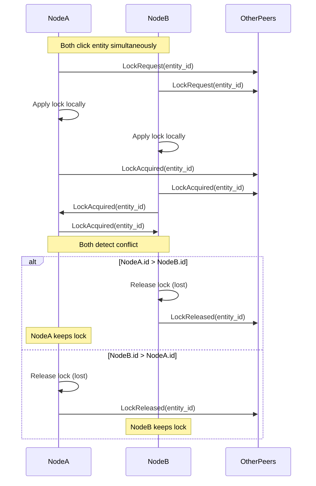

# RFC 0004: Session Lifecycle Management

**Status:** Draft
**Authors:** Sienna
**Created:** 2025-12-11
**Updated:** 2025-12-11

## Abstract

This RFC proposes a session-based lifecycle management system for peer-to-peer collaborative sessions. It introduces explicit session identities, session-scoped network isolation via ALPN, hybrid state restoration combining database persistence with delta synchronization, temporary entity ownership locks to prevent conflicts, and persistent session tracking with automatic rejoin capabilities.

## Motivation

The current architecture supports basic CRDT synchronization across all peers on a global gossip topic, but lacks:

1. **Session Isolation**: All peers share the same global network topic, preventing multiple independent sessions from coexisting
2. **State Management**: No concept of "joining a specific session" vs "creating a new one"
3. **Crash Recovery**: Nodes don't remember which session they were in before shutdown
4. **Entity Conflict Prevention**: Multiple nodes can simultaneously modify the same entity, requiring complex merge logic
5. **Hybrid Sync**: Always sends full state on join, even when rejoining a known session

### Requirements

From user specifications:

1. **Explicit Session IDs** - UUID or human-readable codes that identify unique collaborative sessions (let's do like 6 character abcd123 style so it's easy for humans)
2. **ALPN-based Network Isolation** - Each session gets its own ALPN protocol for gossip isolation (and security)
3. **Hybrid Initial Sync** - Restore from local DB first, then request deltas from peers 
4. **Temporary Lock-based Ownership** - Only one node can modify an entity at a time (prevents conflicts) (but it should be initiator-driven, like i select the cube and move it i don't wait for upstream locking, the lock happens when i "select it" (or whatever))
5. **Persistent Sessions** - Sessions persist to DB and auto-rejoin on restart

## High-Level Architecture

The session lifecycle consists of four major phases: startup, network join, active collaboration, and shutdown. Each phase builds on the previous one to provide seamless session management and state restoration.



## Session Data Model

The session data model defines how collaborative sessions are identified, tracked, and persisted. It consists of three main components: unique session identifiers, session metadata for tracking state, and database schemas for persistence.

### Session Identification

Each collaborative session needs a unique identifier that users can easily share and enter. The design prioritizes human usability while maintaining technical uniqueness and security.

**User-Facing Session Codes**:

Sessions are identified by short, memorable codes in the format `abc-def-123` (9 alphanumeric characters in three groups). This format is:
- **Easy to communicate verbally**: "Join session abc-def-one-two-three"
- **Simple to type**: No confusing characters (0 vs O, 1 vs l)
- **Shareable**: Can be sent via chat, email, or written down

When a user creates a session, they see a code like `xyz-789-mno` that they can share with collaborators. When joining, they simply type this code into a dialog.

**Technical Implementation**:

Behind the scenes, each session code maps to a UUID (Universally Unique Identifier) that provides true global uniqueness. The `SessionId` type handles bidirectional conversion:
- User codes → UUIDs via deterministic hashing
- UUIDs → display codes via formatting

**Network Isolation**:

Each session ID also derives a unique ALPN (Application-Layer Protocol Negotiation) identifier using BLAKE3 hashing. This provides cryptographic isolation at the transport layer - peers in different sessions literally cannot discover or communicate with each other, even if they're on the same local network.

**Key Operations**:
- `SessionId::new()`: Generates a random UUID v4 for new sessions
- `SessionId::from_code(code)`: Parses human-readable codes (format: `xxx-yyy-zzz`) into UUIDs
- `to_code()`: Converts UUID to a 9-character alphanumeric code for display
- `to_alpn()`: Derives a 32-byte ALPN identifier for network isolation

### Session Metadata

Beyond the unique identifier, each session needs metadata to track its lifecycle and state. The `Session` struct captures when the session was created, when it was last active, how many entities it contains, and its current state (created, joining, active, disconnected, or left).

This metadata serves several purposes:
- **Crash recovery**: When the app restarts, we can detect incomplete sessions and decide whether to rejoin
- **UI display**: Show users their recent sessions with entity counts and last access times
- **Network isolation**: Optional session secrets provide a basic authentication layer
- **State machine**: The `SessionState` enum tracks where we are in the session lifecycle

The `CurrentSession` resource represents the active session within the Bevy ECS world. It includes both the session metadata and the vector clock state at the time of joining, which is essential for the hybrid sync protocol.

**Session Structure**:

The `Session` struct contains:
- **id**: Unique `SessionId` identifying this session
- **name**: Optional human-readable label (e.g., "Monday Design Review")
- **created_at**: Timestamp of session creation
- **last_active**: When this node was last active in the session (for auto-rejoin)
- **entity_count**: Cached count of entities (for UI display)
- **state**: Current lifecycle state (see state machine below)
- **secret**: Optional encrypted password for session access control

**Session States**:

Five states track the session lifecycle (see "Session State Transitions" section below for detailed state machine):
- `Created`, `Joining`, `Active`, `Disconnected`, `Left`

The `CurrentSession` Bevy resource wraps the session metadata along with the vector clock captured at join time. This clock snapshot enables the hybrid sync protocol to determine which deltas are needed when rejoining.

### Database Schema

To support persistent sessions, we need to extend the existing database schema with session-aware tables and indexes. The schema changes fall into three categories: session tracking, session membership history, and session-scoping of existing tables.

**Session Tracking**: The `sessions` table stores all session metadata including the session UUID, optional human-readable name, creation and last-active timestamps, entity count cache, current state, and optional encrypted secret. The `idx_sessions_last_active` index enables fast queries for "recent sessions" in the UI.

**Membership History**: The `session_membership` table tracks which nodes have participated in which sessions and when. This provides an audit trail and helps detect cases where a node attempts to rejoin a session it was previously kicked from (future enhancement).

**Session-Scoped Data**: Existing tables (`entities`, `vector_clock`, and `operation_log`) are extended with `session_id` foreign keys. This ensures that:
- Entities are scoped to sessions (prevents accidental cross-session entity leakage)
- Vector clocks are per-session (each session has independent causality tracking)
- Operation logs are per-session (enables efficient delta calculation for rejoins)

The composite indexes ensure that common queries like "get all entities in session X" or "get vector clock for session Y, node Z" remain fast even with thousands of sessions in the database.

```sql
-- Sessions table
CREATE TABLE sessions (
    id BLOB PRIMARY KEY,           -- Session UUID (16 bytes)
    name TEXT,                      -- Optional human-readable name
    created_at INTEGER NOT NULL,   -- Unix timestamp
    last_active INTEGER NOT NULL,  -- Unix timestamp
    entity_count INTEGER NOT NULL DEFAULT 0,
    state TEXT NOT NULL,            -- 'created' | 'joining' | 'active' | 'disconnected' | 'left'
    secret BLOB,                    -- Optional session secret (encrypted)
    UNIQUE(id)
);

-- Index for finding recent sessions
CREATE INDEX idx_sessions_last_active
ON sessions(last_active DESC);

-- Session membership (which node was in which session)
CREATE TABLE session_membership (
    session_id BLOB NOT NULL,
    node_id TEXT NOT NULL,
    joined_at INTEGER NOT NULL,
    left_at INTEGER,                -- NULL if still active
    PRIMARY KEY (session_id, node_id),
    FOREIGN KEY (session_id) REFERENCES sessions(id) ON DELETE CASCADE
);

-- Link entities to sessions
ALTER TABLE entities ADD COLUMN session_id BLOB NOT NULL REFERENCES sessions(id);

-- Index for session-scoped entity queries
CREATE INDEX idx_entities_session
ON entities(session_id);

-- Update vector clock to be session-scoped
ALTER TABLE vector_clock ADD COLUMN session_id BLOB NOT NULL REFERENCES sessions(id);

-- Composite index for session + node lookups
CREATE INDEX idx_vector_clock_session_node
ON vector_clock(session_id, node_id);

-- Update operation log to be session-scoped
ALTER TABLE operation_log ADD COLUMN session_id BLOB NOT NULL REFERENCES sessions(id);

-- Index for session-scoped operation queries
CREATE INDEX idx_operation_log_session
ON operation_log(session_id, node_id, sequence_number);
```

### Session State Transitions

Sessions progress through a well-defined state machine that handles normal operation, network failures, and clean shutdown. The five states capture every phase of a session's lifecycle:

- **Created**: Session exists in database but hasn't connected to the network yet
- **Joining**: Currently attempting to join the network and sync state with peers
- **Active**: Fully synchronized and actively collaborating with peers
- **Disconnected**: Temporarily offline, will attempt to rejoin when network is restored
- **Left**: User explicitly left the session (clean shutdown)

The state machine allows for automatic reconnection after temporary network failures while respecting explicit user actions like leaving a session.



## ALPN-based Network Isolation

### Overview

Instead of using a single global gossip topic, each session gets its own ALPN (Application-Layer Protocol Negotiation) identifier derived from the session ID. This provides true network isolation at the QUIC transport layer: peers in different sessions cannot even discover each other. (this is to protect the players)

### ALPN Derivation

Each session derives a unique ALPN identifier using BLAKE3 cryptographic hashing. The derivation is deterministic - the same session ID always produces the same ALPN - which allows all peers to independently compute the correct ALPN for a session they want to join.

**Derivation Process**:

The ALPN is computed by hashing the session UUID with BLAKE3, using a domain separation prefix (`/app/v1/session-id/`) followed by the session ID bytes. This produces a deterministic 32-byte identifier that all peers independently compute from the same session code.

The design provides several security and isolation guarantees:

- **Cryptographic isolation**: BLAKE3's uniform distribution ensures no ALPN collisions between sessions
- **Protocol versioning**: The `/app/v1/` prefix provides domain separation and version control
- **Forward compatibility**: Future protocol versions use different prefixes (`/app/v2/session-id/`, etc.)
- **Deterministic**: All peers joining session `abc-def-123` independently compute the same ALPN
- **Sufficient entropy**: 32-byte (256-bit) output prevents brute-force session discovery

### Modified Gossip Setup

The gossip network initialization is modified to use session-specific ALPNs instead of a global protocol identifier. This requires configuring the iroh endpoint with the session's derived ALPN and ensuring the router only accepts connections using that ALPN.

**Peer Discovery Strategy**: We use a multi-layered approach to discover peers within a session:

1. **mDNS (Multicast DNS)**: For local network discovery - peers on the same LAN can find each other automatically
2. **Pkarr DNS Discovery**: For Internet-wide discovery - iroh's built-in pkarr-based DNS discovery provides decentralized peer discovery without requiring centralized infrastructure. Pkarr (Public Key Addressable Resource Records) allows peers to publish signed DNS records using their public keys.

The combination ensures both local and remote sessions work seamlessly.

**Initialization Flow**:

The initialization process has three temporal phases:

**One-time Endpoint Setup** (occurs once per application launch):
1. **Endpoint Creation**: Build an iroh `Endpoint` with both mDNS and Pkarr discovery mechanisms enabled
2. **Gossip Protocol**: Spawn the gossip protocol handler using `Gossip::builder().spawn(endpoint)`

**Per-session Connection** (occurs when joining each session):
3. **ALPN Derivation**: Call `session.id.to_alpn()` to compute the 32-byte session-specific ALPN identifier
4. **Router Configuration**: Create a router that only accepts connections on the session's ALPN
   - Critical: Use the derived ALPN, not the default `iroh_gossip::ALPN`
   - This enforces network isolation at the transport layer
5. **Topic Subscription**: Subscribe to a gossip topic derived from the ALPN (can reuse the same bytes)
6. **Join Wait**: Wait up to 2 seconds for the join confirmation
   - Timeout is expected for the first node in a session (no peers yet)
   - Errors are logged but don't prevent continuing

**Background Operation** (runs continuously while session is active):
7. **Bridge Creation**: Create a `GossipBridge` that wraps the gossip channels and provides session context
8. **Task Spawning**: Launch background tasks to forward messages between gossip and application

The key architectural decision is using the same ALPN bytes for both transport-layer connection acceptance and application-layer topic identification. This ensures consistent isolation across both layers.

### Session Discovery

How do peers discover which session to join?

**Primary Method: Manual Entry**

Users manually type the session code into a join dialog. This is the primary and most reliable method:
- Simple and foolproof
- Works across all platforms
- No dependency on clipboard, URL handlers, or QR scanning
- Easy to communicate verbally ("join session abc-def-123")

**Secondary Method: Invite Links**

For convenience, shareable links can encode session information:
```
lonni://join/<session-code>/<optional-secret>

Example: lonni://join/abc-def-ghi/dGVzdHNlY3JldA==
```

These links can be shared via chat, email, or other communication channels. When clicked, they auto-populate the join dialog, but manual entry remains the fallback if URL handling isn't configured.

## Join Protocol (Hybrid Sync)

The join protocol is the mechanism by which a node synchronizes its state when connecting to a session. The protocol is "hybrid" because it intelligently chooses between two strategies based on the node's history with the session.

### Overview

When a node connects to a session, it needs to synchronize its local state with the distributed state maintained by all peers. The naive approach would be to always transfer the complete session state - all entities, components, and resources. However, this is inefficient for nodes that are rejoining a session after a temporary disconnection or app restart.

The hybrid join protocol addresses this by supporting two distinct scenarios:

1. **Fresh Join**: The node is joining this session for the first time and has no local state. The protocol sends a complete snapshot of the entire session state (all entities and components). This is unavoidable for first-time joins but can be bandwidth-intensive.

2. **Rejoin**: The node has previously joined this session and has persistent local state in its database. Instead of transferring the entire state again, the protocol calculates which operations occurred since the node was last active and sends only those deltas. This dramatically reduces bandwidth and latency for reconnection scenarios.

### Extended JoinRequest Message

To enable hybrid sync, the `JoinRequest` message needs to communicate the joining node's state to existing peers. This allows peers to make an intelligent decision about whether to send full state or just deltas.

The key fields are:

- **session_id**: Which session the node wants to join (validates this matches the receiving peer's session)
- **session_secret**: Optional authentication credential (if the session is password-protected)
- **last_known_clock**: The vector clock from when the node was last active in this session. If `None`, this is a fresh join. If `Some`, the node has previous state and only needs updates since that clock.
- **join_type**: Metadata about the join (fresh vs rejoin with entity count) - helps peers optimize their response

Existing peers use this information to decide: "Can I send just deltas, or do I need to send the full state?"

**JoinRequest Message Structure**:

| Field | Type | Purpose |
|-------|------|---------|
| `node_id` | `NodeId` | Identifier of the joining node |
| `session_id` | `SessionId` | Target session UUID |
| `session_secret` | `Option<Vec<u8>>` | Authentication credential if session is password-protected |
| `last_known_clock` | `Option<VectorClock>` | Vector clock from previous participation; `None` indicates fresh join requiring full state |
| `join_type` | `JoinType` | Enum: `Fresh` or `Rejoin { last_active, entity_count }` |

The `last_known_clock` field is the key discriminator: its presence signals that the node has persistent state and only needs deltas, while its absence triggers full state transfer.

### Join Flow: Fresh Join

When a node joins a session for the first time, it has no local state and needs the complete world snapshot. This flow involves:

1. **Local Setup**: Create the session in the local database
2. **Network Connection**: Connect to the gossip network using the session's unique ALPN
3. **Join Request**: Broadcast a `JoinRequest` with `last_known_clock: None` to indicate this is a fresh join
4. **Peer Response**: An existing peer validates the session ID and builds a complete snapshot of all entities and components
5. **State Transfer**: The peer sends a `FullState` message containing the serialized world
6. **Local Application**: The new node deserializes and spawns all entities into its Bevy world
7. **Persistence**: Save the received state to the local database
8. **Final Sync**: Request any deltas that may have occurred during the transfer
9. **Active**: Transition to the active state

This ensures that fresh joins receive a complete, consistent snapshot of the session state.



### Join Flow: Rejoin (Hybrid Sync)

The rejoin flow is optimized for the common case where a node is reconnecting to a session it was previously part of. This happens frequently: app restarts, temporary network disconnections, or laptop sleep/wake cycles.

The key insight is that the node already has most of the session state in its local database. Instead of downloading everything again, it can:

1. **Optimistic Restore**: Load the session and all entities from the local database immediately - the world appears instantly
2. **Clock Comparison**: Send the vector clock from when it last left the session
3. **Delta Calculation**: The peer compares vector clocks and calculates which operations are missing
4. **Incremental Sync**: If the delta count is reasonable (<1000 operations), send only those deltas
5. **Fallback**: If too many deltas accumulated (e.g., node was offline for days), fall back to sending full state
6. **Apply Updates**: Incrementally apply the deltas to bring the world up to date
7. **Final Catchup**: Request any additional deltas that arrived during the sync

This hybrid approach provides several critical advantages:

- **Instant UI**: The world appears immediately from database cache, no loading screen
- **Bandwidth Efficiency**: Only 10-50 KB of deltas instead of 1+ MB full state transfer
- **Lower Latency**: Rejoins complete in under 2 seconds instead of 5-10 seconds
- **Graceful Degradation**: Automatically falls back to full sync if needed
- **Progressive Refinement**: The UI shows cached state immediately, then updates as deltas arrive



### Join Handler Implementation

The join handler is a Bevy system that runs on existing peers and responds to incoming `JoinRequest` messages. Its responsibility is to decide whether to send full state or deltas based on the joining node's vector clock.

**Message Processing Loop**:

The system polls the gossip bridge for incoming messages and filters for `JoinRequest` messages. For each request, it performs a multi-stage validation and response pipeline:

**Stage 1: Security Validation**

1. **Session ID Check**: Verify the request is for the current session
   - Mismatched session IDs are logged and rejected
   - Prevents cross-session message pollution
2. **Secret Validation**: If the session has a secret, validate the provided credential
   - Uses constant-time comparison via `validate_session_secret()`
   - Rejects requests with invalid or missing secrets

**Stage 2: Delta Feasibility Analysis**

The handler examines the `join_type` and `last_known_clock` fields:

- **Fresh Join** (`join_type: Fresh` or `last_known_clock: None`):
  - Always send `FullState` - no other option available
  - Call `build_full_state_for_session()` to serialize all entities and components

- **Rejoin** (`join_type: Rejoin` with `last_known_clock: Some(clock)`):
  - Query operation log: `get_all_operations_newer_than(their_clock)`
  - Count missing operations
  - If count ≤ 1000: Send `MissingDeltas` message with operation list
  - If count > 1000: Send `FullState` instead (more efficient than 1000+ small messages)

**Stage 3: Response Transmission**

Send the constructed response message (`FullState` or `MissingDeltas`) over the gossip bridge. Log errors if transmission fails.

**Design Rationale**:

The 1000-operation threshold is a heuristic based on message overhead: below this, individual delta messages are smaller than a full world snapshot. Above it, the cost of serializing and transmitting 1000+ small messages exceeds the cost of sending one large snapshot. This threshold can be tuned based on profiling.

## Temporary Lock-based Ownership

While CRDTs provide automatic conflict resolution for concurrent edits, they can produce unexpected results when users perform complex, multi-step operations. Consider a user rotating and scaling a 3D object - if another user starts editing the same object mid-operation, the CRDT merge could produce a bizarre intermediate state that neither user intended.

Temporary locks solve this by providing **optimistic, short-lived exclusive access** to entities during active editing. The lock model is intentionally simple and user-driven: when a user selects or begins editing an entity, their client immediately requests a lock. If granted, they have exclusive edit rights for a few seconds. If another user already holds the lock, the request is denied and the user sees visual feedback (e.g., the object is grayed out or shows "locked by Alice").

### Overview

To prevent CRDT conflicts on complex operations (e.g., multi-step drawing, entity transformations), we introduce **temporary exclusive locks** on entities. Only the node holding the lock can modify the entity.

**Design Principles:**
- **Initiator-driven**: Locks are requested immediately when user interaction begins (e.g., clicking an object), not after waiting for server approval
- **Optimistic**: The local client assumes the lock will succeed and allows immediate interaction; conflicts are resolved asynchronously
- **Temporary**: Locks auto-expire after 5 seconds to prevent orphaned locks from crashed nodes
- **Advisory**: Locks are checked before delta generation, but the underlying CRDT still handles conflicts if locks fail
- **Deterministic conflict resolution**: When two nodes request the same lock simultaneously, the higher node ID wins
- **Auto-release**: Disconnected nodes automatically lose all their locks

**Note**: The 5-second lock timeout is fixed in the initial implementation. Future versions may make this configurable per-entity-type or per-session based on UX requirements.

### Lock State Model

The lock system is implemented as a simple in-memory registry that tracks which entities are currently locked and by whom. Each lock contains:
- **Entity ID**: Which entity is locked
- **Holder**: Which node owns the lock
- **Acquisition timestamp**: When the lock was acquired
- **Timeout duration**: How long until auto-expiry (5 seconds)

The `EntityLockRegistry` resource maintains a HashMap of entity ID to lock state, plus an acquisition history queue for rate limiting.

**Lock Acquisition Logic**:

When a node requests a lock, the registry performs several checks:

1. **Existing lock check**: Is this entity already locked?
   - If locked by the requesting node: refresh the timeout and succeed
   - If locked by another node and not expired: reject with `AlreadyLocked` error
   - If locked but expired: proceed to acquire

2. **Rate limiting**: Has this node acquired more than 10 locks in the last second?
   - If yes: reject with `RateLimited` error
   - If no: proceed to acquire

3. **Grant lock**: Create lock entry, add to registry, record acquisition time

If all checks pass, the lock is granted and broadcasted to all peers via a `LockAcquired` message. All peers apply the lock to their local registry, ensuring everyone sees a consistent view of which entities are locked.

**Lock Release Logic**:

When a lock is released - either explicitly by the user (e.g., deselecting an object) or automatically via timeout - a `LockReleased` message is broadcast to all peers. The registry validates that the releasing node actually holds the lock, then removes it from the HashMap. This broadcast-on-release pattern prevents scenarios where one peer thinks an entity is locked while others think it's free.

**Automatic Cleanup**:

A periodic Bevy system runs every second to scan the registry and remove expired locks. This ensures that crashed nodes don't leave orphaned locks indefinitely - after 5 seconds, any lock automatically becomes available again.

The registry also maintains a rolling 60-second history of lock acquisitions for rate limit calculations, pruning old entries to prevent unbounded memory growth.

### Lock Protocol Messages

The lock protocol uses five message types broadcast over the gossip network:

**LockRequest**: Initiates a lock acquisition attempt
- Includes entity ID, requesting node ID, desired timeout, and optional debug reason
- Broadcast to all peers when user begins editing

**LockAcquired**: Confirms successful lock acquisition
- Contains entity ID, holder node ID, and expiration timestamp
- All peers update their local registry to reflect the new lock

**LockRejected**: Indicates lock acquisition failed
- Specifies which entity, who requested it, who currently holds it, and why it failed
- Sent when entity is already locked or rate limit exceeded

**LockRelease**: Explicitly releases a held lock
- Contains entity ID and releasing node ID
- Broadcast when user finishes editing (e.g., deselects object)

**LockReleased**: Confirms lock was released
- Notifies all peers the entity is now available
- All peers remove the lock from their local registry

### Lock Acquisition Flow

The lock acquisition flow is optimistic and user-driven. When a user clicks on an entity to begin editing (e.g., selecting a cube to move it), the client immediately:

1. **Local Check**: Consult the local lock registry - is this entity already locked?
2. **Optimistic Request**: If not locked (or lock expired), immediately broadcast a `LockRequest` to all peers
3. **Peer Application**: All peers (including the requester) apply the lock locally
4. **Grant or Reject**: Each peer validates the lock in their registry:
   - If successful: Broadcast `LockAcquired` confirmation
   - If failed (already locked by someone else): Broadcast `LockRejected` with reason
5. **User Feedback**: Show the user whether they got the lock (enable editing) or didn't (show "locked by Alice")
6. **Edit Phase**: While holding the lock, user can freely modify the entity and generate deltas
7. **Explicit Release**: When done editing (e.g., deselecting), broadcast `LockRelease` to free the entity

The flow is designed for responsiveness - users see immediate feedback rather than waiting for server round-trips.



### Conflict Resolution

**Scenario**: Two nodes request the same lock simultaneously

The most interesting edge case occurs when two users click the same entity at nearly the same time. Due to network latency, both nodes might broadcast `LockRequest` messages before receiving the other's request. This creates a race condition that must be resolved deterministically.

**Resolution Strategy**: Deterministic tiebreaker using node ID comparison

The resolution protocol works as follows:

1. **Optimistic Locking**: Both Node A and Node B broadcast `LockRequest` for the same entity
2. **Local Application**: Both nodes apply the lock locally (optimistic assumption it will succeed)
3. **Broadcast Confirmation**: Both nodes broadcast `LockAcquired`
4. **Conflict Detection**: When Node A receives Node B's `LockAcquired`, it detects a conflict
5. **Deterministic Resolution**: Compare node IDs - the higher node ID wins, the lower releases
6. **Convergence**: The losing node broadcasts `LockReleased`, and the system converges to a single lock holder

This approach is:
- **Deterministic**: All peers reach the same conclusion about who holds the lock
- **Fair**: Neither node has priority; it's based on random UUIDs
- **Fast**: Conflicts resolve in one round-trip (detect conflict → release)
- **No central authority**: Peers coordinate via gossip without requiring a master



**Implementation Notes**:

When a node receives a `LockAcquired` message for an entity it also just acquired, it detects the conflict and compares node IDs:
- **Higher node ID**: Keep the lock, ignore the conflict
- **Lower node ID**: Release the lock after a short timeout (100ms) and broadcast `LockReleased`

The brief timeout allows both nodes to detect the conflict before either releases. Without this delay, nodes might race to release, potentially leaving the entity unlocked. The 100ms window ensures both sides see the conflict before the loser releases, guaranteeing exactly one lock holder remains.

This approach provides fast, deterministic convergence without requiring additional coordination rounds or central authority.

### Integration with Change Detection

Locks integrate with Bevy's change detection system to prevent unauthorized modifications. The delta generation system checks the lock registry before broadcasting entity changes:

**Lock Check on Component Changes**:

When a Bevy component changes (detected via `Changed<Transform>` queries), the delta generation system:

1. **Queries changed entities**: Iterate through all networked entities with modified components
2. **Lock validation**: For each changed entity, check `lock_registry.is_locked_by(entity_id, our_node_id)`
3. **Decision**:
   - If we hold the lock: serialize the component change and broadcast an `EntityDelta` message
   - If we don't hold the lock: log a warning and skip delta generation (local change only, not synchronized)

This enforcement ensures that only the lock holder can propagate changes to peers. If a buggy client or edge case causes a component to change without holding the lock, the change remains local and doesn't corrupt the distributed state.

The advisory nature of locks means the underlying CRDT can still handle conflicts if lock enforcement fails, providing defense in depth.

## Persistence Integration

Session lifecycle management requires tight integration with the persistence layer to support automatic rejoin after crashes or restarts. The persistence systems handle three critical responsibilities:

1. **Session Discovery**: On startup, check if there's a previous session to rejoin
2. **State Restoration**: Load session metadata, entities, and vector clocks from the database
3. **Clean Shutdown**: Save current session state before exit

The integration is implemented through Bevy systems that run at specific lifecycle events: startup, shutdown, and periodic checkpoints.

### Session Lifecycle Systems

The session lifecycle is managed through two primary Bevy systems: one for initialization on startup, and one for persisting state on shutdown.

**Startup: `initialize_session_system`**

On application startup, this system queries the database for the most recent active session:

1. **Session Discovery**: Query `sessions` table ordered by `last_active DESC` to find the most recent session
2. **Decision Point**:
   - If a session exists: Resume it (enables automatic rejoin after crashes)
   - If no session exists: Create a new session with a random UUID and default state
3. **Vector Clock Loading**: Load the session's vector clock from the database, or initialize an empty clock for new sessions
4. **Resource Initialization**: Insert `CurrentSession` resource containing session metadata and the saved vector clock

This enables crash recovery - if the app crashes and restarts, it automatically resumes the previous session and rejoins the network.

**Shutdown: `save_session_state_system`**

On clean shutdown, this system persists the current session state:

1. **Update Metadata**: Set `last_active` timestamp, count current entities, mark state as `Left`
2. **Save Session**: Write session metadata to the `sessions` table using `INSERT OR REPLACE`
3. **Save Vector Clock**: Transaction-based save that clears old clock entries and inserts current state for all known nodes

The vector clock save uses a transaction to ensure atomic updates - either all clock entries are saved, or none are. This prevents partial clock states that could cause sync issues on rejoin.

### Database Operations

The persistence layer provides several key database operations:

**Session Queries**:
- `get_last_active_session()`: Queries the most recent session by `last_active DESC`, returns `Option<Session>`
- `save_session()`: Upserts session metadata using `INSERT OR REPLACE`, persisting all session fields

**Vector Clock Persistence**:
- `load_session_vector_clock()`: Queries all `node_id`/`counter` pairs for a session, rebuilding the HashMap
- `save_session_vector_clock()`: Transactional save that deletes old entries then inserts current clock state

All operations use parameterized queries to prevent SQL injection and handle optional fields (like `name` and `secret`) correctly. Session IDs are stored as 16-byte BLOBs for efficiency.

## Implementation Roadmap

### Documentation Standards

All public APIs should follow Rust documentation conventions with comprehensive docstrings. Expected format:

```rust
/// Derives a session-specific ALPN identifier for network isolation.
///
/// This function computes a deterministic 32-byte BLAKE3 hash from the session ID,
/// using a domain separation prefix to prevent collisions with other protocol uses.
/// All peers independently compute the same ALPN from a given session code, enabling
/// decentralized coordination without a central authority.
///
/// # Arguments
/// * `session_id` - The unique session identifier
///
/// # Returns
/// A 32-byte BLAKE3 hash suitable for use as an ALPN protocol identifier
///
/// # Example
/// ```
/// let session = SessionId::new();
/// let alpn = derive_alpn_from_session(&session);
/// assert_eq!(alpn.len(), 32);
/// ```
///
/// # Security
/// The domain separation prefix (`/app/v1/session-id/`) ensures ALPNs cannot
/// collide with other protocol uses of the same hash space.
pub fn derive_alpn_from_session(session_id: &SessionId) -> [u8; 32]
```

Key documentation elements:
- **Summary**: One-line description of purpose
- **Detailed explanation**: How it works and why
- **Arguments**: All parameters with types and descriptions
- **Returns**: What the function produces
- **Examples**: Working code demonstrating usage
- **Panics/Errors**: Document failure conditions
- **Security/Safety**: Highlight security-critical behavior

### Phase 1: Session Data Model & Persistence
- Create `SessionId`, `Session`, `SessionState` types
- Add database schema migration
- Implement session persistence (save/load)
- Add `CurrentSession` resource

**Critical files:**
- NEW: `crates/lib/src/networking/session.rs`
- MODIFY: `crates/lib/src/persistence/database.rs`
- NEW: `crates/lib/src/persistence/migrations/004_sessions.sql`

### Phase 2: ALPN Network Isolation
- Implement `SessionId::to_alpn()` derivation
- Modify gossip setup to use session-specific ALPN
- Update router configuration
- Test session isolation (two sessions can't see each other)

**Critical files:**
- MODIFY: `crates/app/src/setup.rs`
- MODIFY: `crates/lib/src/networking/session.rs`

### Phase 3: Hybrid Join Protocol
- Extend `JoinRequest` with `last_known_clock` and `join_type`
- Implement fresh join flow
- Implement rejoin flow with delta sync
- Add delta size threshold logic

**Critical files:**
- NEW: `crates/lib/src/networking/join_protocol.rs`
- MODIFY: `crates/lib/src/networking/messages.rs`
- MODIFY: `crates/lib/src/networking/operation_log.rs`

### Phase 4: Entity Lock System
- Create `EntityLock`, `EntityLockRegistry` types
- Add lock protocol messages
- Implement lock acquisition/release/timeout
- Add conflict resolution
- Integrate with change detection

**Critical files:**
- NEW: `crates/lib/src/networking/locks.rs`
- MODIFY: `crates/lib/src/networking/messages.rs`
- MODIFY: `crates/lib/src/networking/delta_generation.rs`
- MODIFY: `crates/lib/src/networking/plugin.rs`

### Phase 5: Auto-Rejoin on Restart
- Implement session load on startup
- Test crash recovery → auto-rejoin
- Verify vector clock restoration
- Handle edge case: session no longer exists

**Critical files:**
- MODIFY: `crates/app/src/main.rs`
- NEW: `crates/lib/src/persistence/session_persistence.rs`

## Edge Cases and Failure Modes

### 1. Session No Longer Exists
**Scenario**: Node tries to rejoin a session that no peers are in anymore.

**Handling**:
- JoinRequest times out (no response after 5 seconds)
- Offer user choice: "Create new session" or "Join different session"
- Clean up orphaned session from database

### 2. Clock Divergence Too Large
**Scenario**: Node rejoins after weeks, vector clock gap is massive.

**Handling**:
- Peer detects: delta count > 1000 operations
- Send FullState instead of deltas
- Node clears local state and reloads from FullState

### 3. Concurrent Lock Requests
**Scenario**: Two nodes request same entity lock within milliseconds.

**Handling**:
- Both apply lock locally (optimistic)
- On receiving peer's LockAcquired, compare node IDs
- Lower node ID releases and broadcasts LockReleased
- Deterministic convergence (higher node ID wins)

### 4. Lock Holder Crashes
**Scenario**: Node A acquires lock, then crashes without releasing.

**Handling**:
- 5-second timeout expires automatically
- Other nodes can acquire lock after timeout
- No special crash detection needed

### 5. Network Partition During Lock
**Scenario**: Network partitions while node holds lock.

**Handling**:
- Both partitions think they have lock (acceptable during partition)
- On partition heal, CRDT merge semantics resolve conflicts
- Vector clock + LWW determines final state
- Locks are advisory (CRDTs provide safety net)

**Convergence Behavior**:

When the partition heals, the gossip protocol reconnects and nodes exchange their full state. The CRDT merge process happens automatically:
1. Vector clocks from both partitions are compared
2. Operations with concurrent clocks are merged using Last-Write-Wins (LWW) based on timestamps
3. The final state reflects the operation with the highest timestamp
4. Convergence typically completes within 1-2 seconds after reconnection

**UX Implications**:

Users in the "losing" partition may see their changes overridden. To minimize surprise:
- Visual indicator shows when the app is disconnected (yellow/orange connection status)
- On reconnection, entities that changed display a brief animation/highlight
- A notification shows "Reconnected - syncing changes" with entity count
- Changes made during disconnection that were overridden could be logged for potential manual recovery (future enhancement)

The system prioritizes consistency over preserving every edit during splits, which is acceptable for collaborative creative work where real-time coordination is expected.

## Security Considerations

Security in a peer-to-peer collaborative environment requires careful balance between usability and protection. This RFC addresses two primary security concerns: session access control and protocol integrity.

### Session Secret Validation

Session secrets provide optional password-based access control. When a session is created with a secret, any peer attempting to join must provide the matching secret in their `JoinRequest`. The validation uses constant-time comparison to prevent timing attacks that could leak information about the secret.

The secret is hashed using BLAKE3 before comparison, ensuring that:
- Secrets are never transmitted in plaintext
- Timing analysis cannot reveal secret length or content
- Fast validation (BLAKE3 is extremely performant)

The validation function uses the `subtle` crate's `ConstantTimeEq` trait to perform constant-time comparison of the hashed secrets, preventing timing-based attacks that could leak information about the secret.

### Rate Limiting

To prevent abuse and buggy clients from monopolizing resources, the lock system implements two rate limits:

1. **Total Locks per Node**: Maximum 100 concurrent locks per node
   - Prevents a single node from locking every entity in the session
   - Ensures entities remain available for other participants

2. **Acquisition Rate**: Maximum 10 lock requests per second per node
   - Prevents rapid lock spamming attacks
   - Tracked via a rolling 60-second acquisition history queue
   - Old entries are pruned to prevent memory growth

When a rate limit is exceeded, the lock request returns a `LockError::RateLimited` error. The requesting node's UI should display appropriate feedback to the user.

## Performance Considerations

### Database Indexing

```sql
-- Fast session lookup by last active
CREATE INDEX idx_sessions_last_active ON sessions(last_active DESC);

-- Fast entity lookup by session
CREATE INDEX idx_entities_session ON entities(session_id);

-- Fast vector clock lookup
CREATE INDEX idx_vector_clock_session_node ON vector_clock(session_id, node_id);

-- Fast operation log queries
CREATE INDEX idx_operation_log_session ON operation_log(session_id, node_id, sequence_number);
```

### Memory Usage
- Lock Registry: O(num_locked_entities) - typically <100 locks
- Session Metadata: O(1) - single active session
- Vector Clock per Session: O(num_peers) - typically 2-5 entries

### Network Bandwidth

**Rejoin Optimization**:
- Delta transfer: ~10 KB (100 operations @ 100 bytes each) - most common case for rejoins
- Full state transfer: ~1 MB - for fresh joins or large deltas

**Streaming Full State Transfer**:

For full state transfers, instead of building and sending the entire world as a single monolithic message, we stream entities incrementally:

1. **Entity Count Header**: Send the total count of networked entities first (`FullStateHeader { total_entities: 1500 }`)
2. **Streaming Entities**: Send entities in batches of 50-100, each as a separate message
3. **Progress Tracking**: The receiving node knows exactly how many entities to expect and can display a progress meter ("Syncing: 450/1500 entities")
4. **Progressive Rendering**: Entities appear in the world as they arrive, rather than waiting for the entire transfer
5. **Interruptibility**: If the connection drops mid-transfer, the node knows which entities are missing and can request them specifically

This streaming approach provides several UX benefits:
- **Visual feedback**: Users see the world populate gradually instead of staring at a blank screen
- **Perceived performance**: The UI feels responsive even during large transfers
- **Early interaction**: Users can start interacting with entities that have already loaded
- **Bandwidth monitoring**: Progress meter shows transfer is active and not stalled

The 100x bandwidth improvement for delta-based rejoins remains the primary optimization, but streaming ensures fresh joins also have good UX.

**Implementation Notes**:

Several implementation details are deferred to Phase 3 (Hybrid Join Protocol):
- **Dependency Ordering**: Entities with parent-child relationships or component references will be sorted before streaming to ensure dependencies arrive before dependents
- **Message Size Limits**: Batch size (50-100 entities) will be dynamically adjusted based on average entity serialization size to stay under QUIC message size limits (~1 MB)
- **Retry Mechanism**: Missing entity ranges are tracked and can be requested via `RequestMissingEntities { start_index, end_index }` if gaps are detected
- **Cancellation**: If the user abandons the join before completion, in-flight batches are discarded and the partial state is cleared

## Testing Strategy

### Unit Tests
- `test_session_alpn_derivation()` - Verify deterministic ALPN generation
- `test_lock_timeout()` - Verify locks expire after 5 seconds
- `test_lock_conflict_resolution()` - Verify deterministic tiebreaker
- `test_session_persistence()` - Verify save/load session
- `test_vector_clock_restoration()` - Verify clock persists per session

### Integration Tests
- `test_session_isolation()` - Two sessions can't see each other's messages
- `test_hybrid_rejoin_flow()` - Node rejoins and receives only deltas
- `test_fresh_join_flow()` - Node joins for first time, receives FullState
- `test_lock_acquisition()` - Node acquires lock, others see rejection
- `test_concurrent_lock_conflict()` - Two nodes request same lock, higher ID wins
- `test_auto_rejoin_after_crash()` - Node restarts, auto-rejoins last session

### Performance Tests
- Rejoin bandwidth: <50 KB (vs >1 MB for full sync)
- Rejoin latency: <2 seconds
- Lock acquisition latency: <100ms
- 60 FPS maintained with 100 active locks

## Success Criteria

- [ ] Two sessions run simultaneously without interference
- [ ] Node rejoins session in <2 seconds after restart
- [ ] Entity locks prevent concurrent modifications
- [ ] Bandwidth for rejoin is <50 KB
- [ ] Lock conflicts resolved deterministically
- [ ] Session persists across app restarts
- [ ] 60 FPS with 100 locked entities
- [ ] Crash recovery restores session correctly

## Future Enhancements

### Session UI/UX with egui (Tech Demo)

For the initial technical demonstration, implement a basic session management UI using egui:

**Create/Join Session Dialog**:
- Text input for session code (6-character format: `abc-def-123`)
- Optional password field for session secret
- "Create New Session" button (generates random session ID)
- "Join Existing Session" button (validates code format)
- Display current session code prominently once connected

**Session Status Panel**:
- Current session code (large, copyable text)
- Connection status indicator (Created → Joining → Active)
- Peer count ("2 peers connected")
- Sync progress bar (for initial join showing "Syncing: 450/1500 entities")
- Entity count in session

**Lock Feedback**:
- Visual indicator on locked entities (outline color, glow effect)
- Tooltip showing "Locked by Alice" when hovering over locked entities
- Your own locks shown in a different color (e.g., green vs. red for others)
- Lock acquisition feedback ("Lock acquired" / "Already locked by Bob")

**Session List** (startup screen):
- Recent sessions with metadata (name, last active, entity count)
- "Resume" button for quick rejoin
- "Delete" button to remove old sessions

This minimal UI provides enough functionality to demonstrate and test the session lifecycle features without building a full application interface.

### Phase 6: Session Invites
- Generate shareable invite links
- QR code support for mobile
- Time-limited invites

### Phase 7: Session Migration
- Merge two sessions
- Split session (fork)
- Export/import session data

### Phase 8: Advanced Lock Modes
- Read/write locks (multiple readers, single writer)
- Lock priorities
- Lock queuing

### Phase 9: Session Discovery
- LAN session browsing (mDNS)
- Recent sessions list
- Session search by name

## References

- RFC 0001: CRDT Gossip Sync (foundation)
- RFC 0002: Persistence Strategy (database layer)
- iroh documentation: https://docs.rs/iroh
- ALPN specification: RFC 7301
