# RFC: Agent Simulation Architecture

**Status:** Draft
**Author:** Sienna
**Date:** December 2024
**Scope:** NPC behavior, lifecycle, scheduling, world interaction

---

## 1. Overview

Aspen simulates a small village of up to 500 inhabitants—people, animals, vehicles, buildings—all living their lives in real-time. There's no pause button, no fast-forward. Time flows, and everyone in it flows with it.

The village baker wakes before dawn, walks to work, bakes bread, serves customers, takes lunch with her spouse, and returns home in the evening. When she catches a cold, she stays home; her apprentice covers the shop. When her child starts school, her mornings shift. When her mother ages and needs care, her priorities change again. These aren't scripted events—they emerge from simple rules about how people, places, and relationships interact.

This RFC describes how that emergence happens.

### 1.1 The Challenge

We want Dwarf Fortress depth on iPad hardware. That means:

- **500 entities existing simultaneously**, each with position, state, and history
- **No teleportation**—everyone is always somewhere, moving through space
- **Real-time simulation** with no pausing, running alongside heavy graphics
- **Emergent behavior** from generic rules, not hand-coded special cases
- **Multiplayer synchronization** across 2-4 peers with no central server

The solution is to separate concerns by **temporal scale**. Not everything changes at the same rate. A villager's life stage changes yearly; their daily schedule changes daily; their moment-to-moment actions change in real-time. By layering these concerns, we can update slow things slowly and fast things only when necessary.

### 1.2 Design Principles

**Generic composition over special cases.** The same systems that make a baker bake should make a cat groom, a car rust, and a building decay. We build primitives (needs, lifecycles, capabilities) and compose them differently for different entities.

**Emergence over authorship.** We build generic rules and let interactions emerge—including ones we never anticipated. The famous Dwarf Fortress "cat death bug" illustrates this perfectly: Toady One never wrote code for cats dying from alcohol. He wrote "substances exist on surfaces," "contact transfers substances to body parts," "grooming consumes substances," and "alcohol is toxic scaled by body mass." A player spilled beer in a tavern. Cats walked through it, groomed their paws, and died of alcohol poisoning. It was a *bug*—but it emerged inevitably from correct generic systems. That's the power of emergence: the simulation does things you never explicitly designed, because the rules are true enough to combine in unexpected ways.

**Consequences without failure.** Life has texture—sickness disrupts plans, relationships strain, businesses struggle. But there are no game-over states. A sick baker means the apprentice steps up, the spouse brings soup, the schedule adapts. The simulation bends; it doesn't break.

**Existence is cheap; cognition is expensive.** Every entity is always somewhere, always moving, always present in the world. But only a few need to *think* at any moment. We do level-of-detail on minds, not bodies.

### 1.3 Key Abstractions

Several concepts recur throughout the architecture:

| Abstraction | What It Is | Why It Matters |
|-------------|-----------|----------------|
| **Life Arc** | State machine of major life stages | Defines what's *possible* for an entity right now |
| **Schedule Authority** | Who controls an entity's time | Children don't set their own bedtime |
| **Institution** | Shared context coordinating multiple entities | The bakery coordinates its workers without them talking |
| **Condition** | Temporary modifier affecting all layers | Sickness changes schedule, capabilities, behavior, and spreads through substrate |
| **Relationship** | Emergent bond enabling coordination | Spouses can have dinner together without negotiating in real-time |

---

## 2. The Four-Layer Architecture

The simulation operates across four layers, each running at a different timescale. Higher layers constrain lower layers: your life arc determines what schedules are possible; your schedule determines what behaviors are appropriate; your behaviors interact with the substrate.

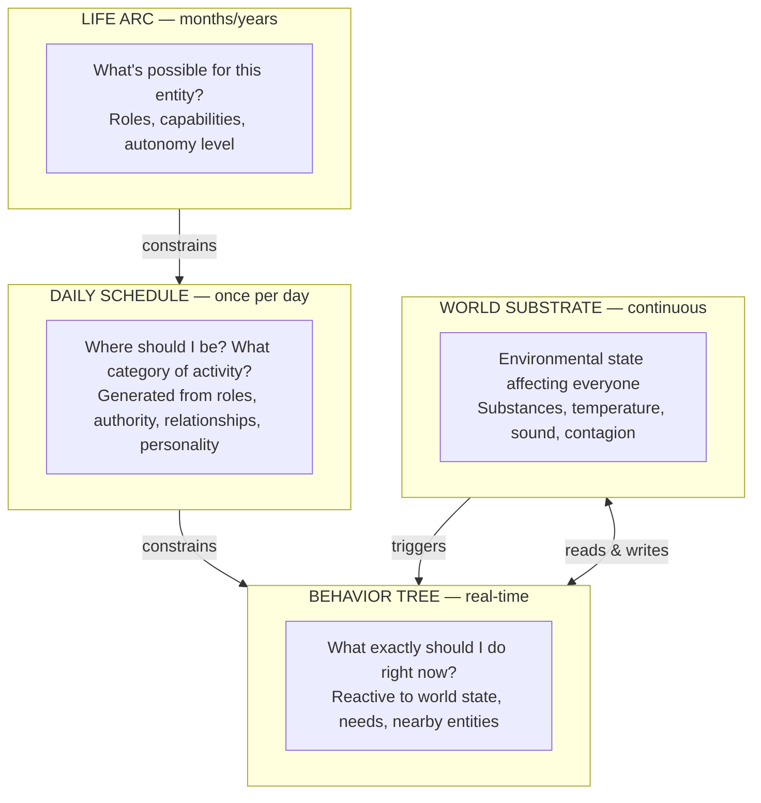
```mermaid
flowchart TB
    subgraph arc["LIFE ARC — months/years"]
        ARC_DESC["What's possible for this entity?<br/>Roles, capabilities, autonomy level"]
    end

    subgraph sched["DAILY SCHEDULE — once per day"]
        SCHED_DESC["Where should I be? What category of activity?<br/>Generated from roles, authority, relationships, personality"]
    end

    subgraph bt["BEHAVIOR TREE — real-time"]
        BT_DESC["What exactly should I do right now?<br/>Reactive to world state, needs, nearby entities"]
    end

    subgraph sub["WORLD SUBSTRATE — continuous"]
        SUB_DESC["Environmental state affecting everyone<br/>Substances, temperature, sound, contagion"]
    end

    arc --> |"constrains"| sched
    sched --> |"constrains"| bt
    bt <--> |"reads & writes"| sub
    sub --> |"triggers"| bt
```

Think of it as nested contexts. Martha's life arc says "you're an adult, partnered, working as a baker." That context generates her schedule: "5am wake, 6am-2pm work, 6pm dinner with spouse." The schedule context activates her work behavior tree: "customers waiting? serve them. Stock low? bake more." Her actions affect the substrate (oven heats up, flour gets on floor), and the substrate affects her back (smoke from burned bread triggers coughing).

### 2.1 Life Arc

The life arc is a state machine representing major life stages. It changes rarely—on birthdays, marriages, deaths, career changes—and when it does, the whole entity transforms. New roles become available; old ones close off. The child who couldn't hold a job becomes an adolescent who can apprentice becomes an adult who can master a craft.

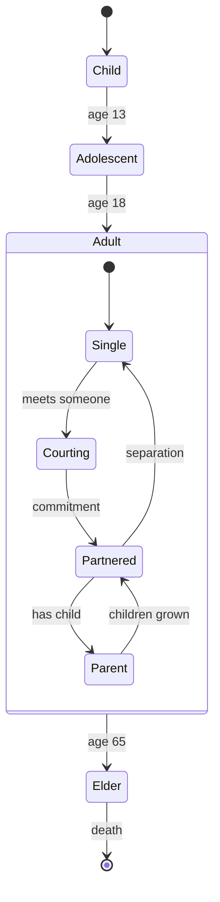
```mermaid
stateDiagram-v2
    [*] --> Child
    Child --> Adolescent: age 13
    Adolescent --> Adult: age 18
    Adult --> Elder: age 65
    Elder --> [*]: death

    state Adult {
        [*] --> Single
        Single --> Courting: meets someone
        Courting --> Partnered: commitment
        Partnered --> Parent: has child
        Parent --> Partnered: children grown
        Partnered --> Single: separation
    }
```

But life arcs aren't just for people. The same abstraction applies to anything that changes state over time:

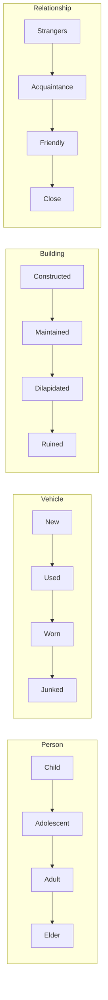
```mermaid
flowchart LR
    subgraph person["Person"]
        P1[Child] --> P2[Adolescent] --> P3[Adult] --> P4[Elder]
    end

    subgraph vehicle["Vehicle"]
        V1[New] --> V2[Used] --> V3[Worn] --> V4[Junked]
    end

    subgraph building["Building"]
        B1[Constructed] --> B2[Maintained] --> B3[Dilapidated] --> B4[Ruined]
    end

    subgraph relationship["Relationship"]
        R1[Strangers] --> R2[Acquaintance] --> R3[Friendly] --> R4[Close]
    end
```

The life arc is the slowest-changing layer, but it's also the most consequential. When Martha's life arc transitions from "Adult/Single" to "Adult/Partnered," her whole world shifts: new shared commitments appear in her schedule, new behaviors unlock (care for partner), new needs emerge (intimacy, coordination). One state change ripples through every other layer.

#### Autonomy Gradient

One critical thing the life arc controls is **autonomy**—who has authority over this entity's time and decisions.

| Life Stage | Schedule Authority | Range | Commerce | Can Refuse? |
|------------|-------------------|-------|----------|-------------|
| Child (0-12) | External (parents/school) | Near home | No | No |
| Adolescent (13-17) | Partial (school imposed, leisure self-directed) | Wider | Limited | Yes, with conflict |
| Adult (18+) | Autonomous (self-directed) | Unlimited | Full | N/A |

A child doesn't generate their own schedule—their parents and school do. They have blocks of free time, but bedtime isn't negotiable. An adolescent gains more control, can refuse (though refusal has consequences), and has a wider range of independent movement. Adults are fully autonomous, though they may *commit* their time to employers, partners, and children.

This autonomy gradient is how children work in the simulation: not as special-cased entities, but as regular entities whose life arc state grants limited autonomy.

### 2.2 Daily Schedule

Each game-day morning, entities generate (or receive) a schedule: a timeline of where to be and what broad category of activity to do. The schedule doesn't specify exact actions—"bake sourdough at 7:15am"—but rather activity blocks: "Work at Bakery, 6am-2pm."


```mermaid
gantt
    title Martha's Daily Schedule (Baker)
    dateFormat HH:mm
    axisFormat %H:%M

    section Home
    Wake & Routine    :05:00, 30m
    Breakfast         :05:30, 15m

    section Commute
    Walk to Bakery    :05:45, 15m

    section Bakery
    Work              :06:00, 120m
    Break             :08:00, 30m
    Work              :08:30, 330m

    section Commute
    Walk Home         :14:00, 15m

    section Home
    Lunch             :14:15, 45m
    Leisure           :15:00, 180m
    Dinner w/ Spouse  :18:00, 60m
    Evening           :19:00, 180m
    Sleep             :22:00, 420m
```

Compare this to a child's schedule, which is largely *imposed* rather than generated:


```mermaid
gantt
    title Tommy's Daily Schedule (Child, age 8)
    dateFormat HH:mm
    axisFormat %H:%M

    section Home (Parent-Imposed)
    Wake              :07:00, 30m
    Breakfast         :07:30, 30m

    section Commute
    Walk to School    :08:00, 30m

    section School (Institution-Imposed)
    Morning Classes   :08:30, 210m
    Lunch             :12:00, 30m
    Afternoon Classes :12:30, 150m

    section Commute
    Walk Home         :15:00, 30m

    section Home
    Free Play (SELF)  :15:30, 150m
    Dinner            :18:00, 60m
    Homework/Evening  :19:00, 90m
    Bedtime Routine   :20:30, 30m
    Sleep             :21:00, 600m
```

Tommy's schedule has one self-directed block: Free Play. Everything else comes from parents (wake time, meals, bedtime) or institutions (school). His behavior tree only runs freely during that 2.5-hour window; the rest of the time, he's following externally-imposed activities.

#### Schedule Authority

Who generates or imposes the schedule depends on the entity's **schedule authority**, which flows from their life arc and relationships:

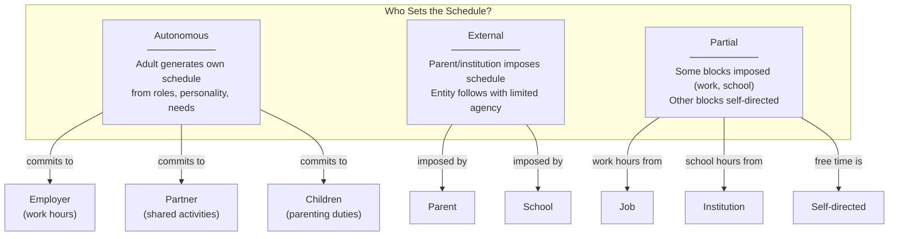
```mermaid
flowchart TB
    subgraph authority["Who Sets the Schedule?"]
        AUT["Autonomous<br/>──────────<br/>Adult generates own schedule<br/>from roles, personality, needs"]

        EXT["External<br/>──────────<br/>Parent/institution imposes schedule<br/>Entity follows with limited agency"]

        PART["Partial<br/>──────────<br/>Some blocks imposed (work, school)<br/>Other blocks self-directed"]
    end

    AUT --> |"commits to"| EMPLOYER["Employer<br/>(work hours)"]
    AUT --> |"commits to"| PARTNER["Partner<br/>(shared activities)"]
    AUT --> |"commits to"| CHILDREN["Children<br/>(parenting duties)"]

    EXT --> |"imposed by"| PARENT["Parent"]
    EXT --> |"imposed by"| SCHOOL["School"]

    PART --> |"work hours from"| JOB["Job"]
    PART --> |"school hours from"| INST["Institution"]
    PART --> |"free time is"| SELF["Self-directed"]
```

An adult with a job has **partial** authority: their employer claims certain hours, but evenings and weekends are autonomous. An adult with a partner has autonomous authority but **shared commitments** that appear in both schedules (dinner together, date night).

#### Shared Commitments

When entities have relationships, they can form commitments that appear in both schedules without real-time negotiation:

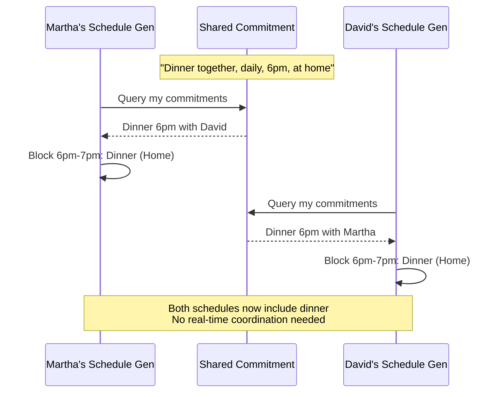
```mermaid
sequenceDiagram
    participant M as Martha's Schedule Gen
    participant C as Shared Commitment
    participant D as David's Schedule Gen

    Note over C: "Dinner together, daily, 6pm, at home"

    M->>C: Query my commitments
    C-->>M: Dinner 6pm with David
    M->>M: Block 6pm-7pm: Dinner (Home)

    D->>C: Query my commitments
    C-->>D: Dinner 6pm with Martha
    D->>D: Block 6pm-7pm: Dinner (Home)

    Note over M,D: Both schedules now include dinner<br/>No real-time coordination needed
```

The commitment was established earlier (when the relationship reached sufficient depth) and now it simply *exists* in the schedule data. Both entities will be at the same place at the same time doing the same activity—not because they negotiated, but because they both read from the same shared commitment.

### 2.3 Behavior Tree

When the schedule says "Work," what does that actually mean? The behavior tree answers: "Given that I'm at work, and given the current state of the world, what exactly should I do right now?"

The behavior tree is a reactive decision-making system. It evaluates conditions (customers waiting? batch in progress? needs urgent?) and selects appropriate actions. Unlike schedules, which are generated once per day, behavior trees tick continuously for nearby entities.

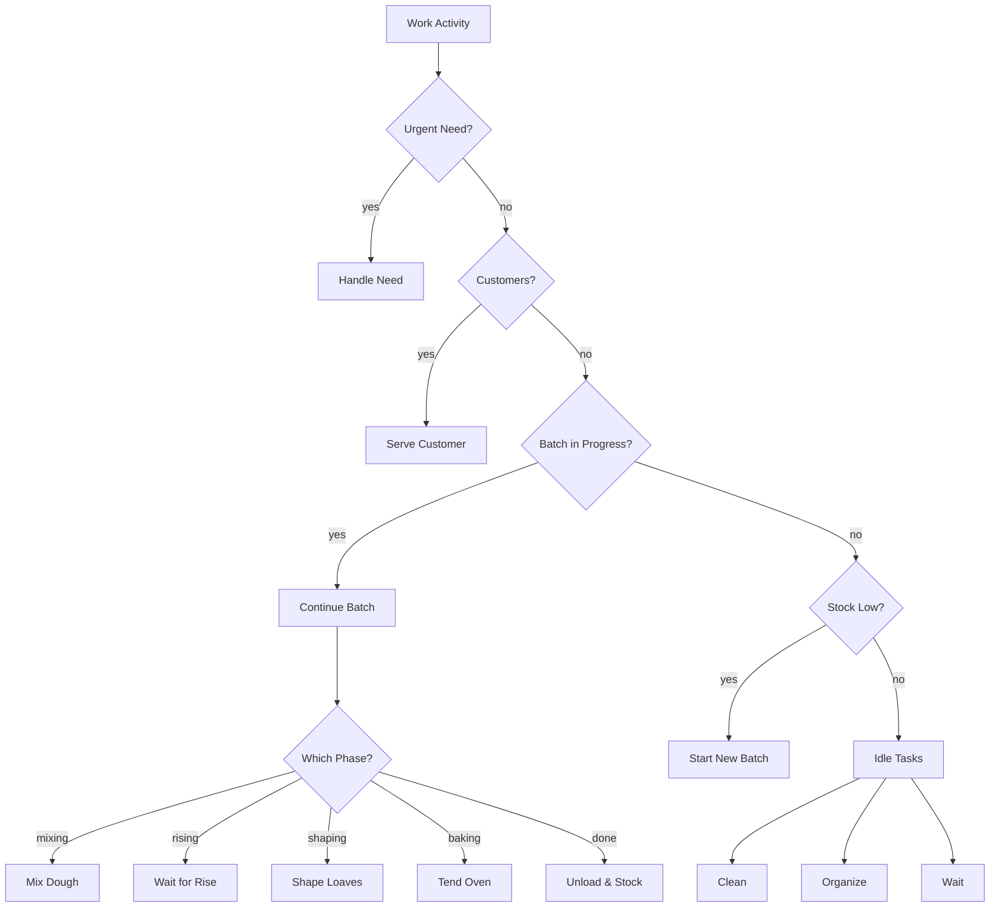
```mermaid
flowchart TB
    ROOT[Work Activity] --> URGENT{Urgent Need?}
    URGENT -->|yes| HANDLE[Handle Need]
    URGENT -->|no| CUST{Customers?}

    CUST -->|yes| SERVE[Serve Customer]
    CUST -->|no| BATCH{Batch in Progress?}

    BATCH -->|yes| CONTINUE[Continue Batch]
    BATCH -->|no| STOCK{Stock Low?}

    STOCK -->|yes| START[Start New Batch]
    STOCK -->|no| IDLE[Idle Tasks]

    CONTINUE --> PHASE{Which Phase?}
    PHASE -->|mixing| MIX[Mix Dough]
    PHASE -->|rising| WAIT[Wait for Rise]
    PHASE -->|shaping| SHAPE[Shape Loaves]
    PHASE -->|baking| TEND[Tend Oven]
    PHASE -->|done| UNLOAD[Unload & Stock]

    IDLE --> CLEAN[Clean]
    IDLE --> ORGANIZE[Organize]
    IDLE --> WANDER[Wait]
```

Martha's behavior tree doesn't know it's 7:23am or that she's been working for 83 minutes. It only knows: "I'm in a Work activity block. There's a batch rising. No customers. My needs are fine." From those inputs, it selects: "Wait for rise to complete."

The schedule says *where* and *when*. The behavior tree says *what* and *how*.

#### Conditions Modify Behavior

When Martha has the flu, her behavior tree still runs—but its priorities shift. A **condition** is a temporary modifier that affects how the tree evaluates:

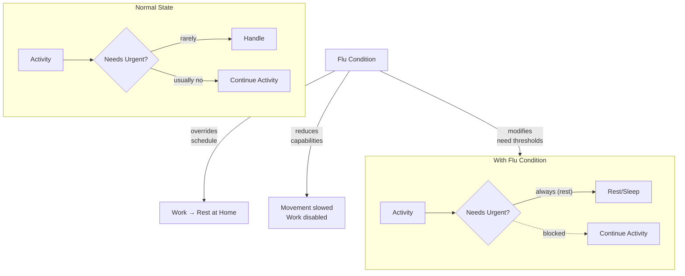
```mermaid
flowchart TB
    subgraph normal["Normal State"]
        N_ROOT[Activity] --> N_NEEDS{Needs Urgent?}
        N_NEEDS -->|rarely| N_HANDLE[Handle]
        N_NEEDS -->|usually no| N_WORK[Continue Activity]
    end

    subgraph sick["With Flu Condition"]
        S_ROOT[Activity] --> S_NEEDS{Needs Urgent?}
        S_NEEDS -->|"always (rest)"| S_HANDLE[Rest/Sleep]
        S_NEEDS -.->|blocked| S_WORK[Continue Activity]
    end

    FLU[Flu Condition] -->|"modifies<br/>need thresholds"| sick
    FLU -->|"overrides<br/>schedule"| SCHED[Work → Rest at Home]
    FLU -->|"reduces<br/>capabilities"| CAP[Movement slowed<br/>Work disabled]
```

The flu doesn't require special-case code in Martha's behavior tree. It's a condition that:
- Overrides her schedule (Work blocks become Rest at Home blocks)
- Modifies her need thresholds (Rest need is always "urgent")
- Reduces her capabilities (can't do Work actions, movement slowed)

Her BT runs the same logic, but with different inputs, it produces different outputs: stay in bed, sleep, accept soup from spouse.

### 2.4 World Substrate

The bottom layer is the world itself: physical space filled with substances, temperatures, sounds, smells, and other environmental state. The substrate doesn't belong to any entity—it's shared context that affects everyone passing through.

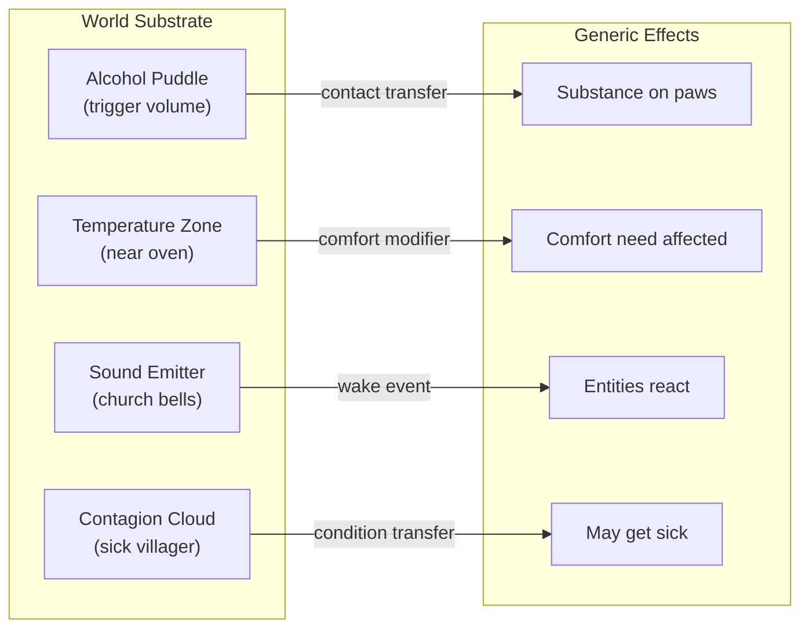
```mermaid
flowchart LR
    subgraph substrate["World Substrate"]
        PUDDLE["Alcohol Puddle<br/>(trigger volume)"]
        TEMP["Temperature Zone<br/>(near oven)"]
        SOUND["Sound Emitter<br/>(church bells)"]
        CONTAGION["Contagion Cloud<br/>(sick villager)"]
    end

    subgraph effects["Generic Effects"]
        PUDDLE -->|"contact transfer"| PAWS["Substance on paws"]
        TEMP -->|"comfort modifier"| COMFORT["Comfort need affected"]
        SOUND -->|"wake event"| WAKE["Entities react"]
        CONTAGION -->|"condition transfer"| SICK["May get sick"]
    end
```

The substrate is where emergence happens. The Dwarf Fortress cat bug emerged from generic rules that were each individually correct:

1. **Substances exist on surfaces.** A spilled drink creates a puddle with substance: alcohol.
2. **Contact transfers substances.** Walking through a puddle transfers substance to feet/paws.
3. **Grooming consumes substances.** Cats groom dirty paws, moving substance from paws to stomach.
4. **Consumed substances affect entities.** Alcohol in stomach creates Intoxication condition, scaled by body mass.

A cat weighs 4kg. A dwarf weighs 60kg. Same amount of alcohol, very different effects. The cat gets a severe Intoxication condition; the dwarf barely notices. Toady never wrote cat-alcohol code—the death emerged from generic rules combining in ways he hadn't anticipated. We *want* that kind of emergence (though perhaps with fewer cat casualties).

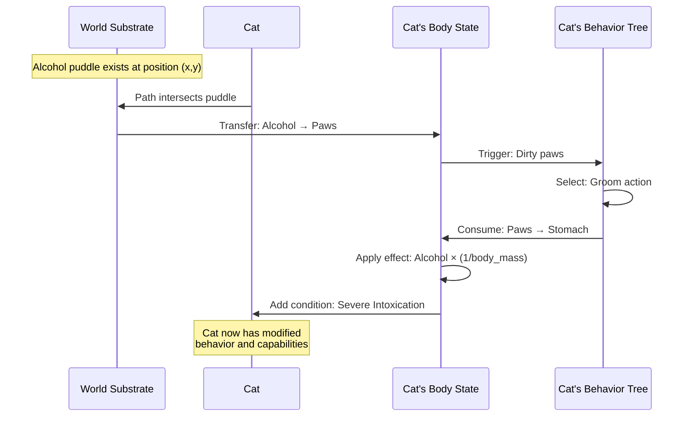
```mermaid
sequenceDiagram
    participant W as World Substrate
    participant C as Cat
    participant B as Cat's Body State
    participant BT as Cat's Behavior Tree

    Note over W: Alcohol puddle exists at position (x,y)

    C->>W: Path intersects puddle
    W->>B: Transfer: Alcohol → Paws

    B->>BT: Trigger: Dirty paws
    BT->>BT: Select: Groom action
    BT->>B: Consume: Paws → Stomach

    B->>B: Apply effect: Alcohol × (1/body_mass)
    B->>C: Add condition: Severe Intoxication

    Note over C: Cat now has modified<br/>behavior and capabilities
```

#### Substrate Layers

The substrate tracks multiple environmental factors, each with its own rules for propagation and effect:

| Layer | Examples | Propagation | Effect on Entities |
|-------|----------|-------------|-------------------|
| **Substances** | Alcohol, water, mud, blood | Surface contact, evaporation | Contact transfer, consumption effects |
| **Temperature** | Oven heat, winter cold, fire | Radiation, convection | Comfort needs, damage, clothing requirements |
| **Light** | Sunlight, lamplight, darkness | Line-of-sight | Visibility, mood, sleep pressure |
| **Sound** | Speech, bells, construction | Distance falloff, occlusion | Wake events, communication, mood |
| **Air Quality** | Smoke, dust, perfume | Diffusion, ventilation | Health, comfort, attraction/repulsion |
| **Contagion** | Flu virus, rumors, moods | Proximity, contact | Condition transfer |

The substrate is the lowest layer but in some ways the most important. It's where the world becomes *physical*—where actions have consequences that ripple out to affect everyone nearby.

---
| Light | Natural and artificial illumination | Visibility, mood, sleep schedules |
| Sound | Ambient noise, conversations, alerts | Wake events, mood, communication range |
| Air Quality | Smoke, dust, pleasant/unpleasant odors | Health, comfort, attraction/repulsion |
| Contagion | Disease vectors on surfaces and in air | Condition transmission |

---

## 3. Entity Composition

Entities are composed from orthogonal components. Not everything has agency; not everything moves; not everything ages. The composition determines what systems apply to an entity.

### 3.1 Component Categories

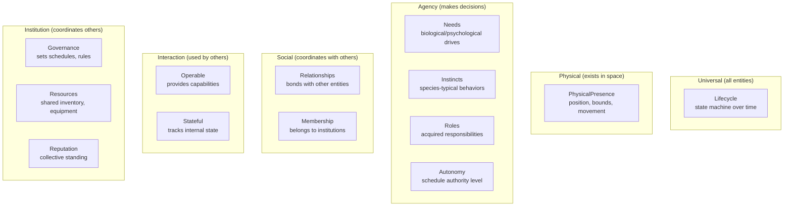
```mermaid
flowchart TB
    subgraph Universal["Universal (all entities)"]
        LC[Lifecycle<br/>state machine over time]
    end

    subgraph Physical["Physical (exists in space)"]
        PP[PhysicalPresence<br/>position, bounds, movement]
    end

    subgraph Agency["Agency (makes decisions)"]
        N[Needs<br/>biological/psychological drives]
        I[Instincts<br/>species-typical behaviors]
        R[Roles<br/>acquired responsibilities]
        AU[Autonomy<br/>schedule authority level]
    end

    subgraph Social["Social (coordinates with others)"]
        REL[Relationships<br/>bonds with other entities]
        MEM[Membership<br/>belongs to institutions]
    end

    subgraph Interaction["Interaction (used by others)"]
        O[Operable<br/>provides capabilities]
        ST[Stateful<br/>tracks internal state]
    end

    subgraph Institution["Institution (coordinates others)"]
        GOV[Governance<br/>sets schedules, rules]
        RES[Resources<br/>shared inventory, equipment]
        REP[Reputation<br/>collective standing]
    end
```

### 3.2 Entity Examples

Different entity types compose different components:

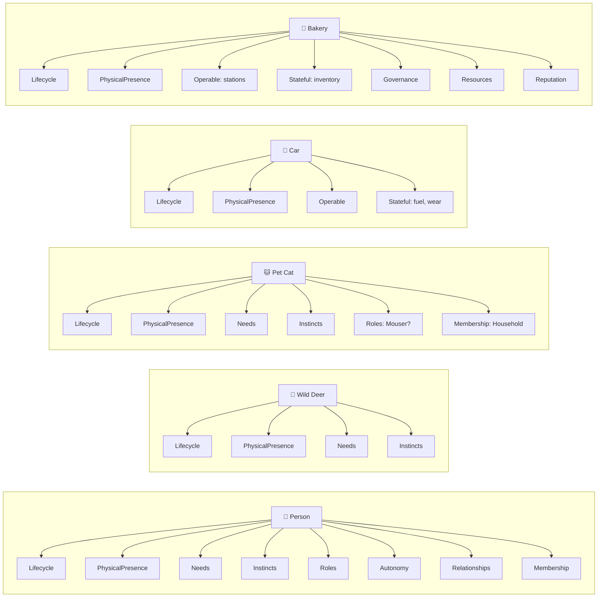
```mermaid
flowchart LR
    subgraph person[" "]
        direction TB
        P[👤 Person]
        P --> P_LC[Lifecycle]
        P --> P_PP[PhysicalPresence]
        P --> P_N[Needs]
        P --> P_I[Instincts]
        P --> P_R[Roles]
        P --> P_AU[Autonomy]
        P --> P_REL[Relationships]
        P --> P_MEM[Membership]
    end

    subgraph deer[" "]
        direction TB
        D[🦌 Wild Deer]
        D --> D_LC[Lifecycle]
        D --> D_PP[PhysicalPresence]
        D --> D_N[Needs]
        D --> D_I[Instincts]
    end

    subgraph cat[" "]
        direction TB
        C[🐱 Pet Cat]
        C --> C_LC[Lifecycle]
        C --> C_PP[PhysicalPresence]
        C --> C_N[Needs]
        C --> C_I[Instincts]
        C --> C_R[Roles: Mouser?]
        C --> C_MEM[Membership: Household]
    end

    subgraph car[" "]
        direction TB
        V[🚗 Car]
        V --> V_LC[Lifecycle]
        V --> V_PP[PhysicalPresence]
        V --> V_O[Operable]
        V --> V_ST[Stateful: fuel, wear]
    end

    subgraph bakery[" "]
        direction TB
        B[🏪 Bakery]
        B --> B_LC[Lifecycle]
        B --> B_PP[PhysicalPresence]
        B --> B_O[Operable: stations]
        B --> B_ST[Stateful: inventory]
        B --> B_GOV[Governance]
        B --> B_RES[Resources]
        B --> B_REP[Reputation]
    end
```

| Entity | Components | Notable Characteristics |
|--------|-----------|------------------------|
| **Adult Person** | Lifecycle, PhysicalPresence, Needs, Instincts, Roles, Autonomy (full), Relationships, Membership | Full agency, can hold jobs, form relationships |
| **Child** | Lifecycle, PhysicalPresence, Needs, Instincts, Autonomy (limited), Relationships, Membership | External schedule authority, limited range |
| **Wild Deer** | Lifecycle, PhysicalPresence, Needs, Instincts | No roles, no relationships, pure survival behaviors |
| **Pet Cat** | Lifecycle, PhysicalPresence, Needs, Instincts, Roles?, Membership | May have mouser role, belongs to household |
| **Car** | Lifecycle, PhysicalPresence, Operable, Stateful | No agency—operated by others |
| **Bakery** | Lifecycle, PhysicalPresence, Operable, Stateful, Governance, Resources, Reputation | Institution that coordinates workers |
| **School** | Lifecycle, PhysicalPresence, Governance, Resources, Reputation | Institution with schedule authority over students |
| **Household** | Governance, Resources | Virtual institution (no physical presence of its own) |

### 3.3 Institutions

Institutions are entities that coordinate multiple other entities. They provide shared context, impose schedules, and aggregate state.

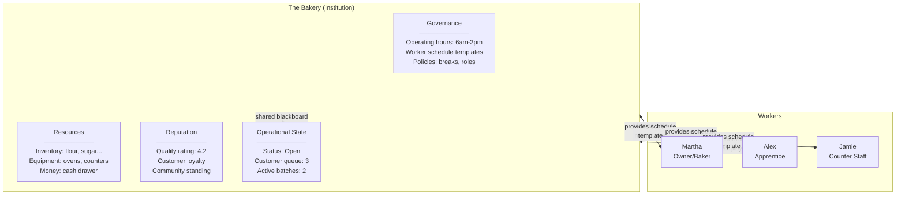
```mermaid
flowchart TB
    subgraph bakery["The Bakery (Institution)"]
        GOV["Governance<br/>───────────<br/>Operating hours: 6am-2pm<br/>Worker schedule templates<br/>Policies: breaks, roles"]
        RES["Resources<br/>───────────<br/>Inventory: flour, sugar...<br/>Equipment: ovens, counters<br/>Money: cash drawer"]
        REP["Reputation<br/>───────────<br/>Quality rating: 4.2<br/>Customer loyalty<br/>Community standing"]
        STATE["Operational State<br/>───────────<br/>Status: Open<br/>Customer queue: 3<br/>Active batches: 2"]
    end

    subgraph workers["Workers"]
        M[Martha<br/>Owner/Baker]
        A[Alex<br/>Apprentice]
        J[Jamie<br/>Counter Staff]
    end

    M -->|"Membership<br/>role: owner"| bakery
    A -->|"Membership<br/>role: apprentice"| bakery
    J -->|"Membership<br/>role: employee"| bakery

    bakery -->|"provides schedule<br/>template"| M
    bakery -->|"provides schedule<br/>template"| A
    bakery -->|"provides schedule<br/>template"| J

    bakery -->|"shared blackboard<br/>for BT decisions"| STATE
```

#### Institution Types

| Institution Type | Provides | Schedule Authority Over | Example |
|-----------------|----------|------------------------|---------|
| **Workplace** | Job roles, schedule templates, shared resources | Employees (work hours) | Bakery, Farm, Clinic |
| **School** | Curriculum, schedule, social environment | Students (school hours) | Elementary School |
| **Household** | Shared living space, family roles, resources | Children (most hours), shared meals | The Miller Home |
| **Religious** | Community, rituals, moral framework | Members (worship times) | Church, Temple |
| **Government** | Laws, services, civic identity | Citizens (jury duty, etc.) | Town Council |

#### Institution Lifecycle

Institutions have their own life arcs:

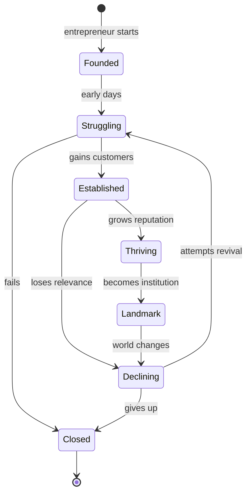
```mermaid
stateDiagram-v2
    [*] --> Founded: entrepreneur starts
    Founded --> Struggling: early days
    Struggling --> Established: gains customers
    Struggling --> Closed: fails
    Established --> Thriving: grows reputation
    Established --> Declining: loses relevance
    Thriving --> Landmark: becomes institution
    Declining --> Struggling: attempts revival
    Declining --> Closed: gives up
    Landmark --> Declining: world changes
    Closed --> [*]
```

When an institution's state changes, it affects all members:
- Bakery becomes "Struggling" → workers' schedules reduce, stress increases
- School becomes "Thriving" → better facilities, more students, hiring
- Household loses income-earner → schedule authority may shift, roles redistribute

### 3.4 Relationships

Relationships are not entities themselves—they emerge from repeated interactions between entities. But they have state that affects both parties.

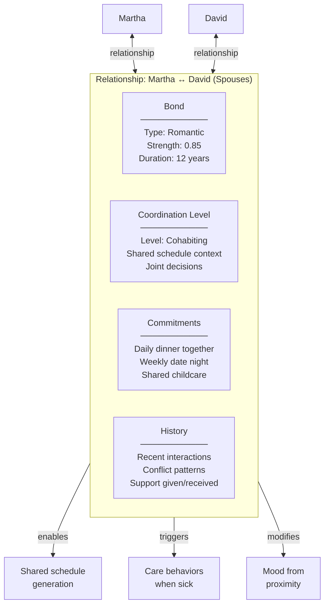
```mermaid
flowchart TB
    subgraph rel["Relationship: Martha ↔ David (Spouses)"]
        BOND["Bond<br/>───────────<br/>Type: Romantic<br/>Strength: 0.85<br/>Duration: 12 years"]
        COORD["Coordination Level<br/>───────────<br/>Level: Cohabiting<br/>Shared schedule context<br/>Joint decisions"]
        COMMIT["Commitments<br/>───────────<br/>Daily dinner together<br/>Weekly date night<br/>Shared childcare"]
        HISTORY["History<br/>───────────<br/>Recent interactions<br/>Conflict patterns<br/>Support given/received"]
    end

    M[Martha] <-->|"relationship"| rel
    D[David] <-->|"relationship"| rel

    rel -->|"enables"| SCHED["Shared schedule<br/>generation"]
    rel -->|"triggers"| CARE["Care behaviors<br/>when sick"]
    rel -->|"modifies"| MOOD["Mood from<br/>proximity"]
```

#### Relationship Properties

```rust
struct Relationship {
    parties: (Entity, Entity),
    bond_type: BondType,
    bond_strength: f32,           // 0.0 = strangers, 1.0 = deeply bonded
    started_at: GameTime,

    coordination_level: CoordinationLevel,
    shared_commitments: Vec<SharedCommitment>,
    interaction_history: RingBuffer<Interaction>,

    // Emotional state
    warmth: f32,                  // current positive feeling
    tension: f32,                 // unresolved conflict
}

enum BondType {
    Romantic,
    Familial { relation: FamilyRelation },
    Friendship,
    Professional,
    Caretaking,                   // pet-owner, elder care
}

enum CoordinationLevel {
    None,                         // strangers, no coordination
    AdHoc,                        // can propose one-off activities
    Recurring,                    // can establish patterns (friends)
    Cohabiting,                   // share schedule generation context
    Dependent,                    // one party's schedule authority over other
}
```

#### Relationship Evolution

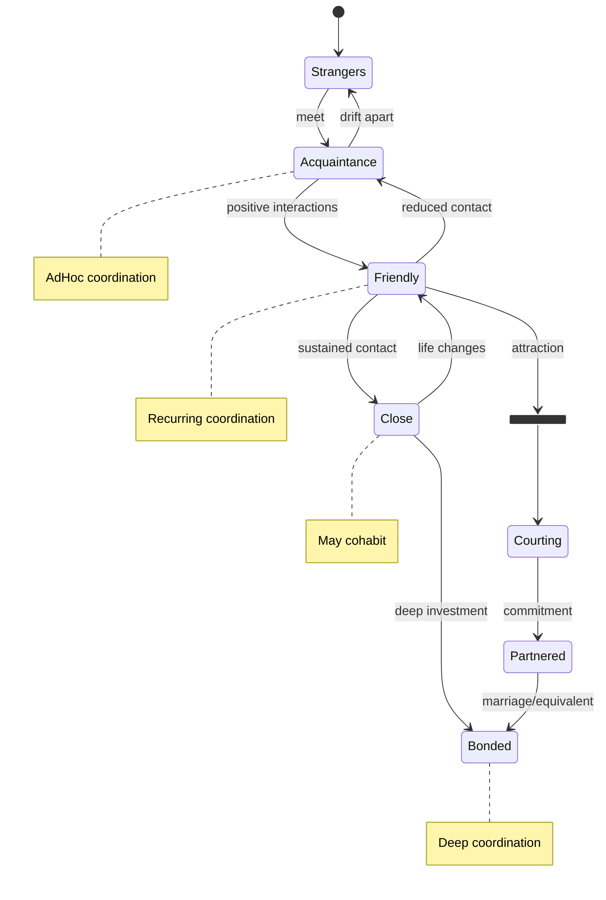
```mermaid
stateDiagram-v2
    [*] --> Strangers
    Strangers --> Acquaintance: meet
    Acquaintance --> Friendly: positive interactions
    Acquaintance --> Strangers: drift apart
    Friendly --> Close: sustained contact
    Friendly --> Acquaintance: reduced contact
    Close --> Bonded: deep investment
    Close --> Friendly: life changes

    note right of Acquaintance: AdHoc coordination
    note right of Friendly: Recurring coordination
    note right of Close: May cohabit
    note right of Bonded: Deep coordination

    state romantic <<fork>>
    Friendly --> romantic: attraction
    romantic --> Courting
    Courting --> Partnered: commitment
    Partnered --> Bonded: marriage/equivalent
```

#### How Relationships Affect Simulation

| Layer | Relationship Effect |
|-------|-------------------|
| **Life Arc** | Enables transitions (Courting → Partnered → Parent) |
| **Schedule** | Shared commitments appear in both schedules; coordination protocol |
| **Behavior Tree** | Care behaviors activate ("is partner sick?"); presence affects mood |
| **Substrate** | Proximity triggers (comfort from nearby loved one) |

### 3.5 Conditions

Conditions are temporary states that modify an entity across all layers. They have duration, severity, and systematic effects.

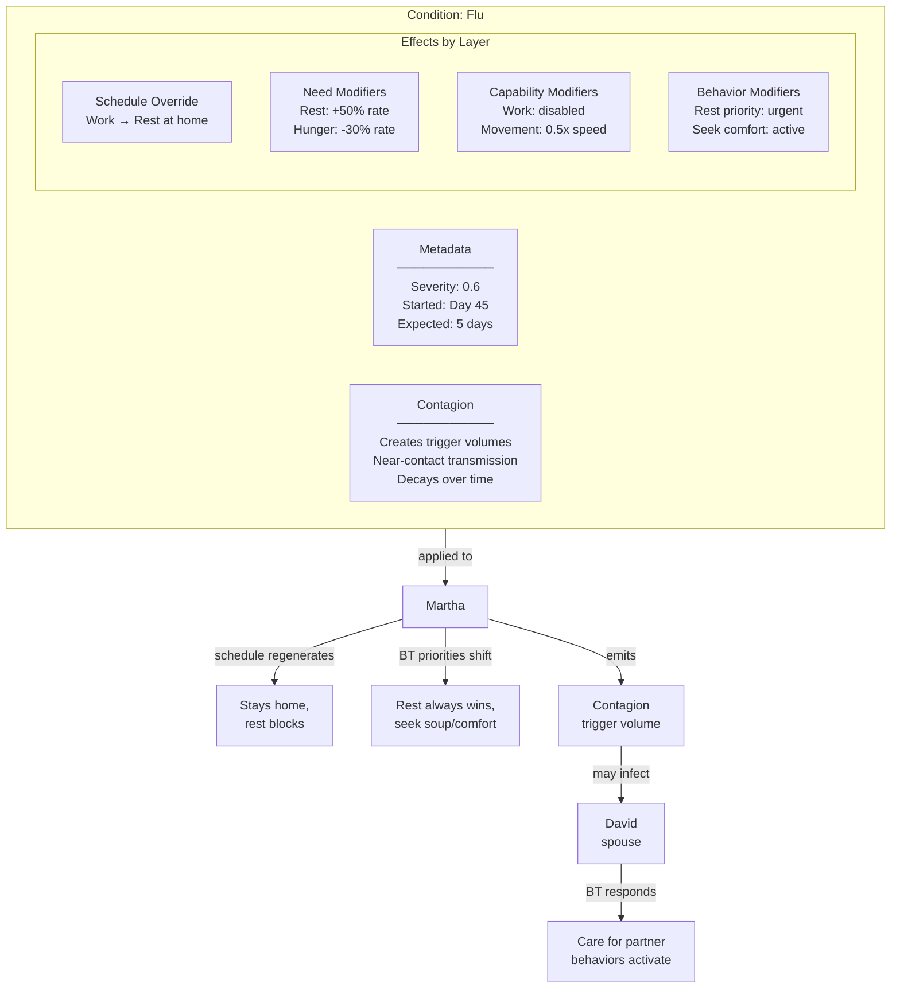
```mermaid
flowchart TB
    subgraph condition["Condition: Flu"]
        META["Metadata<br/>───────────<br/>Severity: 0.6<br/>Started: Day 45<br/>Expected: 5 days"]

        subgraph effects["Effects by Layer"]
            E_SCHED["Schedule Override<br/>Work → Rest at home"]
            E_NEED["Need Modifiers<br/>Rest: +50% rate<br/>Hunger: -30% rate"]
            E_CAP["Capability Modifiers<br/>Work: disabled<br/>Movement: 0.5x speed"]
            E_BT["Behavior Modifiers<br/>Rest priority: urgent<br/>Seek comfort: active"]
        end

        CONTAGION["Contagion<br/>───────────<br/>Creates trigger volumes<br/>Near-contact transmission<br/>Decays over time"]
    end

    condition -->|"applied to"| MARTHA[Martha]

    MARTHA -->|"schedule regenerates"| NEW_SCHED["Stays home,<br/>rest blocks"]
    MARTHA -->|"BT priorities shift"| NEW_BT["Rest always wins,<br/>seek soup/comfort"]
    MARTHA -->|"emits"| VOLUME["Contagion<br/>trigger volume"]

    VOLUME -->|"may infect"| DAVID[David<br/>spouse]
    DAVID -->|"BT responds"| CARE["Care for partner<br/>behaviors activate"]
```

#### Condition Types

| Condition | Duration | Schedule Effect | Capability Effect | Social Effect |
|-----------|----------|-----------------|-------------------|---------------|
| **Flu** | 3-7 days | Work → Rest | Movement slowed, work disabled | Contagious, triggers care |
| **Pregnancy** | 9 months | Progressive work reduction | Gradual capability changes | Relationship deepening |
| **Grief** | Weeks-months | Social withdrawal | Work quality reduced | Others offer support |
| **Intoxication** | Hours | May miss commitments | Coordination impaired | Social disinhibition |
| **Injury** | Variable | May require rest | Specific capability loss | May trigger care |
| **Joy** | Days | More social scheduling | Quality bonus | Mood is contagious |

#### Condition Structure

```rust
struct Condition {
    condition_type: ConditionType,
    severity: f32,                    // 0.0-1.0
    started_at: GameTime,
    expected_duration: Option<Duration>,

    // Effects
    need_modifiers: Vec<NeedModifier>,
    capability_modifiers: Vec<CapabilityModifier>,
    schedule_overrides: Vec<ScheduleOverride>,
    behavior_modifiers: Vec<BehaviorModifier>,

    // Spread
    contagion: Option<ContagionProfile>,
}

struct NeedModifier {
    need: NeedType,
    rate_multiplier: f32,         // how fast need grows
    threshold_modifier: f32,      // when "urgent" triggers
}

struct CapabilityModifier {
    capability: CapabilityType,
    available: bool,              // can they do it at all?
    quality_multiplier: f32,      // how well?
}

struct ScheduleOverride {
    replaces: ActivityCategory,
    with_activity: ActivityCategory,
    with_location: Option<Entity>,
}
```

### 3.6 The Wild Deer (Non-Sapient Entity)

Wild animals demonstrate a simplified entity that lacks social components entirely.

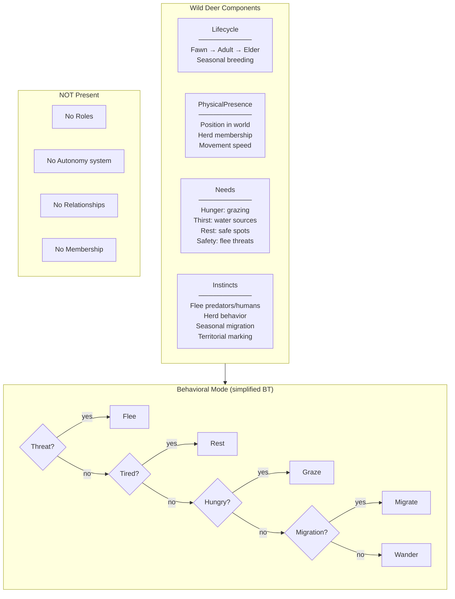
```mermaid
flowchart TB
    subgraph deer["Wild Deer Components"]
        LC["Lifecycle<br/>───────────<br/>Fawn → Adult → Elder<br/>Seasonal breeding"]
        PP["PhysicalPresence<br/>───────────<br/>Position in world<br/>Herd membership<br/>Movement speed"]
        N["Needs<br/>───────────<br/>Hunger: grazing<br/>Thirst: water sources<br/>Rest: safe spots<br/>Safety: flee threats"]
        I["Instincts<br/>───────────<br/>Flee predators/humans<br/>Herd behavior<br/>Seasonal migration<br/>Territorial marking"]
    end

    subgraph absent["NOT Present"]
        NO_R[No Roles]
        NO_AU[No Autonomy system]
        NO_REL[No Relationships]
        NO_MEM[No Membership]
    end

    deer --> MODE

    subgraph MODE["Behavioral Mode (simplified BT)"]
        direction LR
        DANGER{Threat?} -->|yes| FLEE[Flee]
        DANGER -->|no| REST_Q{Tired?}
        REST_Q -->|yes| REST[Rest]
        REST_Q -->|no| HUNGRY{Hungry?}
        HUNGRY -->|yes| GRAZE[Graze]
        HUNGRY -->|no| SEASON{Migration?}
        SEASON -->|yes| MIGRATE[Migrate]
        SEASON -->|no| WANDER[Wander]
    end
```

#### Deer Don't Have Schedules

Unlike sapient entities, deer operate purely on **modes** driven by needs and instincts:

| Mode | Trigger | Behavior |
|------|---------|----------|
| **Flee** | Threat detected (predator, player, loud noise) | Sprint away, rejoin herd at safe distance |
| **Graze** | Hunger need elevated | Move slowly through foliage, consuming plants |
| **Rest** | Rest need elevated, safety confirmed | Find sheltered spot, lie down |
| **Migrate** | Seasonal instinct + environmental cues | Move toward seasonal grounds as herd |
| **Wander** | No pressing needs | Drift with herd, light foraging |

#### Substrate Interaction

Deer interact with the world substrate without schedules or roles:

- **Consume foliage:** Grazing depletes plant resources (your garden!)
- **Create sounds:** Movement alerts predators and players
- **Leave traces:** Scent trails, tracks, droppings
- **Respond to substrate:** Flee from fire, smoke, loud sounds

This is covered more in Section 6 (Performance Architecture) under simulation tiers.

---

## 4. Tools and Capabilities

Behaviors require capabilities. "Bake bread" requires heat application and transformation. The behavior doesn't care whether heat comes from a wood-fired oven, a gas range, or a magical flame—it just needs the `Heat` capability with sufficient parameters.

Tools are entities that provide capabilities to their operators. This abstraction lets us:
- Add new tools without changing behaviors
- Have behaviors gracefully degrade when ideal tools aren't available
- Model tool quality affecting output quality
- Share tools across multiple entities (institution resources)

### 4.1 Capability Types

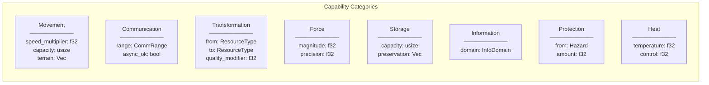
```mermaid
flowchart TB
    subgraph capabilities["Capability Categories"]
        direction TB

        MOV["Movement<br/>───────────<br/>speed_multiplier: f32<br/>capacity: usize<br/>terrain: Vec<TerrainType>"]

        COMM["Communication<br/>───────────<br/>range: CommRange<br/>async_ok: bool"]

        TRANS["Transformation<br/>───────────<br/>from: ResourceType<br/>to: ResourceType<br/>quality_modifier: f32"]

        FORCE["Force<br/>───────────<br/>magnitude: f32<br/>precision: f32"]

        STOR["Storage<br/>───────────<br/>capacity: usize<br/>preservation: Vec<Type>"]

        INFO["Information<br/>───────────<br/>domain: InfoDomain"]

        PROT["Protection<br/>───────────<br/>from: Hazard<br/>amount: f32"]

        HEAT["Heat<br/>───────────<br/>temperature: f32<br/>control: f32"]
    end
```

```rust
enum Capability {
    Movement { speed_multiplier: f32, capacity: usize, terrain: Vec<TerrainType> },
    Communication { range: CommRange, async_ok: bool },
    Transformation { from: ResourceType, to: ResourceType, quality_modifier: f32 },
    Force { magnitude: f32, precision: f32 },
    Storage { capacity: usize, preservation: Vec<PreservationType> },
    Information { domain: InformationDomain },
    Protection { from: EnvironmentalHazard, amount: f32 },
    Heat { temperature: f32, control: f32 },
}
```

### 4.2 Operator Modes

Using a tool affects the operator in different ways:

```mermaid
flowchart LR
    subgraph modes["Operator Modes"]
        direction TB

        INH["🚗 Inhabit<br/>───────────<br/>Inside the tool<br/>Your movement = its movement<br/>May block other actions"]

        WLD["🔨 Wield<br/>───────────<br/>Holding the tool<br/>Can still move (maybe limited)<br/>Occupies hands"]

        STN["🔥 Station<br/>───────────<br/>Standing at the tool<br/>Tool is stationary<br/>Periodic attention needed"]

        WR["🧥 Wear<br/>───────────<br/>Passive benefit<br/>No active attention<br/>Slot-based"]
    end

    CAR[Car] --> INH
    HAMMER[Hammer] --> WLD
    PHONE[Phone] --> WLD
    OVEN[Oven] --> STN
    WORKBENCH[Workbench] --> STN
    COAT[Coat] --> WR
    GLASSES[Glasses] --> WR
```

```rust
enum OperatorMode {
    /// Inside the tool—your movement is its movement (car, elevator)
    Inhabit {
        position_binding: PositionBinding,
        blocks_other_actions: bool
    },

    /// Holding the tool—can still move, maybe limited (phone, hammer)
    Wield {
        hands_required: u8,
        mobility: Mobility
    },

    /// Standing near the tool—tool is stationary (oven, workbench)
    Station {
        interaction_range: f32,
        attention: Attention
    },

    /// Wearing the tool—passive benefit (coat, glasses)
    Wear {
        slot: WearSlot,
        passive: bool
    },
}
```

### 4.3 Tools and Institutions

When tools belong to an institution, they're part of the institution's **Resources** component. Multiple workers can use them, and their state is shared.

```mermaid
flowchart TB
    subgraph bakery["Bakery (Institution)"]
        RES["Resources Component"]

        subgraph equipment["Shared Equipment"]
            OVEN1["Oven #1<br/>Status: In Use<br/>Batch: Sourdough"]
            OVEN2["Oven #2<br/>Status: Available"]
            COUNTER["Counter<br/>Status: Martha using"]
            PREP["Prep Station<br/>Status: Alex using"]
        end

        RES --> equipment
    end

    subgraph workers["Workers query availability"]
        M["Martha's BT:<br/>Need oven?<br/>→ Check institution"]
        A["Alex's BT:<br/>Need prep station?<br/>→ Check institution"]
    end

    M -->|"queries"| RES
    A -->|"queries"| RES

    RES -->|"Oven #2 available"| M
    RES -->|"Prep in use, wait"| A
```

This solves the "multiple workers, shared tools" problem:
1. Tools belong to the Institution's Resources
2. Worker BTs query the Institution for available tools
3. Institution tracks who's using what
4. No direct coordination between workers needed—the Institution mediates

### 4.4 Example Tools

| Tool | Capabilities | Operator Mode | Institution? |
|------|-------------|---------------|--------------|
| Car | Movement (10× speed, 4 capacity), Storage | Inhabit (blocks other actions) | Household or personal |
| Phone | Communication (global, async), Information | Wield (1 hand, full mobility) | Personal |
| Oven | Heat (high temp, good control), Transformation (raw → cooked) | Station (periodic attention) | Bakery |
| Hammer | Force (high magnitude, low precision) | Wield (1 hand, stationary while using) | Workshop or personal |
| Coat | Protection (cold, 0.8) | Wear (body slot, passive) | Personal |
| Cash Register | Information (transactions), Storage (money) | Station (full attention) | Shop |
| Plow | Transformation (soil → tilled), Force | Inhabit (with draft animal) | Farm |
| Loom | Transformation (thread → cloth) | Station (full attention) | Workshop |

### 4.5 Tool Quality and Output

Tool quality affects the output of behaviors that use them. This compounds with skill and input quality:

```mermaid
flowchart LR
    subgraph inputs["Inputs"]
        SKILL["Skill Tier<br/>Martha: Master (1.3×)"]
        TOOL["Tool Quality<br/>Oven: Fine (1.15×)"]
        MAT["Material Quality<br/>Flour: Good (1.1×)"]
    end

    subgraph calc["Calculation"]
        BASE["Base Quality: 1.0"]
        inputs --> MULT["Multiply"]
        BASE --> MULT
        MULT --> FINAL["Final: 1.0 × 1.3 × 1.15 × 1.1<br/>= 1.65 (Excellent)"]
    end

    subgraph output["Output"]
        FINAL --> BREAD["🍞 Excellent Bread<br/>Higher value<br/>Better reputation effect"]
    end
```

```rust
fn calculate_output_quality(
    base: f32,
    skill: &Skill,
    tool: &Tool,
    materials: &[Material],
    conditions: &[Condition],
) -> f32 {
    let skill_mod = skill.quality_modifier();
    let tool_mod = tool.quality_modifier();
    let material_mod = materials.iter()
        .map(|m| m.quality)
        .sum::<f32>() / materials.len() as f32;
    let condition_mod = conditions.iter()
        .filter_map(|c| c.capability_modifier_for(CapabilityType::Work))
        .map(|m| m.quality_multiplier)
        .product::<f32>();

    base * skill_mod * tool_mod * material_mod * condition_mod
}
```

---

## 5. Production Workflows

Complex activities like baking bread unfold across multiple actions and time spans. The system tracks in-progress work through **batch entities** that accumulate state across phases.

### 5.1 Workflow Phases

```mermaid
flowchart LR
    subgraph prep["Preparation"]
        D[Decide Batch] --> G[Gather Ingredients]
        G --> P[Prepare Workspace]
        P --> S[Start Batch]
    end

    subgraph production["Production"]
        S --> M[Mix Dough]
        M --> R["Rise<br/>(60 min)"]
        R --> SH[Shape Loaves]
        SH --> B["Bake<br/>(45 min)"]
    end

    subgraph completion["Completion"]
        B --> U[Unload]
        U --> ST[Stock Display]
    end

    subgraph quality["Quality Accumulates"]
        SK[Skill Tier] --> Q[Final Quality]
        TQ[Tool Quality] --> Q
        IQ[Ingredient Quality] --> Q
        Q --> ST
    end
```

### 5.2 Batch Entity

A batch is itself an entity—it has lifecycle, state, and exists in the world (on a prep table, in an oven, on a cooling rack).

```mermaid
stateDiagram-v2
    [*] --> NeedsMixing: batch created
    NeedsMixing --> Rising: mixed
    Rising --> NeedsShaping: rise complete
    NeedsShaping --> NeedsBaking: shaped
    NeedsBaking --> Baking: put in oven
    Baking --> Done: bake complete
    Done --> [*]: stocked or sold

    note right of Rising: Timer-based transition
    note right of Baking: Timer-based transition
```

```rust
struct Batch {
    recipe: RecipeId,
    phase: BatchPhase,
    phase_complete_at: Option<GameTime>,
    quality_accumulator: f32,
    quantity: u32,
    location: Entity,              // prep table, oven, cooling rack
    assigned_worker: Option<Entity>,
    ingredients_used: Vec<(ResourceType, u32, f32)>,  // type, amount, quality
}

enum BatchPhase {
    NeedsMixing,
    Rising,
    NeedsShaping,
    NeedsBaking,
    Baking,
    Done,
}
```

### 5.3 Interruptible Work

Batches persist across interruptions. If Martha starts mixing, gets interrupted by a customer, and returns—the batch is still there, waiting.

```mermaid
sequenceDiagram
    participant M as Martha
    participant B as Batch
    participant I as Institution
    participant C as Customer

    M->>B: Start mixing
    B->>B: Phase: NeedsMixing → Rising
    Note over B: Timer starts: 60 min

    C->>I: Arrives at bakery
    I->>M: Customer waiting (BT interrupt)
    M->>M: BT: Customer > Batch in progress
    M->>C: Serve customer

    Note over B: Still rising...

    M->>M: Customer done, BT re-evaluates
    B-->>M: Phase complete signal
    M->>B: Continue: Shape loaves
```

The institution's shared state lets any available worker continue a batch:

```mermaid
sequenceDiagram
    participant M as Martha
    participant B as Batch
    participant I as Institution
    participant A as Alex (Apprentice)

    M->>B: Start batch, begin rising
    M->>M: Break time (schedule)
    M->>I: Release batch assignment

    Note over B: Rising complete
    B->>I: Needs attention signal

    I->>A: Batch needs shaping
    Note over A: BT: Available worker
    A->>B: Continue: Shape loaves
    Note over B: Quality modified by Alex's skill
```

### 5.4 Multi-Step Recipes

Some recipes require coordination across multiple batches or workers:

```mermaid
flowchart TB
    subgraph cake["Wedding Cake Production"]
        subgraph layer1["Layer Batches (parallel)"]
            L1[Chocolate Layer]
            L2[Vanilla Layer]
            L3[Red Velvet Layer]
        end

        subgraph frosting["Frosting Batch"]
            F[Buttercream]
        end

        subgraph assembly["Assembly (sequential)"]
            layer1 --> STACK[Stack Layers]
            frosting --> FROST[Apply Frosting]
            STACK --> FROST
            FROST --> DEC[Decorate]
        end

        subgraph quality["Quality Factors"]
            L1 --> Q[Final Quality]
            L2 --> Q
            L3 --> Q
            F --> Q
            DEC_SKILL[Decorator Skill] --> Q
        end
    end
```

The system handles this through **batch dependencies**:

```rust
struct Recipe {
    id: RecipeId,
    name: String,
    phases: Vec<RecipePhase>,
    dependencies: Vec<BatchDependency>,
    required_skills: Vec<(SkillType, SkillTier)>,
    required_capabilities: Vec<Capability>,
}

struct BatchDependency {
    /// This batch requires these other batches to complete first
    requires: Vec<RecipeId>,
    /// How the inputs combine
    combination: CombinationType,
}

enum CombinationType {
    Sequential,      // one after another
    Parallel,        // can happen simultaneously
    Assembly,        // combine outputs into one
}
```

---

## 6. Performance Architecture

With 500 entities and no teleportation, we need aggressive optimization on cognition while maintaining physical presence for all entities. The key insight is that *existing* is cheap, but *thinking* is expensive. Every entity is always somewhere, but only a few need to make decisions at any moment.

### 6.1 Simulation Tiers

Entities fall into different simulation tiers based on their relationship to players and their cognitive complexity.

```mermaid
flowchart TB
    subgraph tiers["Simulation Tiers"]
        direction TB

        ATT["🎮 ATTACHED (1-4)<br/>Players control these directly"]

        NEAR["👁️ NEARBY (~30-50)<br/>Visible to players<br/>Full behavior trees<br/>Real-time decisions"]

        BACK["🌫️ BACKGROUND (~400)<br/>Following schedules<br/>Path interpolation<br/>No active decisions"]

        WILD["🦌 WILDLIFE (~50+)<br/>Mode-based behavior<br/>Herd movement<br/>Simplified needs"]
    end

    ATT --> NEAR
    NEAR --> BACK
    BACK --> NEAR

    WILD -.->|"flee trigger"| NEAR
```

| Tier | Count | Movement | Cognition | Substrate | Update Rate |
|------|-------|----------|-----------|-----------|-------------|
| **Attached** | 1-4 | Player input | Player-driven | Full | Every frame |
| **Nearby** | ~30-50 | Full pathfinding | Full BT ticks | Full | Every frame |
| **Background** | ~400 | Path interpolation | Schedule-following | Batched | On wake events |
| **Wildlife** | ~50+ | Herd interpolation | Mode-based | Sampled | Every few seconds |

#### Tier Transitions

Entities move between tiers based on proximity to players. When a player approaches a background villager, that villager promotes to nearby tier and begins active decision-making. When players leave, the villager demotes back to background.

The transition is seamless because the entity's *state* is always current—their position along their path, their current schedule block, their needs levels. Promotion just means "start running the behavior tree" rather than "reconstruct who this person is."

```mermaid
sequenceDiagram
    participant P as Player
    participant V as Villager (Background)
    participant S as Simulation

    Note over V: Following schedule via interpolation
    P->>S: Moves toward V
    S->>S: Distance check: P within 50m of V
    S->>V: Promote to Nearby
    Note over V: BT activates, evaluates current situation
    V->>V: "I'm in Work block, at bakery, batch needs tending"
    V->>V: Begin active baking behavior

    P->>S: Moves away
    S->>S: Distance check: P beyond 80m of V
    S->>V: Demote to Background
    Note over V: BT suspends, resume interpolation
```

The hysteresis (promote at 50m, demote at 80m) prevents thrashing when players are near the boundary.

### 6.2 The Wildlife Tier

Wild animals like deer need a different approach. They're not following schedules—they don't have appointments or jobs. But they're also not complex enough to warrant full behavior trees.

Wildlife uses **mode-based behavior**: a simplified decision system that picks one of a few behavioral modes based on needs and instincts, then follows that mode until something changes.

```mermaid
stateDiagram-v2
    [*] --> Grazing: default

    Grazing --> Fleeing: threat detected
    Grazing --> Resting: rest need high
    Grazing --> Drinking: thirst need high
    Grazing --> Migrating: seasonal trigger

    Fleeing --> Grazing: threat gone, safe distance
    Resting --> Grazing: rested enough
    Drinking --> Grazing: thirst satisfied
    Migrating --> Grazing: reached destination

    Resting --> Fleeing: threat detected
    Drinking --> Fleeing: threat detected
```

**Mode evaluation happens infrequently**—every 10-30 seconds, or when a significant event occurs (threat appears, need crosses threshold). Between evaluations, the animal simply continues its current mode behavior.

**Herd movement** further reduces computation. Rather than pathfinding for each deer individually, we pathfind for the herd centroid and have individuals maintain positions relative to the herd using simple flocking rules. One pathfinding operation serves a dozen animals.

#### Wildlife and Players

When a player approaches wildlife, the animals don't promote to "nearby" in the same way villagers do. Instead, the player's presence triggers a **threat evaluation**:

1. Player enters detection range (species-specific, ~30-50m for deer)
2. Wildlife mode immediately evaluates → switches to Fleeing
3. Flee pathfinding runs once, animals scatter
4. Once at safe distance, mode returns to previous

This is much cheaper than full BT promotion because:
- No complex decision-making—just "threat? flee"
- Flee paths are simple (away from threat) rather than goal-seeking
- No need to maintain the wildlife at nearby-tier cognition

#### Wildlife and Substrate

Wildlife interacts with the world substrate, but in a sampled way:

- **Grazing depletes foliage** at their current location (your garden suffers)
- **Movement creates trigger volumes** that predators and players can detect
- **Seasonal state** affects migration instincts globally

These interactions happen when mode transitions occur or on a slow timer, not continuously.

### 6.3 Discrete Event Simulation

The traditional game loop polls every entity every frame: "Do you have anything to do?" This is wasteful—most entities most of the time answer "no, still walking to the bakery."

Instead, we use **discrete event simulation**: compute when interesting things will happen, schedule wake-up events, and sleep until then. The simulation advances by processing events in time order rather than by checking everyone constantly.

```mermaid
flowchart LR
    subgraph once["Computed Once (at path start)"]
        PATH["Compute A* path"] --> QUERY["Query spatial index:<br/>What will I intersect?"]
        QUERY --> SCHEDULE["Schedule wake events:<br/>• Puddle at t=2.3s<br/>• Door at t=4.1s<br/>• Arrive at t=5.0s"]
    end

    subgraph runtime["Per Frame"]
        TIME["Current time"] --> QUEUE{"Wake queue:<br/>anything ready?"}
        QUEUE -->|"yes"| WAKE["Wake entity,<br/>run BT tick"]
        QUEUE -->|"no"| SKIP["Skip"]
        WAKE --> NEXT["Schedule next wake"]
    end
```

When Martha starts walking from home to the bakery:

1. Pathfinding computes her route
2. The system raycasts the path against trigger volumes (doors, puddles, zone boundaries)
3. Wake events are scheduled: "Martha enters bakery zone at 5:52am"
4. Martha sleeps—her position interpolates along the path, but no code runs for her
5. At 5:52am, the wake event fires, her BT activates: "I'm at work, what should I do?"

This means 400 background villagers might generate only a few dozen wake events per second total, rather than 400 updates per frame.

### 6.4 Wake Reasons

Entities wake for different reasons, and the reason affects what happens:

| Wake Reason | Trigger | Response |
|-------------|---------|----------|
| **Path Complete** | Arrived at destination | BT evaluates: what now? |
| **Schedule Event** | Time for next activity | Possibly generate new path, update activity |
| **Trigger Volume** | Crossed into a zone | Apply zone effects (enter puddle, enter building) |
| **External Interrupt** | Player approached, someone spoke to them | Promote tier if needed, respond to stimulus |
| **Condition Change** | Got sick, condition ended | Regenerate schedule, modify BT priorities |
| **Institution Signal** | Bakery needs attention, customer arrived | Check if this entity should respond |

```mermaid
sequenceDiagram
    participant W as Wake Queue
    participant E as Entity (sleeping)
    participant BT as Behavior Tree
    participant S as Schedule

    Note over E: Interpolating position...
    W->>E: Wake: ScheduleEvent (Work block starts)
    E->>S: What's my current block?
    S-->>E: Work at Bakery, 6:00-14:00
    E->>BT: Evaluate work behaviors
    BT-->>E: Start batch (stock is low)
    E->>W: Schedule next wake: batch needs attention in 60min
    Note over E: Returns to sleep, position interpolates
```

### 6.5 Institution as Shared Blackboard

When multiple entities work at the same institution, they need to coordinate without direct communication. The institution's state acts as a **shared blackboard**—a place where information is posted that any worker can read.

```mermaid
flowchart TB
    subgraph bakery["Bakery Institution State (Blackboard)"]
        STATUS["Status: Open"]
        QUEUE["Customer Queue: 3 waiting"]
        BATCHES["Active Batches:<br/>• Sourdough (Rising, 20min left)<br/>• Baguettes (Baking, 5min left)"]
        STOCK["Stock Levels: Low on croissants"]
        EQUIPMENT["Equipment:<br/>• Oven 1: In use<br/>• Oven 2: Available"]
    end

    M["Martha's BT"] -->|"reads"| bakery
    A["Alex's BT"] -->|"reads"| bakery
    J["Jamie's BT"] -->|"reads"| bakery

    M -->|"writes"| BATCHES
    A -->|"writes"| BATCHES
    J -->|"writes"| QUEUE
```

When Martha's BT runs, it doesn't ask "what is Alex doing?" It asks the bakery: "are there customers? is stock low? are batches in progress?" The answers come from the shared state, which Alex and Jamie also read and write.

This is how multiple workers naturally coordinate without explicit communication:
- Jamie sees customers in queue → serves them
- Martha sees low stock → starts a batch
- Alex sees batch needs shaping → shapes it

No one tells anyone what to do. They all read the same blackboard and respond to what needs doing.

### 6.6 Background Entity Fidelity

Background entities aren't "paused"—they're still living their lives, just without active decision-making. Their fidelity comes from:

**Schedule adherence:** A background baker still arrives at work at 6am, takes breaks, goes home. Their position interpolates along pre-computed paths between schedule waypoints.

**Need simulation:** Needs still tick (slowly, in batched updates). If a background entity's hunger becomes critical, it triggers a wake event to handle it.

**Condition progression:** Sickness still runs its course. A background entity can get better (or worse) without being in nearby tier.

**Institution participation:** Background workers still contribute to institution state. Martha being at the bakery (even as background) means the bakery has its master baker present—affecting quality, capacity, customer satisfaction.

The goal is that when a player approaches any entity, that entity's state is *plausible*—they're where they should be, doing what they should be doing, with needs and conditions that make sense for their day so far.

---

## 7. Synchronization and Networking

Aspen uses peer-to-peer networking with CRDTs—there's no central server deciding what's true. Each player's device simulates the world, and they synchronize state to stay consistent. This creates interesting challenges for agent simulation: how do 500 villagers stay coherent across 2-4 peers without a server arbitrating?

The good news is that the four-layer architecture maps well to different sync strategies. Slow-changing state syncs directly; fast-changing state uses determinism.

### 7.1 Sync Strategy by Layer

```mermaid
flowchart TB
    subgraph layers["Simulation Layers"]
        LA["Life Arc<br/>───────────<br/>Changes: monthly<br/>Sync: CRDT state"]

        SCHED["Daily Schedule<br/>───────────<br/>Changes: daily<br/>Sync: CRDT state"]

        BT["Behavior Tree<br/>───────────<br/>Changes: per-second<br/>Sync: Outcomes as state"]

        SUB["World Substrate<br/>───────────<br/>Changes: continuous<br/>Sync: Mixed"]
    end

    subgraph strategy["Sync Strategy"]
        LA -->|"Last-Writer-Wins"| CRDT1["CRDT Register"]
        SCHED -->|"Last-Writer-Wins"| CRDT2["CRDT Register"]
        BT -->|"Decisions become state"| CRDT3["CRDT Updates"]
        SUB -->|"Spatial partitioning"| HYBRID["Ownership + CRDTs"]
    end
```

| Layer | Change Rate | Sync Method | Conflict Resolution |
|-------|-------------|-------------|---------------------|
| **Life Arc** | Rare (monthly) | CRDT register | Last-writer-wins; conflicts are rare |
| **Schedule** | Daily | CRDT register | Regenerate from same inputs |
| **Behavior Tree** | Real-time | Outcomes as CRDT state | Entity owner is authoritative |
| **Substrate** | Continuous | Spatial ownership | Owner broadcasts; others apply |

### 7.2 What Syncs Directly

Some state is small, changes rarely, and syncs trivially as CRDT registers:

**Life arc state:** Martha's life arc (Adult/Partnered/Baker) is a single enum. When it transitions, the new state syncs. Conflicts are nearly impossible—life arc transitions are triggered by game events (birthday, marriage) that themselves sync.

**Relationships:** Bond strength, coordination level, shared commitments. These change slowly through accumulated interactions. CRDT counters work well for bond strength; registers for discrete state.

**Institution state:** The bakery's reputation, operating hours, worker roster. Changes infrequently, syncs as registers.

**Conditions:** Martha has the flu. This is a register—condition type, severity, start time, expected duration. When she recovers, the condition is removed.

**Schedules:** Each entity's daily schedule is generated once per game-day. The schedule itself is data—a list of (time, activity, location) tuples. It syncs as a register, regenerated each morning.

### 7.3 Behavior Tree Outcomes

Behavior trees tick locally and produce **outcomes**—state changes that sync like any other state. We're not syncing the tree traversal; we're syncing what the entity decided to do.

```mermaid
sequenceDiagram
    participant P1 as Peer 1 (simulating Martha)
    participant CRDT as Shared State
    participant P2 as Peer 2

    Note over P1: Martha's BT ticks
    P1->>P1: Evaluate: stock low, start batch
    P1->>CRDT: Update: Martha.current_action = StartBatch
    P1->>CRDT: Update: Bakery.batches += Sourdough
    CRDT->>P2: Sync state changes

    Note over P2: Peer 2 sees Martha is now<br/>working on sourdough batch
```

When Martha's BT decides "start a sourdough batch," that decision produces state changes:
- Martha's current action updates
- A new batch entity is created
- Bakery inventory decrements (flour, yeast consumed)
- Equipment status updates (mixer in use)

All of these are normal CRDT state changes. Peer 2 doesn't run Martha's BT independently—they receive the outcome and update their local view.

This is simpler and more robust than trying to achieve deterministic BT evaluation across peers. The BT is just local decision-making; the results are what matter for synchronization.

### 7.4 Wake Queue Synchronization

The wake queue is trickier. Each peer maintains its own queue of (time, entity, reason) events. If the queues diverge, entities will wake at different times and make different decisions.

**Solution: Derive wake events from synced state.**

Wake events aren't arbitrary—they're computed from paths, schedules, and trigger volumes. If two peers have:
- The same path for Martha (derived from same schedule)
- The same trigger volumes in the world (synced substrate)
- The same entity positions (interpolated from synced paths)

Then they'll compute the same wake events.

```mermaid
flowchart LR
    subgraph synced["Synced State"]
        SCHED["Schedule:<br/>Martha goes to bakery at 5:45"]
        MAP["World:<br/>Trigger volumes, paths"]
    end

    subgraph derived["Derived (not synced)"]
        PATH["Path computation:<br/>Home → Bakery"]
        WAKE["Wake events:<br/>• Enter bakery zone at 5:52"]
    end

    synced --> derived

    subgraph peers["Both Peers"]
        P1["Peer 1: computes same path,<br/>same wake events"]
        P2["Peer 2: computes same path,<br/>same wake events"]
    end

    derived --> peers
```

The wake queue itself never syncs—it's locally computed from synced inputs.

### 7.5 Spatial Ownership and the Substrate

The world substrate (puddles, temperatures, trigger volumes) changes frequently and needs spatial partitioning. We use the same ownership model as the terrain and buildings:

**Tiles have owners.** The peer who owns a tile is authoritative for substrate state on that tile. When Martha spills a drink, the owner of that tile creates the puddle and broadcasts its existence.

**Ownership follows players.** Tiles near a player are owned by that player's peer. When players are apart, they own different regions. When players are together, one peer owns the shared space (typically whoever arrived first or has priority).

**Substrate changes broadcast.** When an owner creates, modifies, or removes substrate state, they send a delta to other peers. Others apply it without question—the owner is authoritative.

```mermaid
sequenceDiagram
    participant P1 as Peer 1 (owns tile)
    participant P2 as Peer 2
    participant SUB as Substrate

    Note over P1: Martha (P1's villager) spills drink
    P1->>SUB: Create puddle at (x, y)
    P1->>P2: Broadcast: Puddle created at (x, y)
    P2->>SUB: Apply: Create puddle at (x, y)

    Note over P1,P2: Both peers now have puddle<br/>Cat pathfinding will intersect it
```

### 7.6 Nearby Tier and Entity Ownership

What happens when Peer 1's player is near a villager, but Peer 2's player is far away?

**Entities have owners.** Like tiles, entities are owned by one peer at a time. The owner runs the BT and syncs outcomes. Ownership typically follows proximity—if your player is nearest to Martha, you own Martha.

When Peer 1 owns Martha:
- Peer 1 runs Martha's BT at full fidelity
- BT decisions produce state changes that sync to Peer 2
- Peer 2 sees Martha's actions but doesn't run her BT

When players are together, one peer owns the nearby villagers. When apart, ownership naturally distributes—each peer owns the villagers near their player.

```mermaid
sequenceDiagram
    participant P1 as Peer 1 (owns Martha)
    participant M as Martha's State (CRDT)
    participant P2 as Peer 2

    Note over P1: Player 1 near Martha
    P1->>P1: Run Martha's BT
    P1->>M: Update: current_action = ServingCustomer
    M->>P2: Sync

    Note over P2: Peer 2 sees Martha serving<br/>but didn't run the decision
```

Ownership can transfer when players move:
1. Peer 1's player walks away from Martha
2. Peer 2's player approaches Martha
3. Ownership transfers: Peer 2 now runs Martha's BT
4. Martha's state is already synced—Peer 2 picks up where Peer 1 left off

### 7.7 Institution State Across Peers

Institution state (bakery's customer queue, active batches, inventory) is shared by multiple entities and both peers might have workers there.

**Institution state lives in CRDTs:**
- Customer queue: CRDT sequence (ordered list)
- Inventory: CRDT map of item → count
- Active batches: CRDT map of batch_id → batch state
- Equipment status: CRDT map of equipment_id → (in_use, user)

When Martha (Peer 1's nearby villager) starts a batch, Peer 1 updates the CRDT. The change propagates to Peer 2. Alex (Peer 2's nearby villager) sees the new batch and doesn't duplicate the work.

```mermaid
sequenceDiagram
    participant P1 as Peer 1
    participant CRDT as Bakery State (CRDT)
    participant P2 as Peer 2

    Note over P1: Martha's BT: Stock is low, start batch
    P1->>CRDT: Add batch: Sourdough (NeedsMixing)
    CRDT->>P2: Sync: New batch added

    Note over P2: Alex's BT: Stock is low, but...<br/>batch already started, assist instead
    P2->>CRDT: Update batch: Alex assisting
```

The institution blackboard pattern works across peers because the blackboard is the CRDT—both peers read and write the same shared state.

---

## 8. Open Questions

Several design questions remain unresolved:

### 8.1 Child Agency Transitions

The RFC establishes that children have external schedule authority that gradually shifts toward autonomy through adolescence. But the specific mechanics need design:

- At what ages do specific autonomy capabilities unlock?
- How do parent-child conflicts resolve? (Teenager refuses bedtime)
- What happens when parents are absent? (Orphans, neglect)
- How do custody arrangements work after separation?

### 8.2 Relationship Formation

Relationships evolve through interaction, but the specific mechanics of relationship formation need work:

- What triggers the transition from Acquaintance to Friendly?
- How does romantic attraction emerge? (Personality compatibility? Proximity? Random chance?)
- How do negative relationships form? (Rivals, enemies)
- Can relationships form between background-tier entities, or only when nearby?

### 8.3 Institution Founding and Collapse

Institutions have lifecycles, but who founds them and how?

- Can villagers autonomously start businesses?
- What triggers institution collapse? (Owner dies, bankruptcy, obsolescence)
- How do institutions transfer ownership?
- Can players found institutions, or only villagers?

### 8.4 Wildlife Ecology

The wildlife tier handles individual animals, but ecosystems need more thought:

- How do predator-prey relationships work?
- Do populations grow and shrink over time?
- How does wildlife interact with villager activities? (Hunting, farming, domestication)
- Seasonal migration at population scale

### 8.5 Condition Spread

Contagious conditions spread through the substrate, but the dynamics need tuning:

- How quickly do diseases spread through a population?
- Are there immune responses, vaccination concepts?
- How do villagers respond behaviorally to epidemics? (Avoidance, quarantine)
- Can conditions affect institutions? (Bakery closed due to illness)

### 8.6 Schedule Conflicts

The coordination protocol handles shared commitments, but conflicts can still arise:

- What if two commitments overlap? (Work shift vs child's school event)
- How do emergencies override schedules? (Fire, injury, death in family)
- How much personality affects willingness to reschedule?
- Can villagers develop resentment from repeated schedule conflicts?

---

## 9. Summary

The agent simulation architecture separates concerns by temporal scale:

| Layer | Scope | Update Rate | Sync Strategy |
|-------|-------|-------------|---------------|
| **Life Arc** | What's possible | Monthly | CRDT register |
| **Daily Schedule** | Where and when | Daily | CRDT register |
| **Behavior Tree** | What to do now | Real-time | Outcomes as CRDT state |
| **World Substrate** | Environmental state | Continuous | Spatial ownership |

**Entities compose from orthogonal components** rather than inheriting from class hierarchies:
- Universal: Lifecycle
- Physical: PhysicalPresence
- Agency: Needs, Instincts, Roles, Autonomy
- Social: Relationships, Membership
- Interaction: Operable, Stateful
- Institution: Governance, Resources, Reputation

**Institutions coordinate multiple entities** through shared blackboard state. Workers don't communicate directly—they read and write shared state (customer queue, inventory, active batches) and respond to what needs doing.

**Relationships emerge from interaction** and enable coordination. Bond strength unlocks coordination levels, from ad-hoc activities to cohabiting schedules. Shared commitments appear in both parties' schedules without real-time negotiation.

**Conditions temporarily modify all layers**—schedule overrides, need modifiers, capability reductions, behavior priorities. Sickness isn't a special case; it's a condition that affects Martha like any other condition affects any other entity.

**Performance comes from discrete event simulation**: compute wake events up front, sleep until they happen, promote to full cognition only when players are nearby. Four simulation tiers handle different entity types:
- Attached (players): full control
- Nearby (visible villagers): full BT
- Background (distant villagers): interpolation + wake events
- Wildlife (animals): mode-based + herd movement

**Networking syncs outcomes, not process.** Behavior trees tick locally and produce state changes that sync via CRDT—we don't try to make peers walk the same tree in lockstep. The wake queue is derived from synced state (schedules, paths, triggers). Institutions are CRDT-backed shared blackboards that work across peers.

The goal is Dwarf Fortress depth with iPad sustainability—rich emergent behavior from simple generic rules, not hand-coded special cases. A cat dies from alcohol poisoning not because we wrote cat-alcohol logic, but because substances transfer on contact, grooming consumes substances, and alcohol affects small bodies strongly. Martha coordinates dinner with her spouse not through complex dialogue, but through shared commitments resolved during schedule generation.

**Life has texture—consequences without failure.** Sickness disrupts schedules and triggers care from loved ones. Institutions struggle and thrive. Relationships deepen and fray. Children grow into autonomy. The village feels alive because its inhabitants are living, not performing.
